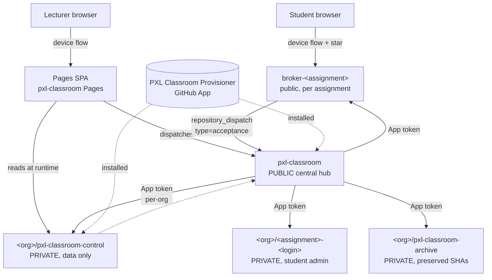

# PXL Classroom — Architecture & Technical Specification

A GitHub-native assignment distribution and submission-reporting system for higher education. Targets **GitHub Team for Education** (never GitHub Enterprise). Replaces the subset of GitHub Classroom that PXL relies on, with a model that lets students keep repository-administrator access — including secrets, environments, self-hosted runners — so course materials can teach Actions properly.

This document is the single technical reference for the system. It supersedes the historical `REQUIREMENTS.md`, `IMPLEMENTATION_PLAN.md`, `REVIEW.md`, `REVIEW_PLAN.md`, `REDUCTION_PLAN.md`, and `SPIKES_PLAN.md`.

---

## 1. Purpose & scope

**The system shall:**

- Let a lecturer define an assignment from a private GitHub template repository.
- Distribute one acceptance link per assignment.
- Provision one private repository per student, with administrator access to the student.
- Preserve an instructor-controlled record of configuration, acceptances, observations, and deadline state.
- Report activity before and after a deadline, including late activity.
- Operate using only GitHub-hosted services (no external server, no external database).

**Non-goals.** Autograding; running instructor tests against submissions; plagiarism detection; preventing every form of late modification; treating Git commit author/committer dates as authoritative submission times; LMS grade export; group assignments (deferred to v2); guaranteeing tamper-proofing against a malicious organization owner.

---

## 2. Platform constraints

The system runs using only:

- GitHub organizations, repositories, REST/GraphQL APIs, and webhooks.
- GitHub Actions workflows and composite actions.
- GitHub Pages (public; access-controlled Pages is an Enterprise feature and is **never** used).
- One GitHub App, installed per participating organization.
- GitHub-hosted runners (lecturer-managed self-hosted runners are permitted per assignment, but the system itself never depends on one).

**No GitHub Enterprise capability is permitted as a dependency, option, or fallback.** Audit-log API, push-event audit records, and private Pages are not used.

All authoritative application data lives in instructor-controlled private repositories. No privileged credential is embedded in the static frontend, committed to source, written to Pages output, or stored in a student-controlled repository.

---

## 3. System topology



Five repository roles, one App, one Pages site.

### 3.1 Repository roles

| Role | Visibility | Count | Owns |
|---|---|---|---|
| **Central hub** — `PXL-Digital-Application-Samples/pxl-classroom` | Public | 1 | All workflows, composite actions, scripts, frontend source, schemas |
| **Control repo** — `<org>/pxl-classroom-control` | Private | 1 per org | Assignments, roster, acceptances, repositories, observations, reports, overrides, errors |
| **Broker repo** — `<org>/broker-<assignment-id>` | Public | 1 per assignment | A single `watch:started` workflow that dispatches to the hub |
| **Archive repo** — `<org>/pxl-classroom-archive` | Private | 1 per org | Preserved submission SHAs as branches |
| **Student repo** — `<org>/<repository_name_pattern>` | Private | 1 per accepted student | The student's own work |

Workflows live **only** in the central hub. Control repos hold data; they contain no `.github/workflows/` directory. This is what makes the system upgradable in one place and keeps participating-org Actions budgets near zero.

### 3.2 The GitHub App

A single GitHub App, `PXL Classroom Provisioner`, with:

| Scope | Permission | Used by |
|---|---|---|
| Repository: Administration | Read/Write | Provisioning, lock-down |
| Repository: Contents | Read/Write | Provisioning (template copy), commits to control repo & archive |
| Repository: Metadata | Read | Everything |
| Account: Starring | Read/Write (Device Flow) | The browser-side device-flow token (stars broker on accept) |

The App is installed:

- On `PXL-Digital-Application-Samples`, **scoped to `pxl-classroom` only**. The broker mints a token for this installation to dispatch into the hub. A compromised broker workflow can only dispatch events to the hub — bounded blast radius.
- On each participating org (`PXLAutomation`, `PXLCloudAndAutomation`, etc.), **scoped to all repositories**. The hub mints per-org tokens at workflow runtime for provisioning, collection, lock-down, preservation, and archive operations against the target org.

**`secrets:write` is not requested, anywhere.** The App never injects secrets into per-org repositories; per-org control repos hold no workflows and therefore no Actions secrets are needed.

The App is created via the one-shot Manifest flow at the hub's `/setup` Pages route (see RUNBOOK §1).

---

## 4. Trust model

### 4.1 What is authoritative

- **Authoritative:** the per-org control repository. It holds assignments, roster, acceptances, repository IDs, observations, reports, overrides. Students never have read or write access.
- **Not authoritative:** student repositories. Students hold admin so the course can teach Actions, secrets, environments, runners — but that means students can rewrite history, disable Actions, alter workflows, and delete the repo. The system treats student repos as observable, not trustworthy.

### 4.2 Identity

- **Lecturers** authenticate to the SPA via GitHub device flow against the Provisioner App. Authorization derives from organization ownership: any owner of an org where the App is installed is a lecturer in that org. The SPA reads control-repo data with the **lecturer's own token**; no per-user secret on the server side.
- **Students** authenticate to the SPA via the same device flow. Acceptance is **open** in v1: any GitHub account that stars the broker within `opens_at … deadline_at` and below `max_acceptances` is provisioned. The lecturer reconciles `github_login` → roster student afterward via overrides.
- **Automation** authenticates as the App, using short-lived per-org installation tokens minted at workflow runtime.

### 4.3 Bounded blast radius

- **Public broker compromise.** A broker workflow can only mint a token for the `pxl-classroom`-scoped App installation. That token can dispatch into the hub but cannot touch any per-org repository.
- **Hub compromise.** The hub is public. Branch protection on `main` (PRs + reviews + signed commits + CI required), CODEOWNERS on `.github/workflows/` and composite actions, secret scanning, and push protection are what make this safe. A bypass of those controls is the actual concern; see RUNBOOK §10.
- **Per-org control-repo compromise.** Restricted to that single org's data.
- **Student-repo compromise.** Contained to that student's repository. Student tokens never see the App's installation tokens.

### 4.4 Lock-down semantics

At a deadline, automation demotes the student from admin to `pull` on their assignment repository via the App. Because the demotion runs through the org-level App installation — which outranks repo-level admin — the student cannot self-restore. This is a deterrent, not a tamper-proof control: a student who prepared beforehand may have alternative write paths (added collaborator, deploy key, fork). Reports continue to flag observed late activity; preservation is the safety net.

---

## 5. Data model

### 5.1 Control repository layout

```
<org>/pxl-classroom-control/
├── assignments/<id>.yml               # source: assignment definition
├── students/roster.yml                # source: roster
├── acceptances/<id>/<login>.json      # observation: who accepted, when
├── repositories/<id>/<login>.json     # fact: provisioned repo id, name, url, state
├── observations/<id>/<login>/*.json   # observations: snapshot (sha, ref, time)
├── lockdowns/<id>/lockdown-record.json # fact: lock-down outcome per assignment
├── reports/<id>.json                  # calculated: per-assignment report
├── reports/dashboard.json             # calculated: aggregate for the SPA dashboard
├── overrides/<id>/<login>.json        # lecturer override (append-only)
├── errors/<id>.json                   # error records
└── public/                            # GENERATED public metadata for Pages
```

### 5.2 Distinguish facts, observations, calculations, overrides

The model explicitly distinguishes:

- **Facts** returned by GitHub (`repo_id`, `repo_url`).
- **Observations** made at a specific time (`observed_at`, `observed_sha`).
- **Calculated** values (`submission_status`, `effective_deadline_at`).
- **Lecturer overrides** (`type`, `reason`, `overridden_by`, `overridden_at`) — append-only; never erase evidence.

### 5.3 Schemas

JSON Schemas live in `schemas/` in the hub and are copied into `frontend/public/schemas/` at build time. The SPA fetches them at runtime to validate user input before commit (Admin Panel).

| Schema | Stores |
|---|---|
| `assignment.schema.json` | Assignment definition (see §5.4) |
| `roster.schema.json` | Roster entries |
| `acceptance.schema.json` | Per-student acceptance record |
| `repository-record.schema.json` | Provisioned repo facts |
| `observation.schema.json` | A single snapshot of the submission ref |
| `report.schema.json` | Computed per-assignment report |
| `override.schema.json` | Lecturer overrides (8 types, see schema) |
| `error-record.schema.json` | Workflow/script error records |
| `participating-orgs.schema.json` | Hub-side registry of participating orgs |

### 5.4 Assignment definition

```yaml
schema_version: 1
id: linux-processes-2026             # URL-safe slug
title: Linux Processes
description: Short student-facing description
organization: PXLAutomation
template:
  owner: PXLAutomation
  repository: template-automation-pe-1
  repository_id: 123456789            # optional, immutable
repository_name_pattern: linux-processes-{github_login}
opens_at: 2026-09-21T06:00:00Z        # ISO 8601 UTC
deadline_at: 2026-10-05T21:59:59Z
timezone: Europe/Brussels
submission_ref: refs/heads/main
student_permission: admin             # pull|triage|push|maintain|admin
acceptance_mode: self-service         # self-service|pre-provisioned
late_policy: report                   # report|block
state: published                      # draft|published|closed|archived
max_acceptances: 250
lock_down_enabled: true
```

### 5.5 Participating-orgs registry

`participating-orgs.yml` lives on a dedicated **`participating-orgs` branch** of the hub repo (not `main`). This branch has lighter protection — `main`'s "PRs + ≥2 reviews + signed commits" rule would block automation commits, but the orgs registry is high-frequency. The Setup-Organization workflow commits directly to this branch; cron workflows fetch from `ref: participating-orgs`.

```yaml
schema_version: 1
orgs:
  - login: PXLAutomation
    budget_owner: jane.doe@pxl.be
    spending_limit_eur: 100
```

---

## 6. Operational model — minimal-minutes (Wave 8)

The defining design decision of v1: **the system consumes zero billed minutes when no class is active.** Active classes are tightly bounded.

### 6.1 Synchronous provisioning

When a student stars a broker, the central `acceptance-handler.yml` workflow runs the full sequence in a single workflow run: accept → provision → write registry record → dispatch dashboard regen. **There is no queue.** A 250-student burst is handled by GitHub's own workflow scheduler and the App's per-org rate-limit budget; if the org is rate-limited, the workflow run fails and the SPA shows the student "GitHub is currently experiencing high load. Please try again in 15 minutes." (`AssignmentView.vue`). The student retries by re-starring the broker; idempotency makes this safe.

### 6.2 One nightly cron

A single workflow, `daily-activity.yml`, runs at `0 0 * * *` UTC. For every participating org with active assignments, it:

1. **Collects** observations for the configured submission ref of every accepted student.
2. **Finds finalizable** assignments — those whose `deadline_at` has just passed and that have not yet been finalized.
3. **Finalizes** each one in a per-assignment matrix leg: `collect → lockdown → preserve → report`.
4. **Disables itself** (`gh workflow disable daily-activity.yml`) if no active assignments remain.

There is no `collect-activity.yml`, no `finalize-deadline.yml`, no `process-queue.yml` — those were earlier cron-heavy designs that have been removed.

### 6.3 Event-driven dashboard regeneration

`regenerate-dashboard.yml` has no cron. It is triggered by:

- `acceptance-handler.yml` after a successful provisioning (so the dashboard reflects new students promptly).
- `daily-activity.yml` after the nightly run (so the dashboard reflects new observations and finalized state).
- Manual `workflow_dispatch` (for repair).

### 6.4 Zero idle minutes

`daily-activity.yml` is disabled by default. The lifecycle is:

```
Lecturer publishes assignment
   ↓
publish-assignment.yml runs `gh workflow enable daily-activity.yml`
   ↓
Nightly cron runs — collects, finalizes, regenerates dashboard
   ↓
After all deadlines pass, check-idle job runs `gh workflow disable daily-activity.yml`
   ↓
0 runs / 0 billed minutes until the next publish
```

### 6.5 What this costs

Central hub Actions are free (public repository). Per-org Actions cost is approximately:

- One acceptance: ~30s of one runner.
- One nightly run: one runner per org with active assignments, plus one matrix leg per finalizable assignment that night. A typical course (50 students, 4 assignments, 2-week windows) consumes well under €5/month at GitHub list prices.

Each participating org **must** still set a GitHub Actions spending limit. See RUNBOOK §3.

---

## 7. Central workflows reference

All in `.github/workflows/` of the hub. Triggered as noted.

| Workflow | Trigger | Purpose |
|---|---|---|
| `acceptance-handler.yml` | `repository_dispatch [acceptance]` | Sync: accept → provision → dispatch dashboard regen. Per-student concurrency. |
| `daily-activity.yml` | `cron 0 0 * * *` + `workflow_dispatch` | Nightly: collect, finalize finalizable assignments, disable self when idle. **Disabled when no class active.** |
| `publish-assignment.yml` | `workflow_dispatch` | Create broker repo, set vars, push broker workflow, flip assignment `state` to `published`, **enable `daily-activity.yml`**. |
| `regenerate-dashboard.yml` | `workflow_dispatch` (called by other workflows) | Multi-org: generate public Pages JSON + run privacy scanner + commit to each org's `public/`. |
| `reconcile-registry.yml` | `push` to `participating-orgs.yml` on `participating-orgs` branch + `workflow_dispatch` | Detect drift: deleted student repos, visibility changes, revoked access. |
| `weekly-usage-report.yml` | `cron 0 22 * * SUN` + `workflow_dispatch` | Sunday 22:00 UTC. Per-org matrix: fetch Enhanced Billing usage for the past 7 days, threshold per SKU, write report to control repo, @-mention budget owner if anything over, fail run on overrun. |
| `setup-org.yml` | `workflow_dispatch` | Create `pxl-classroom-control` in target org; register org in `participating-orgs` branch. |
| `deploy-frontend.yml` | `push` to `main` (paths: `frontend/**`) + `workflow_dispatch` | Build SPA + copy schemas → publish to GitHub Pages. |
| `ci.yml` | `pull_request` + `push` | Run `node --test tests/`. |

**Broker template:** `acceptance/broker-workflow.yml` is the file `publish-assignment.yml` copies into each broker repository as `.github/workflows/acceptance-trigger.yml`. It's the one workflow that does NOT live in the hub at runtime — it lives on every broker — but it is owned and re-published from the hub.

---

## 8. Composite actions reference

All in the hub's repository root. Each is a self-contained composite that mints an App token for the target org, runs a Node script against a control-repo checkout, and emits outputs.

| Action | Input contract (key) | Outputs (key) |
|---|---|---|
| `acceptance/` | dispatched payload, `data-dir` (control checkout) | `outcome` = `accepted` / `already-accepted` / `rejected:*` / `fail:*` |
| `provisioning/` | template owner/repo, target repo, student login | `repo-id`, `repo-url`, `outcome` = `created` / `reused` / `fail:*` |
| `collect/` | assignment id, `data-dir` | `collected_count`, `error_count`, `outcome` = `collected` / `partial` / `fail:*` |
| `lockdown/` | assignment id, `data-dir` | `locked_count`, `uncertainty_seconds`, `outcome` |
| `preserve/` | source repo, source sha, archive repo, login | `preserved_sha`, `verified`, `outcome` = `preserved` / `fail:*` |
| `report/` | assignment id, `data-dir`, `output-format` (json/csv/both) | `student-count`, `on-time-count`, `late-count`, `outcome` |
| `pages/` | `data-dir`, `output-dir` | `generated-count`, `scan-result` (clean/blocked), `outcome` (published/blocked) |
| `registry/` | org, optional `assignment-id`, `data-dir` | `drift-detected` |
| `notify/` | org, `event-type`, `assignment-id`, `details`, `dedup-key` | `outcome` = `notified` / `deduplicated` / `fail:*` |

Pattern in every central workflow: `checkout(hub) → npm ci → mint App token for inputs.org → checkout(control repo) → run action with data-dir=control/ → commit & push the diff to the control repo.`

Scripts in `scripts/` extract logic that would otherwise sit as `node -e` snippets in workflow YAML.

---

## 9. End-to-end flows

### 9.1 Student acceptance (synchronous)

```
1. Student opens https://<pages-host>/pxl-classroom/<org>/a/<assignment-id>
2. SPA shows title, opens_at, deadline, current state
3. Student clicks "Accept" → device-flow auth (only if first time this session)
4. SPA POSTs PUT /user/starred/<org>/broker-<assignment-id>          [Account/Starring]
5. Broker's watch:started workflow fires
6. Broker mints a token for the pxl-classroom-scoped App installation
7. Broker POSTs /repos/PXL-DAS/pxl-classroom/dispatches type=acceptance
8. acceptance-handler.yml in the hub:
   a. Mints App token for inputs.org
   b. Checks out <org>/pxl-classroom-control
   c. Runs ./acceptance — validates payload, checks opens_at..deadline_at,
      checks max_acceptances, writes acceptances/<id>/<login>.json
   d. If accepted/already-accepted, runs ./provisioning — creates the repo
      from template (idempotent on existing) and grants student admin
   e. If provisioning failed, runs ./notify with event-type=provisioning-failed
   f. Commits repositories/<id>/<login>.json + updated acceptance to control repo
   g. Dispatches regenerate-dashboard.yml for this org
9. SPA polls /repos/<org>/<expected-repo-name> with the student's own token
   plus /user/repository_invitations until the repo appears or 30 attempts pass
10. SPA shows the repo URL + "Open repository" button
```

Idempotency: a re-star (unstar then restar) re-fires `watch:started`; the acceptance script detects an existing acceptance and returns `already-accepted`; provisioning detects an existing repo and returns `reused`. The student gets the same repo URL.

Failure modes:
- Rate limit / GitHub outage → workflow fails → SPA polls 30× over ~5 min → "GitHub is currently experiencing high load. Please try again in 15 minutes."
- Outside the open window or above `max_acceptances` → acceptance script returns `rejected:*` → SPA surfaces the reason.

### 9.2 Nightly cycle

```
00:00 UTC daily-activity.yml fires (only if not disabled)
   ↓
find-orgs (reads participating-orgs branch)
   ↓
For each org (max 4 parallel):
   collect — snapshot observations for accepted students
   ↓
find-finalizable — assignments whose deadline_at just passed
   ↓
For each finalizable assignment:
   collect (deadline-mode) → lockdown → preserve → report
   commit observations/, lockdowns/, reports/ to control repo
   ↓
check-idle: if no active assignments remain → gh workflow disable daily-activity.yml
   ↓
trigger-dashboard: dispatches regenerate-dashboard.yml
```

### 9.3 Publish

```
Lecturer opens Admin Panel → Publish Assignment
   ↓
SPA dispatches publish-assignment.yml with {org, assignment_id}
   ↓
publish-assignment.yml:
   a. Mints App token for org, checks out control repo
   b. Validates assignments/<id>.yml exists
   c. Creates or updates <org>/broker-<id> public repo
   d. Sets ASSIGNMENT_ID and CONTROL_ORG variables on the broker
   e. Pushes acceptance/broker-workflow.yml as .github/workflows/acceptance-trigger.yml
   f. Flips state: draft → published in assignments/<id>.yml
   g. gh workflow enable daily-activity.yml      ← wakes the nightly job
```

### 9.4 Override (deadline extension)

```
Lecturer opens Admin Panel → Grant Extension
   ↓
SPA validates the override JSON against override.schema.json
   ↓
SPA commits overrides/<id>/<login>.json directly to the control repo
   (via Contents API with lecturer's own token)
   ↓
Next nightly run's report.mjs reads overrides, computes effective_deadline_at,
   re-classifies submission_status accordingly
```

### 9.5 Onboarding a new organization

```
Admin installs PXL Classroom Provisioner App on <org>
   ↓
Admin triggers Setup Organization workflow in hub (workflow_dispatch)
   with input: target_org=<org>
   ↓
setup-org.yml:
   a. Mints App token for <org>
   b. Creates <org>/pxl-classroom-control (private) if missing
   c. Pushes initial directory scaffold (no workflows)
   d. Appends to participating-orgs.yml on participating-orgs branch
   ↓
Admin sets Actions spending limit + budget alerts on <org>
   (mandatory — see RUNBOOK §3)
```

---

## 10. Frontend

Vue 3 SPA, built with Vite, deployed as static files to GitHub Pages from the hub. No server runtime. Auth state stays in memory only (never localStorage) and dies on tab close.

### 10.1 Routes

| Path | View | Audience |
|---|---|---|
| `/` | `HomeView` | Public — lists open assignments grouped by org from `/data/<org>/assignments.json` |
| `/:org/a/:assignmentId` | `AssignmentView` | Student — accept flow, polling, repo link |
| `/dashboard/:org?` | `DashboardView` | Lecturer — org picker (from `/user/installations`), then assignment list |
| `/dashboard/:org/admin` | `AdminView` | Lecturer — Admin Panel: create assignment, publish, grant extension |
| `/dashboard/:org/:assignmentId` | `AssignmentDetailView` | Lecturer — per-assignment detail + per-student table |
| `/setup` | `SetupView` | Admin — one-shot App Manifest form |

A `frontend/public/404.html` shim handles SPA deep-link cold loads on GitHub Pages.

### 10.2 Authentication

GitHub **device flow** against the Provisioner App's OAuth surface. The user-to-server token's effective scope is the intersection of the App's installation permissions and what the user grants. There is **no client secret in the browser** — device flow is a public-client flow.

The App declares the following installation permissions (see `frontend/src/views/SetupView.vue` for the canonical manifest):

| Permission | Why |
|---|---|
| `actions: write` | SPA dispatches hub workflows from the Admin UI (publish, retry, on-demand usage). |
| `administration: write` | Create student repos, demote at lock-down. |
| `contents: write` | Read/write assignment YAMLs, overrides, reports in the control repo. |
| `metadata: read` | Baseline. |
| `organization_plan: read` | Enhanced Billing endpoint used by the weekly usage report. |
| `secrets: write` | Set per-broker / per-control-repo Actions secrets during provisioning. |

**A CORS proxy is required.** `github.com/login/device/code` and `github.com/login/oauth/access_token` do not send CORS headers (confirmed via GitHub docs + community). A browser cannot call them directly — every attempted fetch fails with a CORS preflight error. The two endpoints are routed through a configurable proxy:

| Setting | Default | Override |
|---|---|---|
| `VITE_CORS_PROXY_URL` | `https://corsproxy.io/?url=` | Set a hub repo secret of the same name; `deploy-frontend.yml` picks it up at build time |

**Threat model accepted for v1.** The proxy operator sees the `device_code` and `access_token` in transit at sign-in (not subsequent API calls — those go directly to `api.github.com`, which is CORS-friendly). A compromised proxy operator can therefore *replay* lecturer tokens harvested during the breach window; they cannot intercept any subsequent traffic.

What a leaked lecturer token grants: the intersection of the table above with the user's GitHub permissions on installed orgs. In practice for an org owner that is contents/admin/secrets/actions write on every repo the App is installed on. The `actions: write` delta on top of the existing write permissions is small in marginal terms — workflows are public, inputs are validated, and the dispatch attack surface is bounded by what those workflows are designed to do. Token lifetime is 8 hours; lecturers can revoke at any time at `https://github.com/settings/applications`.

Student tokens, which only have Account/Starring write granted at OAuth time, remain essentially harmless (worst case: mass-star on the student's behalf for ≤ 8 hours).

For PXL's classroom threat model, this is acceptable. If the deployment ever handles higher-value data (e.g. graded assignments worth credit transferable to another institution), swap the proxy to a self-hosted one or a Cloudflare Worker — both are drop-in replacements via `VITE_CORS_PROXY_URL`.

A regression guard test (`tests/cors.test.mjs`) fails CI if `auth.js` ever directly fetches `github.com/login/*` without going through the proxy variable — exactly the regression that broke production once already.

### 10.3 Data sources

- **Public assignment list:** static Pages JSON at `/data/<org>/assignments.json`, generated by `pages/generate.mjs` after privacy scan.
- **Lecturer dashboard:** the lecturer's own token reads the per-org control repo's `reports/dashboard.json` directly via Contents API. One fetch — not N per-student calls.
- **Student status:** the student's own token reads `/repos/<org>/<expected-name>` and `/user/repository_invitations` — never the control repo.
- **Live Status refresh (Admin UI).** The per-assignment detail view exposes a "Live Status" button that re-queries `/repos/<org>/<repo>/commits?per_page=1` for each provisioned student (concurrency 6) and recomputes `submission_status` against `effective_deadline_at`. The updated `reports/<id>.json` is committed back to the control repo with `live_refreshed_at` + `live_refreshed_by` set; the next nightly `export-report` run replaces the file from authoritative observations. Counts against the lecturer's own GitHub REST quota, which is read dynamically via `/rate_limit` and shown in the action bar.

The privacy scanner (`pages/scan.mjs`) is a **publish gate**: if the generated Pages artifact contains roster fields, emails, tokens, or keys, the workflow fails and nothing is deployed.

### 10.4 Validation

`frontend/src/lib/validate.js` runs ajv against the schemas in `frontend/public/schemas/` before any Admin Panel commit. The lecturer can never accidentally commit a malformed assignment or override.

---

## 11. Deadlines, evidence, lock-down, preservation

### 11.1 Evidence level A — central snapshots

PXL Classroom does not use Git author/committer dates as authoritative submission times — those are settable by the client. The system instead records:

- `observed_at` (server time when the API call was made)
- `observed_sha` (the SHA the configured submission ref pointed at)
- `repo_id`, `ref`

The deadline report classifies a submission by comparing observation times to `effective_deadline_at` (deadline + any override). The uncertainty interval between the deadline instant and the nightly observation is reported — never assumed away.

### 11.2 Lock-down

At nightly finalize, the App demotes the student admin → `pull` and captures a final snapshot. The student cannot self-restore because the org-level App outranks repo-level admin (confirmed by Spike 4 — 22s deadline→execution interval was measured). `uncertainty_seconds = lockdown_at - deadline_at` is recorded per assignment.

Lock-down is configurable per assignment (`lock_down_enabled`, default `true`). Reports continue to flag any observed late activity regardless of lock-down.

### 11.3 Preservation

`preserve.mjs` pushes the candidate SHA into `<org>/pxl-classroom-archive` as a branch under `preserved/<assignment-id>/<login>`. The hash is verified via `git ls-remote`. Force-push or history rewrite of the source repository cannot remove the preserved object, because it lives in a different repository the student cannot administer.

Without preservation, a SHA recorded in `observations/` could become unreachable if the student rewrites history. With preservation, the reachable object survives.

---

## 12. Notifications & audit

A single instructor-only tracking issue per participating org, opened in the control repo titled `PXL Classroom — Instructor Notifications`. The `notify/` action posts (or updates, by `dedup-key`) a comment for any of:

| Event type | Producer |
|---|---|
| `provisioning-failed` | `acceptance-handler.yml` |
| `collection-failed` | `daily-activity.yml`'s collect leg |
| `deadline-gap` | observation gap detector |
| `missing-access` | `reconcile-registry.yml` |
| `unexpected-deletion` | `reconcile-registry.yml` |
| `late-activity` | `daily-activity.yml`'s finalize leg |
| `preservation-failed` | `daily-activity.yml`'s finalize leg |

Dedup-keys are stable per `(org, assignment, login, condition)` so repeated nights don't re-spam.

Every state-changing workflow run records: run URL, initiating actor, op type, assignment ID, affected student, start/complete time, outcome, GitHub IDs, error category. Source changes happen through Git commits. Generated records identify the source revision.

---

## 13. Reliability, scale, rate limits

The system tolerates duplicate events, delayed workflow execution, canceled runs, transient API failures, secondary rate limits, repository renames, partial provisioning, and stale Pages data. All writes are idempotent or guarded by compare-and-set on existing files.

Target scale: 500 active students, 20 active assignments, 10,000 managed repositories over an org's lifetime, 250-student class-wide acceptance burst.

**Bursts.** The secondary rate limit (≈80 content writes/min, 500/hr per token) is the bottleneck. Per-org App tokens are scoped per-installation, so two orgs can burst in parallel. Within one org: a 250-student burst issues ~500 writes (create + grant). The synchronous acceptance model trades retries for queue complexity — students who fail get a clear "try again in 15 minutes" and the retry is a free re-star.

**Per-org concurrency.** `acceptance-handler.yml` uses `concurrency: accept-${org}-${assignment_id}-${github_login}` so duplicate stars from the same user never run in parallel.

**Repository identity.** The immutable repository ID (not the name) is the primary external identifier. Repositories can be renamed; the ID can't.

---

## 14. Multi-organization architecture

One App, installed per org. One participating-orgs registry on a dedicated branch. One public Pages dashboard for all orgs. Data is per-org private — Org A cannot read Org B's roster.

### 14.1 Why per-org control repos

GitHub repository permissions are all-or-nothing. A shared control repository would expose every org's roster and reports to every lecturer who could read it. Therefore each org owns its own private control repo, and the Pages SPA reads each org's data **at runtime** with the lecturer's own scoped token.

### 14.2 The participating-orgs branch

`participating-orgs.yml` lives on its own branch with light protection. The Setup-Organization workflow commits there directly. Cron workflows fetch via `actions/checkout` with `ref: participating-orgs`. The branch is never merged into `main` — it's a deliberately decoupled metadata store.

### 14.3 Weekly usage tracking

The system tracks GitHub usage per repo per SKU and warns when anything crosses a configured threshold. No EUR involved — actuals only (minutes, GiB·h, GB, hours), because a repo with 4 GiB·h of stale artifacts and zero minutes is invisible in a cost view but still a real problem.

**Sunday 22:00 UTC**, `weekly-usage-report.yml` fires. Per participating org (matrix):

1. Mint App token with `Organization plan: read` permission.
2. Fetch `organizations/{id}/settings/billing/usage` for the previous 7 days.
3. Group by `(repositoryName, sku)`, sum quantity.
4. Resolve threshold per (repo, SKU) via three-tier lookup.
5. Write `reports/usage-<YYYY>-W<NN>.json` + `reports/usage-latest.json` to the control repo.
6. If `over_count > 0`: @-mention `budget_owner_login` in a comment on the "PXL Classroom — Weekly Usage Report" issue (created on demand).
7. Exit non-zero if anything over (red X in Actions tab).

**Threshold resolution.** Per (repo, SKU), the limit is the first that matches:

| Source | Location | Scope |
|---|---|---|
| Per-repo | `<org>/pxl-classroom-control/limits-overrides.json` | Specific repo + SKU |
| Per-org | `participating-orgs.yml` → `orgs[i].overrides` | All repos in that org, for that SKU |
| Global | `limits.yml` (hub root) | Default |

If no threshold is configured for a SKU anywhere, that SKU's usage is recorded but never flagged.

**Frontend.** Two views read the latest report from each control repo at runtime with the lecturer's own token:

- `/dashboard/<org>/usage` — per-org table, sortable, over-threshold rows highlighted red.
- `/usage` — cross-org view, iterates the lecturer's App installations, aggregates every repo/SKU pair, filterable by "over only".

**Permission cost.** The Enhanced Billing endpoint requires the App to have `Organization plan: read`. After this permission is added to the App, each participating org owner sees a one-time re-approval prompt on next visit to the installation page. See `RUNBOOK.md` §11.

**Budget owner.** `participating-orgs.yml` now requires `budget_owner_login` (GitHub login, used for @-mention). Optional `budget_owner_email` is informational only — GitHub emails are sent via the @-mention notification.

---

## 15. Constraints accepted in v1

- **Open acceptance.** Any GitHub account that stars the broker within the window and below the cap gets a repo. The lecturer reconciles `github_login` → real student afterward. Mitigations: `opens_at..deadline_at` window, `max_acceptances` cap, idempotency, lecturer reconciliation. Residual risk accepted.
- **Lock-down is a deterrent, not tamper-proof.** A student who prepared beforehand may retain alternative write paths. Reports flag observed late activity; preservation captures the on-time SHA.
- **No institutional verification.** A student could associate with the wrong roster entry. Lecturer review + overrides correct it. MS 365 / Entra ID verification is a v2 candidate and would be the only explicit exception to the GitHub-only constraint.
- **Public broker is public.** Star activity is publicly visible. Acceptable.
- **GitHub Pages is public.** Privacy scanner is a hard publish gate; no roster/email/token can land in public output.
- **Class-wide burst is best-effort.** No queue. If 250 students all star within seconds, GitHub's rate limit may reject some — they retry by re-starring.

---

## 16. Deferred to v2

- Group assignments.
- Institutional identity verification (MS 365 / Entra ID).
- Template updates after provisioning / starter-code resynchronization.
- LMS / grade export.
- Plagiarism / similarity detection.
- Autograding.
- Multi-institution hosting.

---

## 17. Retention

Raw observations and reports are retained for the current and previous academic year in the control repo. Older than two academic years: archive out of the active control repo. Archival preserves the Git history needed to audit past assignments and never destroys preserved submission evidence.

---

## 18. Acceptance criteria (v1)

A lecturer can:

- Define an assignment from a private template via the Admin Panel.
- Publish one assignment URL.
- Let an eligible student accept without using a GitHub Issue.
- Provision exactly one private organization-owned repository.
- Grant the student administrator access.
- Revisit the assignment and recover the repository link.
- View all students and provisioning states.
- View repository activity and deadline classification.
- Distinguish observed submission snapshots from uncertain intervals.
- Identify late activity when evidence permits.
- Preserve a selected submission state outside student control.
- Export a CSV report.
- Operate and recover the system using only GitHub and GitHub Actions.

All criteria met as of v1 GA.
