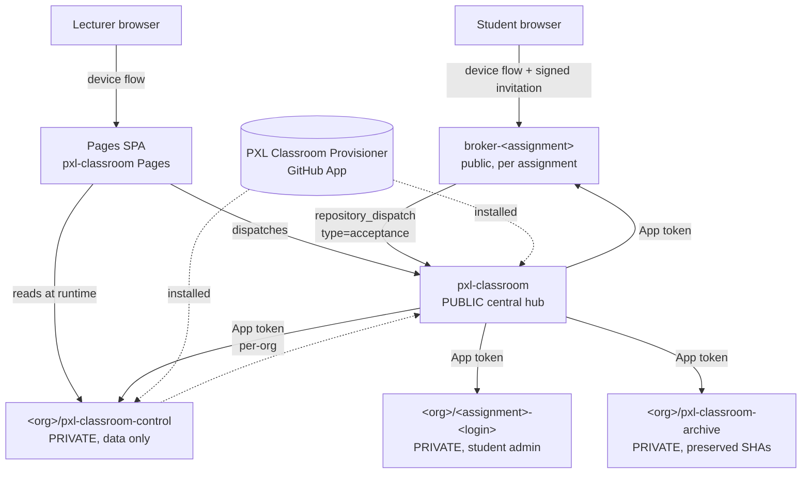

# PXL Classroom - Architecture & Technical Specification

A GitHub-native assignment distribution and submission-reporting system for higher education. Targets **GitHub Team for Education** (never GitHub Enterprise). Replaces the subset of GitHub Classroom that PXL relies on, with a model that lets students keep repository-administrator access - including secrets, environments, self-hosted runners - so course materials can teach Actions properly.

This document is the single technical reference for the system. It supersedes the historical `REQUIREMENTS.md`, `IMPLEMENTATION_PLAN.md`, `REVIEW.md`, `REVIEW_PLAN.md`, `REDUCTION_PLAN.md`, and `SPIKES_PLAN.md`.

---

## 1. Purpose & scope

**The system shall:**

- Let a lecturer define an assignment from a private GitHub template repository.
- Distribute one acceptance link per assignment.
- Provision one private repository per student, with administrator access to the student.
- Preserve an instructor-controlled record of configuration, acceptances, observations, and deadline state.
- Report activity before and after a deadline, including late activity.
- Operate using only GitHub-hosted services (no external server, no external database).

**Non-goals.** Plagiarism detection; preventing every form of late modification; treating Git commit author/committer dates as authoritative submission times; LMS grade export; guaranteeing tamper-proofing against a malicious organization owner.

---

## 2. Platform constraints

The system runs using only:

- GitHub organizations, repositories, REST/GraphQL APIs, and webhooks.
- GitHub Actions workflows and composite actions.
- GitHub Pages (public; access-controlled Pages is an Enterprise feature and is **never** used).
- One GitHub App, installed per participating organization.
- GitHub-hosted runners (lecturer-managed self-hosted runners are permitted per assignment, but the system itself never depends on one).

**No GitHub Enterprise capability is permitted as a dependency, option, or fallback.** Audit-log API, push-event audit records, and private Pages are not used.

All authoritative application data lives in instructor-controlled private repositories. No privileged credential is embedded in the static frontend, committed to source, written to Pages output, or stored in a student-controlled repository.

---

## 3. System topology


```mermaid
graph TD
    Student[Student browser] -->|device flow + signed invitation| Broker
    Lecturer[Lecturer browser] -->|device flow| Pages
    Pages[Pages SPA<br/>pxl-classroom Pages] -->|reads at runtime| ControlRepo
    Pages -->|dispatches| Hub

    Broker[broker-&lt;assignment&gt;<br/>public, per assignment] -->|repository_dispatch<br/>type=acceptance| Hub

    Hub[pxl-classroom<br/>PUBLIC central hub] -->|App token<br/>per-org| ControlRepo
    Hub -->|App token| StudentRepo
    Hub -->|App token| Archive
    Hub -->|App token| Broker

    ControlRepo[&lt;org&gt;/pxl-classroom-control<br/>PRIVATE, data only] -.-> Hub
    StudentRepo[&lt;org&gt;/&lt;assignment&gt;-&lt;login&gt;<br/>PRIVATE, student admin]
    Archive[&lt;org&gt;/pxl-classroom-archive<br/>PRIVATE, preserved SHAs]

    App[(PXL Classroom Provisioner<br/>GitHub App)] -.installed.-> ControlRepo
    App -.installed.-> Hub
```

Five repository roles, one App, one Pages site.

### 3.1 Repository roles

| Role | Visibility | Count | Owns |
|---|---|---|---|
| **Central hub** - `PXL-Digital-Application-Samples/pxl-classroom` | Public | 1 | All workflows, composite actions, scripts, frontend source, schemas |
| **Control repo** - `<org>/pxl-classroom-control` | Private | 1 per org | Assignments, roster, acceptances, repositories, observations, reports, overrides, errors |
| **Broker repo** - `<org>/broker-<assignment-id>` | Public | 1 per assignment | A single workflow that verifies a signed invitation and dispatches to the hub |
| **Archive repo** - `<org>/pxl-classroom-archive` | Private | 1 per org | Preserved submission SHAs as branches |
| **Student repo** - `<org>/<repository_name_pattern>` | Private | 1 per accepted student | The student's own work |

Workflows live **only** in the central hub. Control repos hold data; they contain no `.github/workflows/` directory. This is what makes the system upgradable in one place and keeps participating-org Actions budgets near zero.

### 3.2 The GitHub App

A single GitHub App, `PXL Classroom Provisioner`, with:

| Scope | Permission | In Manifest? | Used by |
|---|---|---|---|
| Repository: Actions | Read/Write | Yes | Dispatching hub workflows from the SPA / Admin UI |
| Repository: Administration | Read/Write | Yes | Provisioning repositories, lock-down demotion |
| Repository: Contents | Read/Write | Yes | Provisioning (template copy), commits to control repo & archive |
| Repository: Issues | Read/Write | Yes | Creating tracking & notification issues in control repo |
| Repository: Metadata | Read | Yes | Repository queries and baseline checks |
| Repository: Pull Requests | Read/Write | Yes | Feedback PR orchestration |
| Repository: Secrets | Read/Write | Yes | Setting Actions secrets during provisioning |
| Repository: Workflows | Read/Write | Yes | Provisioning Actions workflows in student repositories |
| Organization: Administration | Read | Yes | Enhanced Billing endpoint used by the weekly usage report |
| Account: Starring | Read/Write | No (Manual) | Legacy; acceptance no longer stars the broker (§4.3.2) |
| Account: Email addresses | Read | No (Optional) | Reading verified student email during acceptance/login |

The App is installed:

- On `PXL-Digital-Application-Samples`, **scoped to `pxl-classroom` only**. The broker mints a token for this installation to dispatch into the hub. That token can only dispatch events to the hub; the App private key the broker holds to mint it is not similarly bounded, which is what §4.3.1 exists to protect.
- On each participating org (`PXLAutomation`, `PXLCloudAndAutomation`, etc.), **scoped to all repositories**. The hub mints per-org tokens at workflow runtime for provisioning, collection, lock-down, preservation, and archive operations against the target org.

The App is created via the one-shot Manifest flow at the hub's `/setup` Pages route (see RUNBOOK §1.2).

---

## 4. Trust model

### 4.1 What is authoritative

- **Authoritative:** the per-org control repository. It holds assignments, roster, acceptances, repository IDs, observations, reports, overrides. Students never have read or write access.
- **Not authoritative:** student repositories. Students hold admin so the course can teach Actions, secrets, environments, runners - but that means students can rewrite history, disable Actions, alter workflows, and delete the repo. The system treats student repos as observable, not trustworthy.

### 4.2 Identity

- **Lecturers** authenticate to the SPA via GitHub device flow against the Provisioner App. Authorization derives from organization ownership: any owner of an org where the App is installed is a lecturer in that org. The SPA reads control-repo data with the **lecturer's own token**; no per-user secret on the server side.
- **Students** authenticate to the SPA via the same device flow. Acceptance gating is per assignment, via `roster_mode`. Under `enforced` (the default) the student's GitHub login must be registered in the control repository's `students/roster.yml` for their acceptance to be processed and their repository provisioned. Under `open` any GitHub account may accept within the window and below the cap, and the lecturer reconciles `github_login` -> student afterward; unrecognised `roster_mode` values fail closed to `enforced`.
- **Automation** authenticates as the App, using short-lived per-org installation tokens minted at workflow runtime.

### 4.3 Bounded blast radius

- **Public broker compromise.** A broker workflow mints a token for the `pxl-classroom`-scoped App installation. That *token* can dispatch into the hub but cannot touch any per-org repository. The *private key* on the broker is not so bounded - it is the App's own key, and it can mint an installation token for any org the App is installed on. The blast radius is therefore only as small as the broker workflow's resistance to being made to run attacker code, which is why §4.3.1 is a hard rule rather than a style preference.

#### 4.3.1 No attacker-controlled text may reach a shell on a broker

A broker repository is public, carries `PXL_APP_PRIVATE_KEY` as a repo secret, and has issues enabled so the SPA can post group-acceptance payloads. Any GitHub account can therefore fire its workflow.

Group assignments introduced `BODY="${{ github.event.issue.body }}"` into a `run:` block there. `${{ }}` is substituted into the script *text* before the shell sees it, so an issue body of `"; <command>; echo "` executed arbitrary commands in a job that goes on to mint an App token - reachable by anyone, against every participating org.

Three invariants close it, enforced by `tests/broker-injection.test.mjs`:

- **No workflow interpolates `github.event.*` or `client_payload` into any `run:` or `github-script` body.** Values reach scripts through `env:`, where they are never substituted into script text. This is checked repo-wide, not just on the broker.
- **The broker never reads the issue body.** It forwards the issue *number* and its own repository; `scripts/read-team-payload.mjs` runs in the hub, fetches the issue with the hub's token, and validates it (`lib/team-payload.mjs`). `acceptance/action.yml` has no `client_payload` fallback for the team inputs, so no unvalidated value can reach `accept.mjs` by any path.
- **The broker reads the issue title only through `env:`, and only to match `^team:<slug>$`.** The hub's concurrency group is evaluated at dispatch time, before the body can be read, so the broker must supply the slug for it. That value is a **concurrency key only** (`client_payload.team_hint`); the authoritative team comes from the hub's own read. Sequential concurrency per team is what guards team capacity without a distributed lock (§5.8), so it cannot simply be dropped.

Team names are also stripped of control characters before use: outputs are written as `name=value` lines to `GITHUB_OUTPUT`, so an embedded newline would forge outputs downstream.

#### 4.3.2 Signed invitations - what stops an outsider triggering work

Acceptance is triggered by a public event on a public repository. Every event an unprivileged account can fire there - star, fork, issue, comment, wiki edit - is open to any GitHub account on earth, and none of them prove authorization. The trigger is a doorbell, not a key; authorization happens after it, against data the caller cannot forge.

Roster gating (§4.2) is that authorization, but it runs in the hub, *after* the broker has minted an App token and the hub has cloned the private control repo. A stranger's star therefore used to cost two workflow runs, two token mints and a clone. **Signed invitation tokens move the first check to the edge**, before any credential is in scope.

- `publish-assignment.yml` signs `{version, key id, subject, expiry, nonce}` with the hub secret `PXL_INVITE_SIGNING_KEY` and records the token in the assignment YAML - in the **private** control repo. It must never reach Pages output; `pages/generate.mjs` selects fields explicitly and the privacy scanner is the backstop.
- The subject is `sha256("<org lowercased>/<assignment-id>")` truncated to 16 bytes, so a link does not advertise what it opens and a token for one assignment cannot open another broker.
- The whole token is 122 characters and travels in the **issue title**, not the body. That is what lets the broker read everything it needs without touching attacker-controlled body text (§4.3.1).
- The broker checks out the public hub - no credentials - and verifies against `acceptance/invite-keys.json` before minting. **Verification is asymmetric because the verifier is public.** An HMAC would put the minting secret on every broker; a public key is safe to publish by definition. Encryption is the wrong primitive: the broker cannot hold a decryption key either, and on a public channel ciphertext replays exactly as well as plaintext.
- `vars.INVITE_ENABLED` and the `pxl-accept:` title prefix are checked in the workflow's **job-level `if`**, which GitHub evaluates before allocating a runner.

The floor this leaves: a caller without a valid token costs one boot on a free public runner and touches nothing private. `tests/invite-token.test.mjs` pins the ordering - no step before verification may reference a secret.

**The token is not a secret in the sharing sense.** Anyone the link reaches can accept; that is an accepted risk bounded by `max_acceptances` and closing the assignment (§15). What it prevents is an outsider who never had the link causing work to happen.

**Revocation** is the nonce, mirrored to the broker's `INVITE_NONCE` variable. Republishing reuses it, so a repair does not break links already handed out; `regenerate_invite: true` mints a fresh one and every earlier link reports `superseded`. Key rotation is the `kid` field, with old public keys retained until their assignments close. See RUNBOOK §1.3.1.

**Where the invitation is recorded, and who reads it back.** The token, nonce and expiry live as three lines in the assignment's YAML in the private control repo. `lib/invite-token-format.mjs` owns both halves of that - `readInviteField` / `parseInviteFields` for reading, `quoteInviteValue` for writing - because a reader that drifts from the writer is a lecturer holding an empty link box, which has now happened four times. Two rules fall out of it:

- **The nonce is written quoted.** Eight hex characters are all digits about one time in forty, and an all-digit nonce with a leading zero round-trips through a YAML parser as an integer - `01234567` returns as `1234567`. `set-assignment-invite.mjs` then fails its own `^[0-9a-f]{8}$` check, concludes there is no reusable nonce and mints a fresh one, retiring every link already handed out on a republish whose entire contract is that it does not.
- **The parse is a line-based regex, not a YAML round trip.** The module is imported by `lib/invite-token.mjs`, which the broker runs from a bare hub checkout with no `npm ci`; a dependency here would put npm on a credential-bearing public repository. It also keeps the reader and the writer working on the same representation, so a round-trip test exercises the real thing rather than two parsers that happen to agree.

#### 4.3.3 What the public Pages artifacts disclose

GitHub Pages is public and access-controlled Pages is an Enterprise feature the system never uses (§2), so everything published is world-readable. Until signed invitations existed, `data/<org>/assignments.json` listed every published assignment - id, title, description, deadline, broker repo, roster mode, cap and acceptance count - which made "unlisted assignments" a UI convention rather than a property.

The acceptance card now lives at `data/<org>/i/<sha256(invite_token)>.json`, and a group assignment's teams file beside it as `<sha256>.teams.json`. Consequences:

- **Finding the card requires the link.** The filename is a digest of the token, so it cannot be derived from an assignment id or guessed.
- **A leaked filename is not a working link.** The digest is published; the token is not, and one does not yield the other.
- **The teams file stops being a public cohort list.** It carries member logins, which is the roster by another name.
- **The privacy scanner gates it.** `pages/scan.mjs` fails the publish on anything matching the token's wire shape, so a future field that carried one could not reach Pages quietly.

`assignments.json` survives, reduced to `id`, `title`, `organization`, `opens_at`, `deadline_at`, `timezone`, `repository_name_pattern`, `assignment_type` and `state`. It exists for exactly one reason: the student portal at `/` matches a signed-in student's own repositories against assignments, and **students cannot read the control repo**, so that list has nowhere else to come from. Everything an outsider could use to size up or reach an assignment - broker repo, roster mode, cap, accepted count, description, group config - is on the invitation card instead. `tests/public-data-contract.test.mjs` pins both halves.

**The residual is deliberate.** An outsider can still enumerate assignment titles and deadlines per org. After §4.3.2 that discloses course structure; it grants nothing, because acceptance needs a signed invitation. Removing it entirely would mean either breaking the student portal or writing per-student data to a public site, and neither is a trade worth making for a title.

The invitation token is in the URL path, so `frontend/index.html` sets `<meta name="referrer" content="no-referrer">` - otherwise every cross-origin subresource, Google Fonts included, would receive it as a `Referer` header.

#### 4.3.4 Hub defence in depth

`workflow_dispatch` runs the workflow file from whichever ref the caller names, and the `participating-orgs` branch carries deliberately lighter protection (§5.5) so automation can commit the org registry to it. Those two facts compose into a way to run hub code at an attacker-influenced ref with the App private key in scope. §4.3.1 and §4.3.2 close the realistic route to *obtaining* that key; this bounds what holding one would be worth.

- **Every job holding a hub credential names the `provisioning` environment**, whose deployment branch policy allows `main` only. A job that names an environment does not start when the run's ref falls outside that policy - so the branch-ref path is closed by the reference itself, independent of where the secret is stored. Thirteen jobs across eleven workflows; `tests/workflow-hardening.test.mjs` fails if a new one forgets.
- **The admin workflows refuse an automated dispatch.** `setup-org.yml`, `retry-acceptance.yml` and `publish-assignment.yml` reject a `workflow_dispatch` whose actor ends in `[bot]`, as the first step, before anything mints a token. A lecturer dispatches as themselves through the SPA or the Actions tab; an App installation token - what a stolen broker credential would be - arrives as `<slug>[bot]`. `retry-acceptance` can provision for an arbitrary login with the window bypassed and `setup-org` creates org-level state, so neither should be reachable by a credential rather than a person.
- **Hub credentials are never exposed at workflow or job level**, only on the steps that need them, so a third-party action elsewhere in the job never sees one.

- **The signing keys live only on the environment.** `PXL_APP_PRIVATE_KEY` and `PXL_INVITE_SIGNING_KEY` are environment secrets with no repository-level copy, so a job that does not name `provisioning` cannot read them at all - the branch policy and the secret's location now enforce the same rule independently. `PXL_APP_CLIENT_ID` stays a repository secret deliberately: a client id is public by design and ships in the SPA bundle.

**Residual, accepted.** The actor guard does not stop a stolen *user* credential, which acts as its owner - rulesets and the environment are what bound that. Broker repositories still hold their own copy of the App key, because they must mint a dispatcher token; §4.3.1 and §4.3.2 are what keep that copy out of reach.
- **Hub compromise.** The hub is public. Branch protection on `main` (force-pushes and deletions blocked, including for administrators), secret scanning, and push protection are what make this safe; CI runs on every push and fails loudly. A bypass of those controls is the actual concern; see RUNBOOK §9.
- **Per-org control-repo compromise.** Restricted to that single org's data.
- **Student-repo compromise.** Contained to that student's repository. Student tokens never see the App's installation tokens.

### 4.4 Lock-down semantics

At a deadline, automation demotes the student from admin to `pull` on their assignment repository via the App. Because the demotion runs through the org-level App installation - which outranks repo-level admin - the student cannot self-restore. This is a deterrent, not a tamper-proof control: a student who prepared beforehand may have alternative write paths (added collaborator, deploy key, fork). Reports continue to flag observed late activity; preservation is the safety net.

---

## 5. Data model

### 5.1 Control repository layout

```
<org>/pxl-classroom-control/
├── assignments/<id>.yml               # source: assignment definition
├── students/roster.yml                # source: roster
├── teams/<id>/<team-slug>.json        # source: team definition & members (group assignments)
├── acceptances/<id>/<login>.json      # observation: who accepted, when
├── repositories/<id>/<login>.json     # fact: provisioned repo id, name, url, state
├── observations/<id>/<login>/*.json   # observations: snapshot (sha, ref, time)
├── lockdowns/<id>/lockdown-record.json # fact: lock-down outcome per assignment
├── reports/<id>.json                  # calculated: per-assignment report
├── reports/dashboard.json             # calculated: aggregate for the SPA dashboard
├── overrides/<id>/<login>.json        # lecturer override (append-only)
├── errors/<id>.json                   # error records
└── public/                            # GENERATED public metadata for Pages
```

### 5.2 Distinguish facts, observations, calculations, overrides

The model explicitly distinguishes:

- **Facts** returned by GitHub (`repo_id`, `repo_url`).
- **Observations** made at a specific time (`observed_at`, `observed_sha`).
- **Calculated** values (`submission_status`, `effective_deadline_at`).
- **Lecturer overrides** (`type`, `reason`, `overridden_by`, `overridden_at`) - append-only; never erase evidence.

### 5.3 Schemas

JSON Schemas live in `schemas/` in the hub and are copied into `frontend/public/schemas/` at build time. The SPA fetches them at runtime to validate user input before commit (Admin Panel).

| Schema | Stores |
|---|---|
| `assignment.schema.json` | Assignment definition (see §5.4) |
| `roster.schema.json` | Roster entries |
| `team.schema.json` | Team manifest and members for group assignments (`teams/<id>/<team-slug>.json`) |
| `acceptance.schema.json` | Per-student acceptance record |
| `repository-record.schema.json` | Provisioned repo facts |
| `observation.schema.json` | A single submission observation - `snapshot` of the submission ref or a `tagged-submission` produced from `refs/tags/submit/*` |
| `report.schema.json` | Computed per-assignment report |
| `override.schema.json` | Lecturer overrides (8 types, see schema) |
| `error-record.schema.json` | Workflow/script error records |
| `participating-orgs.schema.json` | Hub-side registry of participating orgs |
| `limits.schema.json` | Global and per-org weekly usage limits |
| `limits-overrides.schema.json` | Per-repository SKU threshold overrides |
| `grading-result.schema.json` | Autograder run result record |
| `download-manifest.schema.json` | Preserved submission archive download manifest |

### 5.4 Assignment definition

```yaml
schema_version: 1
id: linux-processes-2026             # URL-safe slug
title: Linux Processes
description: Short student-facing description
organization: PXLAutomation
template:
  owner: PXLAutomation
  repository: template-automation-pe-1
  repository_id: 123456789            # optional, immutable
repository_name_pattern: linux-processes-{github_login}
opens_at: 2026-09-21T06:00:00Z        # ISO 8601 UTC
deadline_at: 2026-10-05T21:59:59Z
timezone: Europe/Brussels
submission_ref: refs/heads/main
student_permission: admin             # pull|triage|push|maintain|admin
acceptance_mode: self-service         # self-service is the only implemented mode
roster_mode: enforced                 # enforced|open - who may accept (§15).
                                      # open requires max_acceptances.
late_policy: report                   # report|block
state: published                      # draft|published|closed|archived
max_acceptances: 150
lock_down_enabled: true

# Written by publish-assignment.yml, never by hand. The token is a capability:
# it stays in this PRIVATE repo and reaches Pages only as a sha256 filename
# (§4.3.2, §4.3.3). Republishing reuses the nonce and expiry so links already
# handed out keep working; regenerate_invite mints a new one and retires them.
invite_token: AQGL...w9NAj9P              # signed, 122 chars
invite_nonce: 63ad9fbc                    # mirrored to the broker's INVITE_NONCE
invite_expires_at: 2027-09-27T01:27:18Z
```

**`acceptance_mode` has one implemented value.** A `pre-provisioned` mode - the lecturer creates repositories up front and GitHub sends its own repository invitations - was offered in the schema and the Admin Panel but implemented in no code path, so selecting it silently produced self-service behaviour. It has been removed rather than left as a trap; see §16.

**`roster_mode` is independent of it.** `acceptance_mode` is *how* a repository is created; `roster_mode` is *who* may accept. Rosters apply to self-service acceptance exactly as before, and `enforced` remains the default (§15).

### 5.5 Participating-orgs registry

`participating-orgs.yml` lives on a dedicated **`participating-orgs` branch** of the hub repo (not `main`). This branch has lighter protection - `main`'s "PRs + ≥2 reviews + signed commits" rule would block automation commits, but the orgs registry is high-frequency. The Setup-Organization workflow commits directly to this branch; cron workflows fetch from `ref: participating-orgs`.

```yaml
schema_version: 1
orgs:
  - login: PXLAutomation
    budget_owner_login: tomcoolpxl
    budget_owner_email: tom.cool@pxl.be  # optional
    overrides:                           # optional SKU overrides
      "Actions Linux": 2000
```

### 5.8 Group Assignments

Assignments can be polymorphic: `assignment_type: "individual"` (default) or `"group"`.

- **Configuration:** `group_config` on the assignment YAML specifies `max_team_size` (integer, e.g. 3), `min_team_size` (optional integer, flags under-capacity teams with warning badges in the lecturer dashboard), `formation_mode` (`"self-service"`), and `allow_team_creation` (boolean).
- **Manifests:** Each team is stored as a JSON document in `teams/<id>/<team-slug>.json` conforming to `team.schema.json`.
- **Target Repositories:** Group assignments use `{team_slug}` in `repository_name_pattern` (e.g. `{id}-{team_slug}`). All teammates share read/write access to the single team repository.
- **Sequential Concurrency:** `acceptance-handler.yml` sets concurrency group `accept-${org}-${assignment_id}-${team_slug || login}` to serialize concurrent joins and team creation, strictly guarding team capacity without distributed locks.
- **Team Switching:** Students can switch teams prior to the deadline. On switch, `accept.mjs` revokes old team membership and marks 0-member teams as `vacant: true`; `provision.mjs` revokes collaborator access on the previous repository and grants access on the new team repository.
- **Preservation & Reporting:** Lockdown demotes all team members to `pull`; preserve archives the submission to `refs/heads/preserved/<id>/<team-slug>`; `report.mjs` computes both a top-level `teams` array and student-level `team_slug`/`team_name` fields.
- **Unassigned fallback:** `group_config.unassigned_fallback` (`block` | `self-service`, default `block`) decides what happens to a student with no assigned team under `formation_mode: pre-assigned`. `block` is the historical behaviour - the acceptance is rejected `rejected:no-assigned-team` and the SPA tells the student to contact their instructor. `self-service` lets them join or create a team instead, which is what keeps late enrollers and students whose partners dropped out from being stuck behind a lecturer action.
- **Pre-assignment is enforced server-side.** Under `pre-assigned`, `accept.mjs` resolves the student's team from (1) a team manifest that already lists them, then (2) the roster's `teams[<assignment-id>]` / `team_slug` columns. A payload naming a *different* team is rejected `rejected:team-not-assigned` rather than silently redirected. Under `self-service` the resolved team is only a default: naming another team is a switch, and switching stays open until the deadline.

#### 5.8.1 Carrying groups forward between assignments

Team membership is per assignment by design, so a second group assignment would otherwise make students re-form the same groups. **Seeding** copies an existing grouping into a target assignment as real `teams/<id>/<team-slug>.json` manifests, which the student then confirms in one click.

- **Sources:** an earlier group assignment's team manifests (the common case - they reflect every switch and dropout), or the roster's `team_slug` / `team_name` columns (the bootstrap case, before any group assignment exists). The roster is never written to; each assignment owns its own membership.
- **Planner:** `lib/seed-teams.mjs` is pure and shared by the SPA (`SeedTeamsModal.vue`) and the CLI (`pxl-classroom teams seed`). It returns `{ok, errors, warnings, teams, changes}`; `ok: false` means nothing may be written.
- **Blocking errors:** the target is not a group assignment; its `repository_name_pattern` has no `{team_slug}`; a source team exceeds the target's `max_team_size` (refused, never truncated); the source has no populated teams; or **target and source share a `repository_name_pattern`** - provisioning is idempotent on repository *existence*, so a colliding pattern would hand students the previous assignment's already-locked-down repository instead of a new one.
- **Warnings (non-blocking):** carried-over students missing from the roster, teams below `min_team_size`, a cohort larger than `max_acceptances`, target teams that already have members (kept, never overwritten), and members already in another target team (dropped from the seeded team).
- **Two invariants:** a login appears in at most **one** team file per assignment (`accept.mjs` finds "my team" by scanning the directory and taking the first match), and a target team that students already joined is never overwritten.
- **Provenance:** seeded manifests carry `seeded_from` (`source`, `assignment_id`, `assignment_title`, `seeded_at`, `seeded_by`). `pages/generate.mjs` publishes only `source` / `assignment_id` / `assignment_title`, which the student card renders as "Carried over from <assignment>".
- **Writes:** all team files land in **one** commit via `lib/gittree.mjs` (33 teams through the Contents API would be 33 commits against a ~80 writes/min secondary limit), followed by a `regenerate-dashboard.yml` dispatch - students read the generated public teams file, never the control repo, so a seed that skips the regeneration is invisible to them.
- **Seeding is not enrolment.** A seeded team owns no repository until a member accepts; the first accepter generates it from the template and the rest are added as collaborators when they accept. The lecturer's Teams tab dims members with no acceptance record and counts them per team. Acceptance requires a published assignment, so on a draft nothing is marked pending - the "students cannot see these teams yet" banner already says it.
- **A bulk write has a bulk undo.** The Teams tab's `Undo seed (N)` deletes, in one multi-file commit, exactly the teams that carry `seeded_from`, have no repository, and have no member with an acceptance record; teams a student has joined are counted and reported as kept. Without it the only route was per-team, and `deleteVacantTeam` refuses any team that still has members.
- **Unplaced students are surfaced, not implied.** `planSeed` returns `unplaced` - active roster entries with a `github_login` who belong to no team once the plan is applied - and the Teams tab carries the same count as a standing line. After a carry-forward this list *is* the remaining manual work. It is roster-relative and therefore omitted under `roster_mode: open`. A source team skipped because the target already has that slug populated names the students it strands, since they are placed nowhere by the seed.

---

## 6. Operational model - minimal-minutes (Wave 8)

The defining design decision of v1: **the system consumes zero billed minutes when no class is active.** Active classes are tightly bounded.

### 6.1 Synchronous provisioning

When a student accepts through their invitation link, the central `acceptance-handler.yml` workflow runs the full sequence in a single workflow run: accept -> provision -> write registry record -> dispatch dashboard regen. **There is no queue.** A 250-student burst is handled by GitHub's own workflow scheduler and the App's per-org rate-limit budget; if the org is rate-limited, the workflow run fails and the SPA shows the student "GitHub is currently experiencing high load. Please try again in 15 minutes." (`AssignmentView.vue`). The student retries from the same link; idempotency makes this safe.

### 6.2 One nightly cron

A single workflow, `daily-activity.yml`, runs at `0 0 * * *` UTC. For every participating org with active assignments, it:

1. **Collects** observations for the configured submission ref of every accepted student.
2. **Finds finalizable** assignments - those whose `deadline_at` has passed and whose finalize is not yet *complete*.
3. **Finalizes** each one in a per-assignment matrix leg: `collect -> lockdown -> preserve -> report`.
4. **Disables itself** (`gh workflow disable daily-activity.yml`) if no active assignments remain **and** no finalize leg failed.

#### 6.2.1 Finalize is complete only when the submissions are archived

The idempotency key is *not* "a lockdown record exists". A run that locked students down and then failed in `preserve` would otherwise be recorded as finished and never retried, leaving submissions permanently unarchived - which is exactly what happened on 2026-07-30. `find-finalizable.mjs` therefore re-queues a past-deadline assignment when its `lockdown-record.json` lists a student with a `snapshot_sha` but no verified `observations/<id>/<login>/preservation.json`.

Three properties make that retry safe:

- **Snapshots are frozen.** On a retry `lockdown.mjs` reuses each student's recorded `snapshot_sha` and `lockdown_at` instead of re-reading `HEAD`. Without this a late commit - pushed before the demotion propagated, or enabled by an extension - would silently replace the on-time submission. New students still get a fresh snapshot.
- **Retries are capped.** `finalize_attempts` is incremented in the lockdown record; past `MAX_FINALIZE_ATTEMPTS` (3) the assignment is left alone with an explanatory log line, so a repo that can never be preserved (deleted, for instance) cannot burn a matrix leg every night. Reset the counter in the record to force another attempt.
- **The record is always committed.** The `Commit + push` step runs `if: always()`, because lockdown has already demoted permissions through the API by that point; discarding the record would lose both the frozen snapshot and the attempt counter.

There is no `collect-activity.yml`, no `finalize-deadline.yml`, no `process-queue.yml` - those were earlier cron-heavy designs that have been removed.

### 6.3 Event-driven dashboard regeneration

`regenerate-dashboard.yml` has no cron. It is triggered by:

- `acceptance-handler.yml` after a student accepts (so the public Pages assignments list is rebuilt, and real-time interim reports are generated to keep `reports/dashboard.json` updated).
- `daily-activity.yml` after the nightly run (so the dashboard reflects new observations and finalized state).
- Manual `workflow_dispatch` (for repair).

### 6.4 Zero idle minutes

`daily-activity.yml` is disabled by default. The lifecycle is:

```
Lecturer publishes assignment
   v
publish-assignment.yml runs `gh workflow enable daily-activity.yml`
   v
Nightly cron runs - collects, finalizes, regenerates dashboard
   v
After all deadlines pass, check-idle job runs `gh workflow disable daily-activity.yml`
   v
0 runs / 0 billed minutes until the next publish
```

### 6.5 What this costs

Central hub Actions are free (public repository). Per-org Actions cost is approximately:

- One acceptance: ~30s of one runner.
- One nightly run: one runner per org with active assignments, plus one matrix leg per finalizable assignment that night. A typical course (50 students, 4 assignments, 2-week windows) consumes well under €5/month at GitHub list prices.

Each participating org **must** still set a GitHub Actions spending limit. See RUNBOOK §3.

---

## 7. Central workflows reference

All in `.github/workflows/` of the hub. Triggered as noted.

| Workflow | Trigger | Purpose |
|---|---|---|
| `acceptance-handler.yml` | `repository_dispatch [acceptance]` | Sync: read team payload -> accept -> provision -> dispatch dashboard regen. Per-student concurrency. |
| `daily-activity.yml` | `cron 0 0 * * *` + `workflow_dispatch` | Nightly: collect, finalize finalizable assignments, disable self when idle. **Disabled when no class active.** |
| `publish-assignment.yml` | `workflow_dispatch` | Create broker repo, set vars, push broker workflow, flip assignment `state` to `published`, **enable `daily-activity.yml`**. |
| `regenerate-dashboard.yml` | `workflow_dispatch` (called by other workflows) | Multi-org: generate public Pages JSON + run privacy scanner + commit to each org's `public/`. |
| `reconcile-registry.yml` | `workflow_dispatch` only (a push trigger cannot fire for the workflow-less `participating-orgs` data branch) | Detect drift: deleted student repos, visibility changes, revoked access. |
| `retry-acceptance.yml` | `workflow_dispatch` | Lecturer retry for failed student acceptances (with optional window bypass). |
| `weekly-usage-report.yml` | `cron 0 22 * * SUN` + `workflow_dispatch` | Sunday 22:00 UTC. An `app-declaration` job compares the live App's declared permissions against `MANIFEST_APP_PERMISSIONS` (`scripts/check-app-declaration.mjs`). Then a per-org matrix: fetch Enhanced Billing usage for the past 7 days, threshold per SKU, write report to control repo, @-mention budget owner if anything over, fail run on overrun. |
| `setup-org.yml` | `workflow_dispatch` | Create `pxl-classroom-control` in target org; register org in `participating-orgs` branch. |
| `provision.yml` | `workflow_call` | Reusable workflow wrapping `provisioning/action.yml` with concurrency controls. |
| `deploy-frontend.yml` | `push` to `main` (paths: `frontend/**`, `lib/**`, `schemas/**`) + `workflow_dispatch` | Build SPA + copy schemas -> publish to GitHub Pages. |
| `ci.yml` | `pull_request` + `push` | Run `node --test tests/`. |

**Broker template:** `acceptance/broker-workflow.yml` is the file `publish-assignment.yml` copies into each broker repository as `.github/workflows/acceptance-trigger.yml`. It's the one workflow that does NOT live in the hub at runtime - it lives on every broker - but it is owned and re-published from the hub.

---

## 8. Composite actions reference

All in the hub's repository root. Each is a self-contained composite that mints an App token for the target org, runs a Node script against a control-repo checkout, and emits outputs.

| Action | Input contract (key) | Outputs (key) |
|---|---|---|
| `acceptance/` | dispatched payload, `data-dir` (control checkout) | `outcome` = `accepted` / `already-accepted` / `rejected:*` / `fail:*` |
| `provisioning/` | template owner/repo, target repo, student login | `repo-id`, `repo-url`, `outcome` = `created` / `reused` / `fail:*` |
| `collect/` | assignment id, `data-dir` | `collected_count`, `error_count`, `outcome` = `collected` / `partial` / `fail:*` |
| `lockdown/` | assignment id, `data-dir` | `locked_count`, `uncertainty_seconds`, `outcome` |
| `preserve/` | `data-dir`, `assignment-id` | `preserved_count`, `error_count`, `outcome` = `preserved` / `partial` / `fail:*` |
| `report/` | assignment id, `data-dir`, `output-format` (json/csv/both) | `student-count`, `on-time-count`, `late-count`, `outcome` |
| `pages/` | `data-dir`, `output-dir` | `generated-count`, `scan-result` (clean/blocked), `outcome` (published/blocked) |
| `registry/` | org, optional `assignment-id`, `data-dir` | `drift-detected` |
| `notify/` | org, `event-type`, `assignment-id`, `details`, `dedup-key` | `outcome` = `notified` / `deduplicated` / `fail:*` |

Pattern in every central workflow: `checkout(hub) -> npm ci -> mint App token for inputs.org -> checkout(control repo) -> run action with data-dir=control/ -> commit & push the diff to the control repo.`

Scripts in `scripts/` extract logic that would otherwise sit as `node -e` snippets in workflow YAML.

---

## 9. End-to-end flows

### 9.1 Student acceptance (synchronous)

```
1. Student opens the invitation link, https://<pages-host>/pxl-classroom/<org>/i/<token>
2. SPA matches the token's subject against the org's published assignments to
   learn which one it is - the id is a hash inside the token, not readable from
   the link - then shows title, opens_at, deadline, current state.
   - *Acceptance Gating:* The SPA gates the acceptance flow: if the assignment state is not 'published' (e.g., if it is 'closed' or 'draft') or if the current time is before `opens_at`, it displays a status warning message instead of the Accept button. If the student has already accepted and has a provisioned repository, they can still access their repository.
3. Student clicks "Accept" -> device-flow auth (only if first time this session)
4. SPA opens an issue on <org>/broker-<assignment-id> titled
   `pxl-accept:<token>[ team:<slug>]`
5. Broker job-level `if` checks the title prefix and vars.INVITE_ENABLED, before
   GitHub allocates a runner
6. Broker checks out the public hub (no credentials) and verifies the signature
   against acceptance/invite-keys.json. An invalid token stops here - nothing
   private has been touched and no credential has been minted (§4.3.2)
7. Only then: broker mints a token for the pxl-classroom-scoped App installation
   and POSTs /repos/PXL-DAS/pxl-classroom/dispatches type=acceptance
8. acceptance-handler.yml in the hub:
   a. Mints App token for inputs.org
   b. Checks out <org>/pxl-classroom-control
   b2. For a group assignment, runs scripts/read-team-payload.mjs - fetches the
      broker issue by number and validates the team payload here rather than
      on the public broker (§4.3.1)
   c. Runs ./acceptance - validates payload, checks roster registration (unless
      roster_mode: open), checks opens_at..deadline_at, checks max_acceptances,
      writes acceptances/<id>/<login>.json
   d. If accepted/already-accepted, runs ./provisioning - creates the repo
      from template (idempotent on existing) and grants student admin
   e. If provisioning failed, runs ./notify with event-type=provisioning-failed
   f. Commits repositories/<id>/<login>.json + updated acceptance to control repo
   g. Dispatches regenerate-dashboard.yml for this org
9. SPA polls /repos/<org>/<expected-repo-name> with the student's own token
   plus /user/repository_invitations until the repo appears or 30 attempts pass
10. SPA shows the repo URL + "Open repository" button
```

Idempotency: opening a second acceptance issue re-fires the broker; the acceptance script detects an existing acceptance and returns `already-accepted`; provisioning detects an existing repo and returns `reused`. The student gets the same repo URL.

Failure modes:
- Rate limit / GitHub outage -> workflow fails -> SPA polls 30× over ~3 min (20 × 3 s, then 10 × 10 s) -> "GitHub is currently experiencing high load. Please try again in 15 minutes."
- Outside the open window or above `max_acceptances` -> SPA pre-computes the rejection client-side, gates acceptance, and surfaces the reason. (The acceptance script also enforces this as a server-side backup.)

### 9.2 Nightly cycle

```
00:00 UTC daily-activity.yml fires (only if not disabled)
   v
find-orgs (reads participating-orgs branch)
   v
For each org (max 4 parallel):
   collect - snapshot observations for accepted students
   v
find-finalizable - assignments whose deadline_at just passed
   v
For each finalizable assignment:
   collect (deadline-mode) -> lockdown -> preserve -> report
   commit observations/, lockdowns/, reports/ to control repo
   v
check-idle: if no active assignments remain -> gh workflow disable daily-activity.yml
   v
trigger-dashboard: dispatches regenerate-dashboard.yml
```

### 9.3 Publish

```
Lecturer opens Admin Panel -> Publish Assignment
   v
SPA dispatches publish-assignment.yml with {org, assignment_id}
   v
publish-assignment.yml:
   a. Mints App token for org, checks out control repo
   b. Validates assignments/<id>.yml exists
   c. Creates or updates <org>/broker-<id> public repo
   d. Sets ASSIGNMENT_ID and CONTROL_ORG variables on the broker
   e. Pushes acceptance/broker-workflow.yml as .github/workflows/acceptance-trigger.yml
   f. Flips state: draft -> published in assignments/<id>.yml
   g. gh workflow enable daily-activity.yml      <- wakes the nightly job
```

### 9.4 Override (deadline extension)

```
Lecturer opens Admin Panel -> Grant Extension
   v
SPA validates the override JSON against override.schema.json
   v
SPA commits overrides/<id>/<login>.json directly to the control repo
   (via Contents API with lecturer's own token)
   v
Next nightly run's report.mjs reads overrides, computes effective_deadline_at,
   re-classifies submission_status accordingly
```

### 9.5 Onboarding a new organization

```
Admin installs PXL Classroom Provisioner App on <org>
   v
Admin triggers Setup Organization workflow in hub (workflow_dispatch)
   with input: target_org=<org>
   v
setup-org.yml:
   a. Mints App token for <org>
   b. Creates <org>/pxl-classroom-control (private) if missing
   c. Pushes initial directory scaffold (no workflows)
   d. Appends to participating-orgs.yml on participating-orgs branch
   v
Admin sets Actions spending limit + budget alerts on <org>
   (mandatory - see RUNBOOK §3)
```

---

## 10. Frontend

Vue 3 SPA, built with Vite, deployed as static files to GitHub Pages from the hub. No server runtime. Auth state stays in memory and sessionStorage only (never localStorage) and dies on tab close.

The SPA ships a single dark theme (GitHub-dark palette) by design; there is no `prefers-color-scheme: light` variant. Every authenticated view - including deep links to the Admin Panel and per-assignment detail - renders a sign-in card when no session exists, never a data-shaped empty state; device-flow failures render inline in that card.

### 10.1 Routes

| Path | View | Audience |
|---|---|---|
| `/` | `HomeView` | Role-adaptive portal - unauthenticated landing with sign-in & direct lookup; authenticated student "My Assignments" (accepted repos only); lecturer dashboard router |
| `/:org/i/:inviteToken` | `AssignmentView` | Student - invitation link: resolves the assignment from the token's subject, accept flow, polling, repo link |
| `/dashboard/:org?` | `DashboardView` | Lecturer - org selector (with live status lights & memory), System Health audit modal, live assignment sync, + Assignment shortcut, and embedded Resource Usage & Limits panel |
| `/dashboard/:org/admin` | `AdminView` | Lecturer - Admin Panel: create assignment, publish, grant extension |
| `/dashboard/:org/:assignmentId` | `AssignmentDetailView` | Lecturer - per-assignment detail + per-student table with smart hover tooltips, amber Admin shortcut, and Export dropdown menu |
| `/dashboard/:org/usage` | `UsageView` | Lecturer - per-org weekly usage report |
| `/usage` | `UsageOverviewView` | Lecturer - cross-org usage aggregate |
| `/setup` | `SetupView` | Admin - App Manifest form; on GitHub's redirect back it exchanges the one-time `?code=` for the App ID / Client ID / private key and displays them once |
| `/sandbox` | `SandboxView` | Developer / Designer - offline component gallery and design system workbench with mock fixtures |

A `frontend/public/404.html` shim handles SPA deep-link cold loads on GitHub Pages.

### 10.2 Authentication

GitHub **device flow** against the Provisioner App's OAuth surface. The user-to-server token's effective scope is the intersection of the App's installation permissions and what the user grants. Device flow requests the `user:email` scope so verified primary emails can be read upon login/acceptance via `GET /user/emails`. There is **no client secret in the browser** - device flow is a public-client flow.

The App needs the following permissions. Eight repository permissions and Organization Administration are declared in the manifest at `frontend/src/views/SetupView.vue` and applied at App creation via the `/setup` route. Account Starring is added manually on the App settings page after creation (see RUNBOOK §1.2).

| Permission | In manifest? | Why |
|---|---|---|
| `actions: write` | Yes | SPA dispatches hub workflows from the Admin UI (publish, retry, on-demand usage) and sets broker variables. |
| `administration: write` | Yes | Create student repos, demote at lock-down. |
| `contents: write` | Yes | Read/write assignment YAMLs, overrides, reports in the control repo. |
| `issues: write` | Yes | Open notification & tracking issues in the control repo. |
| `metadata: read` | Yes | Baseline repository metadata. |
| `pull_requests: write` | Yes | Open & manage Feedback PRs on student repositories. |
| `secrets: write` | Yes | Set per-broker / per-control-repo Actions secrets during provisioning. |
| `workflows: write` | Yes | Provision Actions workflows in student repositories. |
| `organization_administration: read` | Yes | Enhanced Billing endpoint used by the weekly usage report. Distinct from repository `administration`. |
| `issues: write` | Yes | Students open the acceptance issue carrying their signed invitation on the public broker (§4.3.2). |
| `email addresses: read` (account) | No (optional) | Read student verified primary email upon acceptance/login. |

**A CORS proxy is required.** `github.com/login/device/code` and `github.com/login/oauth/access_token` do not send CORS headers (confirmed via GitHub docs + community). A browser cannot call them directly - every attempted fetch fails with a CORS preflight error. The two endpoints are routed through a configurable proxy:

| Setting | Default | Override |
|---|---|---|
| `VITE_CORS_PROXY_URL` | `https://corsproxy.io/?url=` | Set a hub repo secret of the same name; `deploy-frontend.yml` picks it up at build time. MUST end in `?url=` or `?`. |

**Threat model accepted for v1.** The proxy operator sees the `device_code` and `access_token` in transit at sign-in (not subsequent API calls - those go directly to `api.github.com`, which is CORS-friendly). A compromised proxy operator can therefore *replay* lecturer tokens harvested during the breach window; they cannot intercept any subsequent traffic.

What a leaked lecturer token grants: the intersection of the table above with the user's GitHub permissions on installed orgs. In practice for an org owner that is contents/admin/secrets/actions write on every repo the App is installed on. The `actions: write` delta on top of the existing write permissions is small in marginal terms - workflows are public, inputs are validated, and the dispatch attack surface is bounded by what those workflows are designed to do. Token lifetime is 8 hours; lecturers can revoke at any time at `https://github.com/settings/applications`.

Student tokens, which grant only issue creation on public repositories and email read at OAuth time, remain essentially harmless (worst case: opening issues on the student's behalf for ≤ 8 hours - and on a broker those are rejected without a valid invitation).

For PXL's classroom threat model, this is acceptable. If the deployment ever handles higher-value data (e.g. graded assignments worth credit transferable to another institution), swap the proxy to a self-hosted one or a Cloudflare Worker - both are drop-in replacements via `VITE_CORS_PROXY_URL`.

A regression guard test (`tests/cors.test.mjs`) fails CI if `auth.js` ever directly fetches `github.com/login/*` without going through the proxy variable - exactly the regression that broke production once already.

### 10.3 Data sources

- **Acceptance card:** static Pages JSON at `/data/<org>/i/<sha256(invite_token)>.json`, one file per invitation, with a group assignment's teams file beside it as `<sha256>.teams.json`. Fetching it requires the link (§4.3.3). `pages/generate.mjs` writes these into each control repo's `public/`, and `scripts/fetch-pages-data.mjs` gathers them into the SPA at build time.
- **Portal index:** `/data/<org>/assignments.json`, reduced to the fields the student portal needs to match a signed-in student's own repositories against an assignment. It carries nothing that would let an outsider size up or reach one.
- **Lecturer dashboard:** the lecturer's own token reads the per-org control repo's `reports/dashboard.json` directly via Contents API. One fetch - not N per-student calls.
- **Student status:** the student's own token reads `/repos/<org>/<expected-name>` and `/user/repository_invitations` - never the control repo.
- **Refresh / Live Status & Student Hover Tooltips (AssignmentDetailView).** The per-assignment detail view exposes a "Refresh" button that re-queries `/repos/<org>/<repo>/commits?per_page=1` for each provisioned student (concurrency 6) and recomputes `submission_status` against `effective_deadline_at` with nightly semantics: a post-deadline commit never downgrades a student who has an on-time submission on record (it records `first_late_sha`, not a `late` status). Refresh also captures `author_name` and `author_email` from commit objects. Hovering over a student's username renders a smart tooltip resolving identity across a 4-tier hierarchy: (1) institutional roster (`students/roster.yml`), (2) Git commit author email/name (prioritizing real email, suppressing noreply addresses and bot names), (3) GitHub public user profile (`GET /users/{login}`, batched in the background without blocking render), and (4) clean fallback. The updated `reports/<id>.json` is committed back to the control repo with `live_refreshed_at` + `live_refreshed_by` set - but only when every student refreshed successfully; a partial refresh (rate limit, transient errors) is surfaced and not persisted. Backend `collect/collect.mjs` also gathers `commit_count`, `commit_date`, `author_name`, and `author_email` during scheduled runs so static reports populate automatically. The view's CSV export is generated client-side from the report currently on screen, matching the table.

The privacy scanner (`pages/scan.mjs`) is a **publish gate**: if the generated Pages artifact contains roster fields, emails, tokens, or keys, the workflow fails and nothing is deployed.

### 10.4 Validation

`frontend/src/lib/validate.js` runs ajv against the schemas in `frontend/public/schemas/` before any Admin Panel commit. The lecturer can never accidentally commit a malformed assignment or override.

### 10.5 CLI companion

The `cli/` workspace ships a `pxl-classroom` command - an alternate UX for the SPA's lecturer-side actions where clicking through the Admin Panel scales poorly (bulk CSV roster import, install audits, feedback-PR orchestration, bulk submission download, autograding runs, carrying groups forward with `teams seed`). Same App, same device-flow auth, same schemas. CLI and SPA validate against the same files in `schemas/`; the CLI reads them from disk, the SPA fetches them at runtime. See RUNBOOK §12 for installation.

The multi-file commit primitive at `lib/gittree.mjs` is HTTP-stack-agnostic (accepts an Octokit-style request fn or a plain `{ fetch, token }`), so the CLI, workflow scripts, and the SPA can share it without dependency lock-in.

### 10.6 Design System & Visual Architecture

The frontend follows a developer-centric, human-crafted aesthetic inspired by **GitHub Primer**. It strictly eliminates generic AI template tropes (e.g. 1px border cages around all nested components, competing multi-color action buttons, bulky uppercase badge capsules) in favor of high-density ergonomics:

- **Tonal Surface Hierarchy:** The UI separates sections through background luminance shifts rather than thick border cages: Canvas (`--bg-canvas: #0d1117`), Surface (`--bg-surface: #161b22`), Surface Elevated (`--bg-surface-elevated: #1c2128`), and Hover States (`--bg-surface-hover: #21262d`). Borders are muted (`--border-muted: #21262d`) and reserved for structural dividers.
- **Strict 1-Primary-Button Rule:** Each viewport features strictly one solid primary CTA (`.btn-primary`), while standard toolbar actions use neutral secondary buttons (`.btn-secondary`), and maintenance/destructive options reside in clean dropdown menus (`··· More ▾`).
- **Status Indicator System:** Replaces heavy pill badges with subtle, glowing status dots (`.status-indicator` + `.status-dot` with `.dot-success`, `.dot-warning`, `.dot-danger`, `.dot-neutral`) and clean mixed-case labels (`● On-time`, `● Accepting`, `● Provisioned`).
- **Primer Underline Tabs:** Navigation between view modes and sub-sections uses underline tabs (`.primer-tabs` / `.primer-tab`) with an active accent border.
- **Canonical Guidelines:** See [`DESIGN.md`](DESIGN.md) in the repository root for the full token reference and styling rules.

---

## 11. Deadlines, evidence, lock-down, preservation

### 11.1 Evidence level A - central snapshots

PXL Classroom does not use Git author/committer dates as authoritative submission times - those are settable by the client. The system instead records:

- `observed_at` (server time when the API call was made)
- `observed_sha` (the SHA the configured submission ref pointed at)
- `repo_id`, `ref`

The deadline report classifies a submission by comparing observation times to `effective_deadline_at` (deadline + any override). The uncertainty interval between the deadline instant and the nightly observation is reported - never assumed away.

### 11.1a Optional evidence - submit/ tags

`collect/` additionally lists `refs/tags/submit/*` on each student repo. When a matching tag is found, a `tagged-submission` observation is written (separate file alongside the snapshot, same observations directory). The observed time (server-side, when `collect/` ran) is authoritative; the timestamp embedded in the tag name is recorded as `declared_at` (observed-not-authoritative - students set the value).

When a tagged-submission exists, the deadline report prefers its SHA over the default-branch tip; otherwise it falls back to the snapshot - there is no breaking change for untagged submissions. Tag format: `submit/<ISO-8601-Z>-<short-sha>` (lex-sortable). The student helper one-liner lives in the control-repo template README.

### 11.2 Lock-down

At nightly finalize, the App demotes the student admin -> `pull` and captures a final snapshot. The student cannot self-restore because the org-level App outranks repo-level admin (confirmed by Spike 4 - 22s deadline->execution interval was measured). `uncertainty_seconds = lockdown_at - deadline_at` is recorded per assignment.

Lock-down is configurable per assignment (`lock_down_enabled`, default `true`). Reports continue to flag any observed late activity regardless of lock-down.

### 11.3 Preservation & Summary Banner

`preserve.mjs` pushes the candidate SHA into `<org>/pxl-classroom-archive` as a branch under `preserved/<assignment-id>/<login>` (or `preserved/<assignment-id>/<team-slug>` for group assignments). The hash is verified via `git ls-remote`. Force-push or history rewrite of the source repository cannot remove the preserved object, because it lives in a different repository the student cannot administer.

Without preservation, a SHA recorded in `observations/` could become unreachable if the student rewrites history. With preservation, the reachable object survives.

On `AssignmentDetailView.vue`, the Post-Deadline Preservation Summary Banner provides real-time verification of preserved vs eligible student records, displays the measured uncertainty delay interval (`uncertainty_seconds = lockdown_at - deadline_at`), provides 1-click targeted retries for any failed records, and links directly to `<org>/pxl-classroom-archive`. Student and team rows render direct hyperlinks to their specific archive branch.

### 11.4 Feedback PR (optional)

When `feedback_pr: true` on the assignment, provisioning additionally:

1. Creates a frozen branch `pxl-baseline` (configurable via `feedback_pr_baseline_branch`) at the just-generated default-branch HEAD.
2. Applies branch protection that forbids force-push and delete. The App's org-admin role outranks the student's repo admin so the student cannot remove the baseline (same primacy as lock-down).

The Feedback PR itself (head `main` -> base `pxl-baseline`, draft) cannot be opened at provisioning time - both refs point at the same SHA and GitHub refuses with 422 "No commits between …". The PR is therefore opened lazily once students have pushed at least one commit. Lecturers can trigger PR creation with 1 click in the SPA via the **"Open Feedback PRs"** button in `AssignmentDetailView.vue`, or headless via the CLI `pxl-classroom feedback open` or `.github/workflows/open-feedback-prs.yml`. The action is idempotent and records `feedback_pr_number` / `feedback_pr_url` on the repository record.

The lecturer (org owner) leaves inline review comments on the PR. Comments persist as the student continues to push; the PR head tracks `main`.

### 11.5 Bulk submission download

Archive-backed bulk download: `pxl-classroom download --org X --assignment Y --dir ./Y` clones each preserved branch (`preserved/<assignment-id>/<login>` in `<org>/pxl-classroom-archive`) into a per-student directory and writes `_manifest.json` with the SHA + branch URL. Resumable (re-runs skip students whose checkout already matches). The SPA exposes the same manifest as a JSON download plus a "Copy CLI Download" command inside the "Export" dropdown on `AssignmentDetailView` - the browser can't clone Git, so the actual bulk op stays on the CLI.

### 11.6 Autograding (Lecturer-side & Student-side)

Assignment YAML may carry an `autograde` block (`enabled`, `execution_environment`, `visibility`, and `tests[]`, mirroring classroom50's `run` / `io` / `python` taxonomy). The system supports two execution paths:

**1. Lecturer-side (CLI-only):** When `execution_environment` is `lecturer_local`, tests execute on the **lecturer's** machine via `pxl-classroom grade --runner docker|host` against archive SHAs - never on the platform - keeping Wave 8 minimal-minutes intact. Results land in `grading/<assignment-id>/<login>.json` plus `summary.json` (validated against `schemas/grading-result.schema.json`). The Docker runner sandboxes each test with `--network=none`, read-only bind mount, `--memory=512m`, and per-test wall-clock timeouts; the host runner is host-direct and intended for trusted-code use only.

**2. Student-side (GitHub Actions):** When `execution_environment` is `github_actions`, the tests run automatically on GitHub Actions on every student push. During provisioning, if the template repository already provides its own `.github/workflows/autograding.yml` or `classroom.yml`, it is preserved without overwrite; otherwise, provisioning injects a workflow composed of `classroom-resources/autograding-*-grader` and `classroom-resources/autograding-grading-reporter` actions (or calls a private reusable workflow in the control repo if `visibility` is `private`). Grades are synced via the SPA using the "Sync CI results from GitHub" button (or CLI `pxl-classroom grade`), which queries the GitHub Checks API at each student's preserved or latest observed commit SHA, parses granular `Points <earned>/<total>` strings from check-run outputs, and commits the aggregated results to `grading/<id>/summary.json`.

In both modes, `AssignmentDetailView` shows a read-only Autograder panel rendering the latest summary.

### 11.7 Smart Starter Code Synchronization

If an instructor updates starter code or test suites after students have accepted repositories:

1. **Selective File Picking & Diff Inspection:** `StarterSyncModal.vue` allows instructors to inspect new template commits and select specific files to synchronize via checkboxes.
2. **Pre-Flight Conflict Scanner:** The SPA runs a background conflict analysis against student repositories with a live progress bar, categorizing the cohort into Clean Auto-Merges vs. Potential Conflicts.
3. **Smart Auto-Merge Algorithm:**
   - **Clean non-conflicting student repositories (90%+):** Executes a direct three-way merge into `main`. Friction for students is zero; the fix arrives automatically on their next `git pull`.
   - **Conflicted repositories:** Safely aborts mutating `main`, creates an isolated branch `refs/heads/starter-update-<timestamp>`, and opens a Pull Request into `main` so student work is never overwritten.
4. **Student Tracking Issues:** Automatically opens an informational Issue in each student repository with clear instructions.
5. **Execution & Records:** Triggered via the Web UI modal, CLI `pxl-classroom sync-starter`, or `.github/workflows/sync-starter-code.yml`. Sync results are committed to `syncs/<assignment-id>/<sync-id>.json` (validated by `schemas/sync-record.schema.json`).

---

## 12. Notifications & audit

A single instructor-only tracking issue per participating org, opened in the control repo titled `PXL Classroom - Instructor Notifications`. The `notify/` action posts (or updates, by `dedup-key`) a comment for any of:

| Event type | Producer |
|---|---|
| `provisioning-failed` | `acceptance-handler.yml` |
| `collection-failed` | `daily-activity.yml`'s collect leg |
| `deadline-gap` | observation gap detector |
| `missing-access` | `reconcile-registry.yml` |
| `unexpected-deletion` | `reconcile-registry.yml` |
| `late-activity` | `daily-activity.yml`'s finalize leg |
| `acceptance-rejected` | `acceptance-handler.yml` - a student was turned away (not on roster, window closed, cap full). Deduped per assignment+login+reason. Without it a rejection left no trace the org's lecturer could find: nothing is written to the control repo, and the only signal was a red run in the hub, which belongs to a different org. |
| `preservation-failed` | `daily-activity.yml`'s finalize leg |

Dedup-keys are stable per `(org, assignment, login, condition)` so repeated nights don't re-spam.

**Unified Diagnostic & Health Engine (`lib/diagnostics.mjs` & `lib/audit.mjs`).** A comprehensive 5-tier diagnostic engine used by the CLI (`pxl-classroom audit`) and the Web UI's unified `SystemHealthModal.vue` on both `DashboardView` (organization-wide health) and `AdminView` (deep assignment pre-flight troubleshoot & auto-fix). Same module, different HTTP carriers (Octokit vs. `ghApi`).

The engine evaluates dependencies in strict hierarchical order:
1. **Tier 0 (Auth & Quota):** Session validity and API rate-limit headroom.
2. **Tier 1 (Org & App):** the App's own declaration (`GET /apps/pxl-classroom-provisioner`, unauthenticated) against `MANIFEST_APP_PERMISSIONS` **before** installation drift against `EXPECTED_APP_PERMISSIONS` - an App that predates a manifest permission can never have it approved, and attributing that to the installation sends org owners to approve something that isn't on offer; then `repository_selection` (must be `all` outside the hub's own deliberately scoped installation) and `participating-orgs.yml` enrollment.
3. **Tier 2 (Control Repo):** Control repository existence, privacy (`private: true`), and canonical scaffold directory integrity.
4. **Tier 3 (Assignment & Template):** YAML schema validation, starter template accessibility, `is_template: true` verification on GitHub, and enforced roster file presence.
5. **Tier 4 (Acceptance Broker):** Broker repository existence, public visibility (`private: false`), and `.github/workflows/acceptance-trigger.yml` integrity.
5b. **Tier 4 (Acceptance Broker) also verifies the invitation chain.** Four things must agree before a student can accept, and every mismatch fails silently - the broker skips or rejects, nothing is written to the control repo, and the lecturer sees a working page. The engine checks that the assignment holds an `invite_token`, that the hub publishes the key id it was signed with, that the broker's `INVITE_NONCE` matches the one the token carries, and that `INVITE_ENABLED` is not `false`. It also flags a broker still running a pre-invitation workflow. All of it stays silent for an unsaved Admin Panel form, which never carries a token.
6. **Tier 5 (Student Edge & Pages):** Control repo `public/` compilation, GitHub Pages CDN propagation, and student invitation link readiness - an assignment published before signed invitations existed has no `invite_token`, so no acceptance card is generated and its link cannot resolve until it is republished.

The Web UI integrates 1-click self-healing automated repairs (`mark_template`, `publish_broker`, `make_broker_public`, `deploy_pages`, `regen_dashboard`, `setup_org`, `navigate_roster`) that execute immediate remediation and automatically re-run diagnostics. Exit codes mirror severity: `0` clean, `1` warnings, `2` failures.

---

## 13. Reliability, scale, rate limits

The system tolerates duplicate events, delayed workflow execution, canceled runs, transient API failures, secondary rate limits, repository renames, partial provisioning, and stale Pages data. All writes are idempotent or guarded by compare-and-set on existing files.

Target scale: 500 active students, 20 active assignments, 10,000 managed repositories over an org's lifetime, 250-student class-wide acceptance burst.

**Bursts.** The secondary rate limit (≈80 content writes/min, 500/hr per token) is the bottleneck. Per-org App tokens are scoped per-installation, so two orgs can burst in parallel. Within one org: a 250-student burst issues ~500 writes (create + grant). The synchronous acceptance model trades retries for queue complexity - students who fail get a clear "try again in 15 minutes" and the retry is a free reopen of the same link.

**Per-org concurrency.** `acceptance-handler.yml` uses `concurrency: accept-${org}-${assignment_id}-${github_login}` so duplicate stars from the same user never run in parallel.

**Repository identity.** The immutable repository ID (not the name) is the primary external identifier. Repositories can be renamed; the ID can't.

---

## 14. Multi-organization architecture

One App, installed per org. One participating-orgs registry on a dedicated branch. One public Pages dashboard for all orgs. Data is per-org private - Org A cannot read Org B's roster.

### 14.1 Why per-org control repos

GitHub repository permissions are all-or-nothing. A shared control repository would expose every org's roster and reports to every lecturer who could read it. Therefore each org owns its own private control repo, and the Pages SPA reads each org's data **at runtime** with the lecturer's own scoped token.

### 14.2 The participating-orgs branch

`participating-orgs.yml` lives on its own branch with light protection. The Setup-Organization workflow commits there directly. Cron workflows fetch via `actions/checkout` with `ref: participating-orgs`. The branch is never merged into `main` - it's a deliberately decoupled metadata store.

### 14.3 Weekly usage tracking

The system tracks GitHub usage per repo per SKU and warns when anything crosses a configured threshold. No EUR involved - actuals only (minutes, GiB·h, GB, hours), because a repo with 4 GiB·h of stale artifacts and zero minutes is invisible in a cost view but still a real problem.

**Sunday 22:00 UTC**, `weekly-usage-report.yml` fires. Per participating org (matrix):

1. Mint a least-privilege App token with `Organization Administration: read` plus the repository permissions needed to write and notify.
2. Fetch `organizations/{id}/settings/billing/usage` for the previous 7 days.
3. Group by `(repositoryName, sku)`, sum quantity.
4. Resolve threshold per (repo, SKU) via three-tier lookup.
5. Write `reports/usage-<YYYY>-W<NN>.json` + `reports/usage-latest.json` to the control repo.
6. If `over_count > 0`: @-mention `budget_owner_login` in a comment on the "PXL Classroom - Weekly Usage Report" issue (created on demand).
7. Exit non-zero if anything over (red X in Actions tab).

**Threshold resolution.** Per (repo, SKU), the limit is the first that matches:

| Source | Location | Scope |
|---|---|---|
| Per-repo | `<org>/pxl-classroom-control/limits-overrides.json` | Specific repo + SKU |
| Per-org | `participating-orgs.yml` -> `orgs[i].overrides` | All repos in that org, for that SKU |
| Global | `limits.yml` (hub root) | Default |

If no threshold is configured for a SKU anywhere, that SKU's usage is recorded but never flagged.

**Frontend.** The embedded dashboard panel and two dedicated views read the latest report from control repos at runtime with the lecturer's own token:

- `/dashboard/<org>/usage` - per-org table, sortable, over-threshold rows highlighted red.
- `/usage` - cross-org view, iterates the lecturer's App installations, aggregates every repo/SKU pair, filterable by "over only".

On-demand runs are dispatch-and-watch operations. The SPA sends a unique `request_id`, the workflow includes it in `run-name`, and the watcher polls that exact Actions run every five seconds. Report JSON is reloaded only after completion. Failure, cancellation, timeout, or a successful run with unchanged `generated_at` terminates the watcher with a direct run link; stale JSON is never treated as a still-running audit.

**Permission and health invariant.** The Enhanced Billing endpoint requires `organization_administration: read`. The App manifest carries it, so Apps *created* from the manifest have it and their installations approve it on install. An App created before the manifest gained the permission does **not** have it, and no installation can be granted what the App does not declare - the App owner widens the App first, then each org owner approves. Three surfaces watch for it: System Health checks the App's declaration, the installation metadata and a live Enhanced Billing request; `setup-org.yml` performs the same live preflight before creating organization state, failing with the two-step remediation; and `weekly-usage-report.yml`'s `app-declaration` job fails the run when `MANIFEST_APP_PERMISSIONS` and the live App diverge, so drift is caught on a cadence rather than by the next lecturer to onboard. `weekly-usage-report.yml` instead degrades: minting a token with an ungranted permission is a 422 at mint time (it never reaches the script's 403/404 skip), so the leg re-mints without the billing scope, warns, and skips that org's report rather than failing sibling legs. See `RUNBOOK.md` §6.7 and §10.6.

**Budget owner.** `participating-orgs.yml` now requires `budget_owner_login` (GitHub login, used for @-mention). Optional `budget_owner_email` is informational only - GitHub emails are sent via the @-mention notification.

---

## 15. Constraints accepted in v1

- **Roster-gated acceptance, with a per-assignment opt-out.** By default (`roster_mode: enforced`) students must be registered on the course roster (`students/roster.yml`) before they can accept the assignment and get a repo, which prevents arbitrary users from spawning repositories and using template resources. Mitigations: `opens_at..deadline_at` window, `max_acceptances` cap, idempotency, roster gating.

  Setting `roster_mode: open` on an assignment restores the original v1 behaviour: any GitHub account that stars the broker within the window and below the cap gets a repo, and the lecturer reconciles `github_login` -> real student afterward. This exists for exams and workshops whose cohort is not known when the assignment is published - the alternative being an assignment that silently provisions nobody. Because the roster gate is gone, `max_acceptances` becomes **mandatory** under `open` and is the binding limit - enforced by the schema, by the Admin Panel, and by `accept.mjs` (`fail:config`). Residual risk accepted, per assignment, by explicit lecturer choice. The gate fails closed: absent or unrecognised values are treated as `enforced`.

  Open-mode acceptors appear in reports without roster metadata - `report/report.mjs` unions acceptances, repositories, observations and roster, so they are listed with `full_name`/`student_number`/`class_group` as `null` until the lecturer imports a roster or applies overrides.
- **Lock-down is a deterrent, not tamper-proof.** A student who prepared beforehand may retain alternative write paths. Reports flag observed late activity; preservation captures the on-time SHA.
- **No institutional verification.** A student could associate with the wrong roster entry. Lecturer review + overrides correct it. MS 365 / Entra ID verification is a v2 candidate and would be the only explicit exception to the GitHub-only constraint.
- **Public broker is public.** Acceptance issues, and so who accepted, are publicly visible. Acceptable. A signed invitation stops an outsider *triggering* work (§4.3.2); it does not hide that acceptance happened.
- **GitHub Pages is public.** Privacy scanner is a hard publish gate; no roster/email/token can land in public output.
- **Class-wide burst is best-effort.** No queue. If 250 students all accept within seconds, GitHub's rate limit may reject some - they retry from the same link.

---

## 16. Deferred to v2

- Institutional identity verification (MS 365 / Entra ID).
- LMS / LTI 1.3 direct gradebook sync.
- Plagiarism / similarity detection (Dolos CLI plugin).
- Multi-institution federated hosting.
- **Pre-provisioning with timed handover.** Repositories created from the template ahead of time and held closed, with student access granted at a scheduled instant - the exam-day pattern, where everything is ready and the cohort starts together rather than each student racing a provisioning run.

  Removed from `acceptance_mode` for now because it was declared and implemented nowhere (§5.4). Three things to settle before building it:

  - **Precision costs minutes.** `daily-activity.yml` is nightly, so a handover accurate to the minute needs its own trigger. GitHub's cron is best-effort and can drift by 15 minutes or more under load, which is the wrong tool for "the exam starts at 09:00". A lecturer-pressed button at the moment of handover is precise, free, and honest about who decides; a scheduled workflow is convenient and approximate. Wave 8 (§6) argues for the button.
  - **It replaces the invitation link rather than refining it.** With repositories already created, the student accepts a GitHub *repository invitation*, not a PXL link - so signed invitations (§4.3.2) do not apply to these assignments at all, and neither would per-student tokens.
  - **It needs every student's GitHub login up front**, not just a roster of names and student numbers. A repository cannot be created from `repository_name_pattern` or have access granted without the login. This is the binding constraint, and it runs against the grain of how exams are actually run here: both live exam assignments use `roster_mode: open` (§15) *because* the cohort is not known when the assignment is published. Pre-provisioning is therefore incompatible with `open` by construction, and adopting it means adding a step where students register their GitHub username before exam day - a process change, not a code change. Worth settling that before building anything.

---

## 17. Retention

Raw observations and reports are retained for the current and previous academic year in the control repo. Older than two academic years: archive out of the active control repo. Archival preserves the Git history needed to audit past assignments and never destroys preserved submission evidence.

---

## 18. Acceptance criteria (v1)

A lecturer can:

- Define an assignment from a private template via the Admin Panel.
- Publish one assignment URL.
- Let an eligible student accept without using a GitHub Issue.
- Provision exactly one private organization-owned repository.
- Grant the student administrator access.
- Revisit the assignment and recover the repository link.
- View all students and provisioning states.
- View repository activity and deadline classification.
- Distinguish observed submission snapshots from uncertain intervals.
- Identify late activity when evidence permits.
- Preserve a selected submission state outside student control.
- Export a CSV report.
- Operate and recover the system using only GitHub and GitHub Actions.

All criteria met as of v1 GA.
