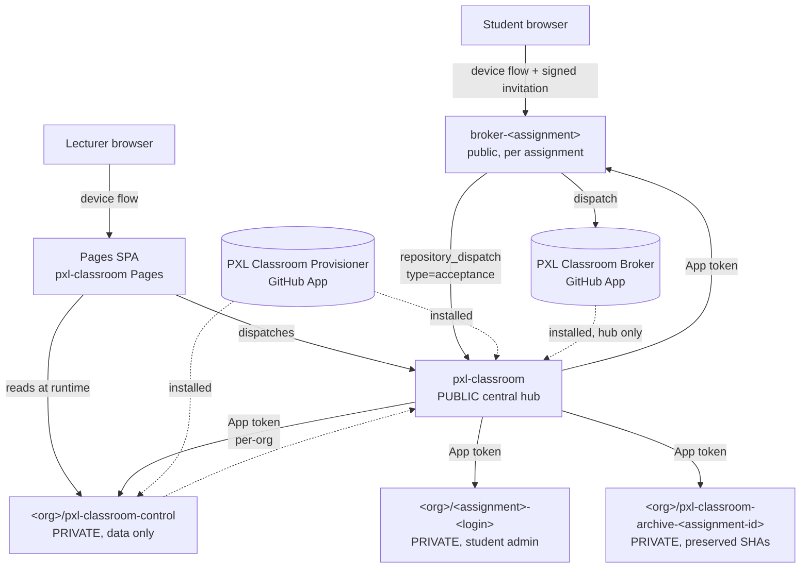

# PXL Classroom - Architecture & Technical Specification

A GitHub-native assignment distribution and submission-reporting system for higher education. Targets **GitHub Team for Education** (never GitHub Enterprise). Replaces the subset of GitHub Classroom that PXL relies on, with a model that lets students keep repository-administrator access - including secrets, environments, self-hosted runners - so course materials can teach Actions properly.

This document is the single technical reference for the system, and it describes the system **as it is**. Why a shape or a rule exists - what broke, what was measured, what was rejected - is in [LESSONS.md](LESSONS.md), searchable by the wording of the thing it explains. Operating procedure is in [RUNBOOK.md](RUNBOOK.md); visual rules are in [DESIGN.md](DESIGN.md).

---

## Contents

- [1. Purpose & scope](#1-purpose--scope)
- [2. Platform constraints](#2-platform-constraints)
- [3. System topology](#3-system-topology)
- [4. Trust model](#4-trust-model)
- [5. Data model](#5-data-model)
- [6. Operational model - minimal-minutes (Wave 8)](#6-operational-model---minimal-minutes-wave-8)
- [7. Central workflows reference](#7-central-workflows-reference)
- [8. Composite actions reference](#8-composite-actions-reference)
- [9. End-to-end flows](#9-end-to-end-flows)
- [10. Frontend](#10-frontend)
- [11. Deadlines, evidence, lock-down, preservation](#11-deadlines-evidence-lock-down-preservation)
- [12. Notifications & audit](#12-notifications--audit)
- [13. Reliability, scale, rate limits](#13-reliability-scale-rate-limits)
- [14. Multi-organization architecture](#14-multi-organization-architecture)
- [15. Constraints accepted in v1](#15-constraints-accepted-in-v1)
- [16. Deferred to v2](#16-deferred-to-v2)
- [17. Retention](#17-retention)
- [18. Acceptance criteria (v1)](#18-acceptance-criteria-v1)

---
## 1. Purpose & scope

**The system shall:**

- Let a lecturer define an assignment from a private GitHub template repository.
- Distribute one acceptance link per assignment.
- Provision one private repository per student, with administrator access to the student.
- Preserve an instructor-controlled record of configuration, acceptances, observations, and deadline state.
- Report activity before and after a deadline, including late activity.
- Operate using only GitHub-hosted services (no external server, no external database).

**Non-goals.** Plagiarism detection; preventing every form of late modification; treating Git commit author/committer dates as authoritative submission times; LMS grade export; guaranteeing tamper-proofing against a malicious organization owner.

---

## 2. Platform constraints

The system runs using only:

- GitHub organizations, repositories, REST/GraphQL APIs, and webhooks.
- GitHub Actions workflows and composite actions.
- GitHub Pages (public; access-controlled Pages is an Enterprise feature and is **never** used).
- Two GitHub Apps (§3.2): a *Provisioner* installed on every participating organization, and a *Broker* installed on the hub repository alone.
- GitHub-hosted runners (lecturer-managed self-hosted runners are permitted per assignment, but the system itself never depends on one).

**No GitHub Enterprise capability is permitted as a dependency, option, or fallback.** Audit-log API, push-event audit records, and private Pages are not used.

All authoritative application data lives in instructor-controlled private repositories. No privileged credential is embedded in the static frontend, committed to source, written to Pages output, or stored in a student-controlled repository.

### 2.1 Deployment configuration

Everything specific to *one institution's installation* lives in **`deployment.yml`** at the repository root. A fork edits that file and nothing else:

| Key | What it decides |
|---|---|
| `claim_domains` | Default email domains `roster_mode: claim` accepts, when an assignment declares none |
| `timezone` | Default IANA zone for assignment dates |
| `hub_owner` / `hub_repo` | The organization and repository this hub runs from |
| `app_slug` | The GitHub App's slug, used to read its live declaration |
| `app_client_id` | The App's public `Iv23…` client id. Not a secret — the device flow puts it in the bundle. It is here because it was spelled out in both `lib/audit.mjs` and `frontend/src/lib/config.js`, and "which App is this deployment" needs one home |
| `control_repo` | Name of the per-org control repository |
| `archive_repo_prefix` / `legacy_archive_repo` | Where preserved submissions go (§11.3.1) |
| `device_flow_proxy` | The **primary** device-flow proxy, and the one security-relevant value here: whatever answers sees the access token, so a fork points this at a proxy it operates (§10.2.1) |

The product name — *PXL Classroom* — is the software, not the deployment, and stays.

It is **YAML data, not a module**: this is a file people are meant to open and edit, so every key carries a comment saying what it does and what breaks if it is wrong. It is the same format the repository already configures itself with (`limits.yml`, `participating-orgs.yml`).

Two readers, because the runtimes genuinely differ and neither should be pretended away:

- **`lib/deployment.mjs`** — `node:fs` + the `yaml` package, for the hub's workflows, scripts and CLI. It throws at import time if a required key is missing, so a broken configuration fails at startup rather than as a confusing error hours later.
- **`frontend/src/lib/deployment.js`** — the same file, inlined by Vite at build time (`?raw`) and parsed with the `yaml` package the bundle already ships for the roster import.

One source file, no generated copy to drift.

**Isomorphic modules must never statically import a Node builtin.** The modules under `lib/` are shared byte-for-byte between the hub and the browser, and Vite *externalizes* builtins rather than failing the build, so the symptom is a blank page on the first route that loads the chunk and `npm run build` stays green. Two sanctioned ways to hold the line:

- **Take the configuration as a parameter.** `resolveClaimDomains(assignment, defaults)` requires its defaults from the caller and throws a message naming both readers when they are absent.
- **Import `#deployment`.** Node resolves it to `lib/deployment.mjs` through the root `package.json` `imports` field; the browser resolves it to `frontend/src/lib/deployment.js` through `resolve.alias` in `frontend/vite.config.js`. One `deployment.yml`, two loaders, identical export surfaces. `lib/audit.mjs` and `lib/archive-repo.mjs` use it, their functions being called from too many places to thread a parameter through.

A builtin behind a **dynamic** `await import(...)` inside a function is deferred and therefore safe — `lib/yaml.mjs` relies on this so `parseYaml` can be bundled while `loadYaml` stays Node-only. `tests/spa-bundle-safety.test.mjs` walks the SPA's import graph transitively and fails on any static builtin.

`deploy-frontend.yml`'s path filter names `deployment.yml`, because the SPA bakes these values in at build time. `tests/deploy-paths.test.mjs` fails if any build-time import escapes the filter.

**A value here is READ, never re-spelled — and `tests/deployment-literals.test.mjs` enforces it.** "A fork edits that file and nothing else" was aspiration rather than fact: the 2026-09-01 audit counted 49 occurrences of the literal `pxl-classroom-control` across 29 files while `CONTROL_REPO` was exported by both readers and consumed by `lib/audit.mjs` alone, and `hub_owner`, the client id and `timezone` were written out the same way. `timezone` was the sharpest case — exported by both readers, validated as *required* by `lib/deployment.mjs`, and read by **nothing**, while the value actually in force was a literal in `frontend/src/lib/config.js` and three more in `AdminView.vue`. Editing `deployment.yml` changed neither what a lecturer saw nor what the Admin Panel wrote into every assignment.

The rule now has two halves, because the runtimes differ:

- **JavaScript imports the reader.** Anything under `lib/`, `scripts/`, `cli/src/`, `frontend/src/` or an entry-point directory reads `#deployment` (or `lib/deployment.mjs` directly, in Node-only code). `frontend/src/lib/config.js` is a *view* onto it, not a second source: the `VITE_*` overrides that duplicated deployment facts are gone, and what remains a build knob is only what genuinely varies per build (`VITE_DEFAULT_ORG`, `VITE_ASSIGNMENTS_URL`).
- **YAML cannot import, so it is checked.** The workflows keep the literal; the test derives it from `deployment.yml` and fails naming every file still holding the old name. `cors-worker/worker.js` is checked the same way (`tests/cors.test.mjs`): it is deployed standalone by `wrangler` with no access to the repository at runtime, and its `ALLOWED_ORIGINS` was the one place a fork had to edit *after* everything else already worked.

---

## 3. System topology


```mermaid
graph TD
    Student[Student browser] -->|device flow + signed invitation| Broker
    Lecturer[Lecturer browser] -->|device flow| Pages
    Pages[Pages SPA<br/>pxl-classroom Pages] -->|reads at runtime| ControlRepo
    Pages -->|dispatches| Hub

    Broker[broker-&lt;assignment&gt;<br/>public, per assignment] -->|repository_dispatch<br/>type=acceptance| Hub

    Hub[pxl-classroom<br/>PUBLIC central hub] -->|App token<br/>per-org| ControlRepo
    Hub -->|App token| StudentRepo
    Hub -->|App token| Archive
    Hub -->|App token| Broker

    ControlRepo[&lt;org&gt;/pxl-classroom-control<br/>PRIVATE, data only] -.-> Hub
    StudentRepo[&lt;org&gt;/&lt;assignment&gt;-&lt;login&gt;<br/>PRIVATE, student admin]
    Archive[&lt;org&gt;/pxl-classroom-archive-&lt;assignment-id&gt;<br/>PRIVATE, preserved SHAs]

    App[(PXL Classroom Provisioner<br/>GitHub App)] -.installed.-> ControlRepo
    App -.installed.-> Hub
    BrokerApp[(PXL Classroom Broker<br/>GitHub App)] -.installed, hub only.-> Hub
    Broker -->|dispatch| BrokerApp
```

Five repository roles, **two** GitHub Apps, one Pages site.

### 3.1 Repository roles

| Role | Visibility | Count | Owns |
|---|---|---|---|
| **Central hub** - `PXL-Digital-Application-Samples/pxl-classroom` | Public | 1 | All workflows, composite actions, scripts, frontend source, schemas |
| **Control repo** - `<org>/pxl-classroom-control` | Private | 1 per org | Assignments, roster, acceptances, repositories, observations, lockdowns, reports, overrides, public |
| **Broker repo** - `<org>/broker-<assignment-id>` | Public | 1 per assignment | A single workflow that verifies a signed invitation and dispatches to the hub |
| **Archive repo** - `<org>/pxl-classroom-archive-<assignment-id>` | Private | 1 per assignment | Preserved submission SHAs as branches |
| **Student repo** - `<org>/<repository_name_pattern>` | Private | 1 per accepted student | The student's own work |

Workflows live **only** in the central hub. Control repos hold data; they contain no `.github/workflows/` directory. This is what makes the system upgradable in one place and keeps participating-org Actions budgets near zero.

### 3.2 The two GitHub Apps

**Why two.** A broker is a *public* repository, one per assignment, and it needs a credential to dispatch into the hub. The Provisioner's key on that repository would put administration over every participating organization on a public host, so each App's key is worth exactly what its App is allowed to do and no more (§4.3.0).

| | **PXL Classroom Provisioner** | **PXL Classroom Broker** |
|---|---|---|
| Does | Everything: provisioning, collection, lock-down, preservation, reporting, and the SPA's own authentication | One call - `POST /repos/.../dispatches` into the hub |
| Installed on | Every participating org (all repositories) **and** the hub repo | The hub repo **only** |
| Permissions | The table below | `contents: write`, nothing else |
| Key lives on | The hub's `provisioning` environment, nowhere else | The `provisioning` environment **and every public broker** |
| If the key leaks | Administrative control of every participating organization | The ability to submit an acceptance the signature check already gates |

The Broker App deliberately has **no `actions: write`**, so a leaked broker key cannot dispatch a hub workflow either. Its narrowness is the whole point; do not widen it. Created by `scripts/create-broker-app.mjs` (INSTALL.md §10), which fills in the permission set from a manifest so nobody ticks a box by hand.

#### 3.2.1 The Provisioner's permissions

`PXL Classroom Provisioner`, with:

| Scope | Permission | In Manifest? | Used by |
|---|---|---|---|
| Repository: Actions | Read/Write | Yes | Dispatching hub workflows from the SPA / Admin UI |
| Repository: Administration | Read/Write | Yes | Provisioning repositories, lock-down demotion |
| Repository: Contents | Read/Write | Yes | Provisioning (template copy), commits to control repo & archive |
| Repository: Issues | Read/Write | Yes | Creating tracking & notification issues in control repo |
| Repository: Checks | Read | Yes | Reading a grade out of CI: `GET /repos/{o}/{r}/commits/{ref}/check-runs` and the annotations behind it (§11.6) |
| Repository: Metadata | Read | Yes | Repository queries and baseline checks |
| Repository: Pull Requests | Read/Write | Yes | Feedback PR orchestration |
| Repository: Secrets | Read/Write | Yes | Setting Actions secrets during provisioning |
| Repository: Workflows | Read/Write | Yes | Provisioning Actions workflows in student repositories |
| Repository: Actions Variables | Read/Write | Yes | `publish-assignment.yml` configures a broker with five `gh variable set` calls |
| Organization: Administration | Read/Write | Yes | Enhanced Billing for the weekly usage report, and `default_repository_permission` on `GET /orgs/{org}` - both need **read**. Declared at **write** deliberately: §11.2.1's org-scoped lock-down needs it, and a reduction is instant while restoring one needs all twelve org owners to approve |
| Organization: Members | Read/Write | Yes | **Read is what is used** - `unfreezableAcceptorsFinding` lists `GET /orgs/{org}/members?role=admin` to find acceptors who are org owners and so cannot be frozen (§11.6). Nothing in the system writes org membership; swept three ways on 2026-08-31 and the only membership call in the source is that GET. Declared at `write` for the same reason as Administration - `roster_mode: org_member` enrolled by org invitation and would need it back, and re-acquiring costs twelve approvals |
| Account: Email addresses | Read | No (Manual) | **Required by the claim flow.** A student confirms one of their own GitHub-**verified** addresses, which is a user-to-server read of `/user/emails` - an installation token cannot do it at all |

Account permissions are declared on the App and set by the App owner alone: they are **not** part of the manifest's `default_permissions`, and no organization owner approves them. **`emails` is the only one**, and it is the one thing added by hand after App creation. They are tracked in `ACCOUNT_APP_PERMISSIONS` in `lib/audit.mjs`, kept separate from `MANIFEST_APP_PERMISSIONS` because `EXPECTED_APP_PERMISSIONS` spreads the latter and is compared against an **installation** — which never carries an account permission, so a name in the wrong constant reports every organization as permanently drifting on something nobody can approve. `GET /apps/{slug}` does list them, so that is where `missingAccountPermissions` checks, and `scripts/check-app-declaration.mjs` reports a gap as a **warning** rather than a failure, because these need no approval round. **The API key is `emails`, not `email_addresses`** - the App settings toggle reads "Email addresses", and only the API spelling matters to the checks.

The App is installed:

- On `PXL-Digital-Application-Samples`, **scoped to `pxl-classroom` only**. This installation is what lets the **SPA** dispatch hub workflows on a lecturer's behalf: the SPA dispatches `publish-assignment`, `retry-acceptance`, `setup-org`, `daily-activity`, `regenerate-dashboard`, `sync-starter-code`, `weekly-usage-report` and `deploy-frontend` with a user-to-server token, and `actions: write` on this installation is what authorizes that. **Not `open-feedback-prs`** — the SPA opens those pull requests client-side (§11.4), which is why that classifier has three implementations to keep in step. Nothing mints a Provisioner token for the hub org otherwise; the broker's dispatch is the Broker App's job.
- On each participating org (`PXLAutomation`, `PXLCloudAndAutomation`, etc.), **scoped to all repositories**. The hub mints per-org tokens at workflow runtime for provisioning, collection, lock-down, preservation, and archive operations against the target org.

The App is created via the one-shot Manifest flow at the hub's `/setup` Pages route (see INSTALL.md §2).

---

## 4. Trust model

[4.1 What is authoritative](#41-what-is-authoritative) · [4.2 Identity](#42-identity) · [4.3 Bounded blast radius](#43-bounded-blast-radius) · [4.4 Lock-down semantics](#44-lock-down-semantics)

### 4.1 What is authoritative

- **Authoritative:** the per-org control repository. It holds assignments, roster, acceptances, repository IDs, observations, reports, overrides. Students never have read or write access.
- **Not authoritative:** student repositories. Students hold admin so the course can teach Actions, secrets, environments, runners - but that means students can rewrite history, disable Actions, alter workflows, and delete the repo. The system treats student repos as observable, not trustworthy.

### 4.2 Identity

- **Lecturers** authenticate to the SPA via GitHub device flow against the Provisioner App. Authorization derives from organization ownership: any owner of an org where the App is installed is a lecturer in that org. The SPA reads control-repo data with the **lecturer's own token**; no per-user secret on the server side.
- **Students** authenticate to the SPA via the same device flow. Acceptance gating is per assignment, via `roster_mode`. Under `enforced` the student's GitHub login must be registered in the control repository's `students/roster.yml` for their acceptance to be processed and their repository provisioned. Under `open` any GitHub account may accept within the window and below the cap, and the lecturer reconciles `github_login` -> student afterward; unrecognised `roster_mode` values fail closed to `enforced`.
- **Automation** authenticates as the App, using short-lived per-org installation tokens minted at workflow runtime.

### 4.3 Bounded blast radius

Four things can be compromised, and each is bounded to what it can reach. The subsections below are the mechanisms behind those bounds.

- **Public broker compromise.** A broker workflow mints a token for the `pxl-classroom`-scoped installation and dispatches into the hub. The *private key* it does that with is bounded too (§4.3.0), so a broker compromise buys the ability to submit an acceptance - which the signature check already gates - and nothing else. §4.3.1 is a hard rule rather than a style preference: it is what keeps attacker code out of the job in the first place.
- **Hub compromise.** The hub is public. Branch protection on `main` (force-pushes and deletions blocked, including for administrators), secret scanning, and push protection are what make this safe; CI runs on every push and fails loudly. A bypass of those controls is the actual concern - see ADMIN.md §5 - and §4.3.4 bounds what a hub credential is worth to someone who does obtain one.
- **Per-org control-repo compromise.** Restricted to that single org's data.
- **Student-repo compromise.** Contained to that student's repository. Student tokens never see the App's installation tokens.

#### 4.3.0 The broker holds its own credential, not the provisioning App's

A broker is public, one per assignment, and it holds a private key as a repository secret. The only safe key to put there is one that buys nothing worth having, so brokers carry the **Broker** App's credential - `PXL_BROKER_CLIENT_ID` / `PXL_BROKER_PRIVATE_KEY` - installed on the hub repository alone and holding `contents: write` alone, which is exactly what `POST /repos/{owner}/{repo}/dispatches` requires and nothing more. It has no `actions: write`, so a leaked broker key cannot dispatch a hub workflow either.

**Scoping the minted token is not a substitute for this.** `owner:` + `repositories:` narrows the *token*; the *secret* is what is stored, and anyone with admin on one course organization can push a workflow to that org's broker and read it out. The provisioning App's key must therefore never reach a broker at all. ([LESSONS.md](LESSONS.md): *"The master App key was on ELEVEN PUBLIC REPOSITORIES"*.)

Four rules hold this in place:

- **Publishing fails closed.** `publish-assignment.yml` refuses to publish when the broker credential is unset, rather than falling back to the App key - a fallback would make the whole change cosmetic. It also *mints a token with it first*, so a broker App that is missing, uninstalled or under-permissioned fails in the lecturer's own publish run instead of silently at the first student's acceptance.
- **Republishing is the migration.** Ceasing to write a secret does not delete it, so publish actively removes `PXL_APP_PRIVATE_KEY` and `PXL_APP_CLIENT_ID` from the broker - **after** pushing the new workflow, never before, because the old broker workflow still reads the old secret and deleting first would break acceptance in between. INSTALL.md §10 covers sweeping every live assignment.
- **The token is narrowed as well as the secret.** `permission-contents: write` on the mint step, so an over-granted broker App still yields a minimal token.
- **`tests/workflow-hardening.test.mjs` fails** if either file references the provisioning App's credential again, if publish stops removing the legacy secret, or if the removal moves above the workflow push.

#### 4.3.1 No attacker-controlled text may reach a shell on a broker

A broker repository is public, carries the broker App's private key as a repo secret, and has issues enabled so the SPA can post group-acceptance payloads. Any GitHub account can therefore fire its workflow.

The hazard is a single interpolation: `${{ }}` is substituted into a `run:` block's script *text* before the shell sees it, so `BODY="${{ github.event.issue.body }}"` turns an issue body of `"; <command>; echo "` into arbitrary commands in a job that goes on to mint an App token - reachable by anyone, against every participating org.

Three invariants close it, enforced by `tests/broker-injection.test.mjs`:

- **No workflow composes a script out of a value.** The question is never who can reach a value but whether it is a literal somebody wrote. Everything else arrives through `env:`, where it is data. The guard allowlists only run-scoped facts GitHub sets itself, and covers composite `action.yml` files as well as workflows. It is deliberately **not** narrowed to broker-reachable values: a rule phrased around reachability leaves standing exactly the sites that run with a hub credential in scope, such as `retry-acceptance.yml`, which provisions for an arbitrary login with the deadline bypassed.
- **The broker never reads the issue body.** It forwards the issue *number* and its own repository; `scripts/read-team-payload.mjs` runs in the hub, fetches the issue with the hub's token, and validates it (`lib/team-payload.mjs`). `acceptance/action.yml` has no `client_payload` fallback for the team inputs, so no unvalidated value can reach `accept.mjs` by any path.
- **The broker reads the issue title only through `env:`, and only to match `^team:<slug>$`.** The hub's concurrency group is evaluated at dispatch time, before the body can be read, so the broker must supply the slug for it. That value is a **concurrency key only** (`client_payload.team_hint`); the authoritative team comes from the hub's own read. Sequential concurrency per team is what guards team capacity without a distributed lock (§5.6), so it cannot simply be dropped.

Team names are also stripped of control characters before use: outputs are written as `name=value` lines to `GITHUB_OUTPUT`, so an embedded newline would forge outputs downstream.

#### 4.3.2 Signed invitations - what stops an outsider triggering work

Acceptance is triggered by a public event on a public repository. Every event an unprivileged account can fire there - star, fork, issue, comment, wiki edit - is open to any GitHub account on earth, and none of them prove authorization. The trigger is a doorbell, not a key; authorization happens after it, against data the caller cannot forge.

Roster gating (§4.2) is that authorization, but it runs in the hub, *after* the broker has minted an App token and the hub has cloned the private control repo. A stranger's star therefore used to cost two workflow runs, two token mints and a clone. **Signed invitation tokens move the first check to the edge**, before any credential is in scope.

- `publish-assignment.yml` signs `{version, key id, subject, expiry, nonce}` with the hub secret `PXL_INVITE_SIGNING_KEY` and records the token in the assignment YAML - in the **private** control repo. It must never reach Pages output; `pages/generate.mjs` selects fields explicitly and the privacy scanner is the backstop.
- The subject is `sha256("<org lowercased>/<assignment-id>")` truncated to 16 bytes, so a link does not advertise what it opens and a token for one assignment cannot open another broker.
- Everything the broker needs travels in the **issue title**, not the body. That is what lets it read what it needs without touching attacker-controlled body text (§4.3.1).
- The broker checks out the public hub - no credentials - and verifies before minting. **Verification is asymmetric because the verifier is public.** An HMAC would put the minting secret on every broker; a public key is safe to publish by definition. Encryption is the wrong primitive: the broker cannot hold a decryption key either, and on a public channel ciphertext replays exactly as well as plaintext.
- `vars.INVITE_ENABLED` and the `pxl-accept:` title prefix are checked in the workflow's **job-level `if`**, which GitHub evaluates before allocating a runner.

**What lands in the title is a signature, not the invitation.** Every acceptance opens an issue on a public repository; GitHub emits an `IssuesEvent` carrying the title; GH Archive mirrors that firehose into a permanent public dataset. `GET /repos/<org>/<broker>/events` is unauthenticated and returns titles from issues that have since been deleted. Redaction, deletion and the exposure sweep below are therefore all *after the fact* - the `opened` event has already gone out, and rotation kills a token without unpublishing it.

Hiding the title is not available either: every student-initiated trigger on a public repository emits a public event, and there is no private transport without self-hosting. So what lands in the event is made **insufficient on its own**:

- **The link carries a private key**, minted per assignment by `publish-assignment.yml` and stored as `invite_key` in the private control repo. The public half goes onto the broker as the `INVITE_PUBKEY` variable, where it is not a secret at all.
- **The student's browser signs** an assertion naming their own GitHub account, and only the signature reaches the title. Replaying it requires being that account; forging one requires the key, which appears in no event.
- **The payload is 19 binary bytes** - a version, eight bytes of `sha256(assignment id)`, a 48-bit account id and a four-byte nonce - which is 26 base64url characters and makes the whole title 127, or 196 with the longest team hint GitHub will accept. **The subject is hashed rather than carried**, so the title's length does not depend on how long a lecturer made the assignment id.
- **The broker checks the signer against the issue author**, comparing the signed account id to `github.event.issue.user.id` before minting anything. It is the **only** place that check happens: the dispatch carries a login and an id, never the title, so the hub has no signature to re-verify. Nothing may describe it as checked twice - that invites the broker's check to be relaxed on the strength of a second one that does not exist.
- **The accepting account is one field, read once.** `github.event.issue.user` decides who signed, who is validated, who is dispatched and how the run is serialised. `github.actor` and `sender.id` agree with it for a freshly opened issue and diverge silently for one opened through an App on a user's behalf, so neither is read.
- **ECDSA P-256, not Ed25519.** Ed25519 reached WebCrypto in Chrome only in May 2026, leaving roughly a fifth of browsers unable to sign at all; P-256 is universal in browsers and in Node's `crypto.subtle`, so `lib/acceptance-signature.mjs` serves the SPA, the broker and the hub from one module. Ed25519 stays on the Node-only paths it already owns - the invitation token itself is still signed with it.

**The title budget is 256 characters, and it is ours rather than GitHub's.** GitHub enforces 1024 - measured against the live API, 1024 is accepted and 1025 refused - but its own 422 on the latter says *"title is too long (maximum is 256 characters)"*. Building on the enforced 1024 would mean building on something GitHub's own validator calls invalid, so 256 stands, and the title has to fit inside it with the longest team hint attached. That is what the binary payload buys. Titles round-trip byte-identically, whitespace and tabs included, so a signature over those bytes still verifies afterwards; verification compares bytes, and any normalisation would break every acceptance.

**The team hint is appended after signing, and the verifier cuts it off.** `verifyAcceptanceTitle` reads only the first whitespace-delimited token - never a split on `.`, which would hand the verifier `<signature> team:alpha` and reject every group acceptance as malformed while individual acceptance worked perfectly. Trailing content is ignored rather than refused, deliberately: the hint is a concurrency key and never an authoritative value (§5.6), and the hub re-derives the real team from the issue body.

The floor this leaves: a caller without a valid token costs one boot on a free public runner and touches nothing private. `tests/invite-token.test.mjs` pins the ordering - no step before verification may reference a secret.

**The invitation is not a secret in the sharing sense.** Anyone the link reaches can accept; that is an accepted risk bounded by `max_acceptances` and closing the assignment (§15). What it prevents is an outsider who never had the link causing work to happen. The signature changes only *where* that boundary holds: the link is still a capability, but it is no longer published by the act of using it.

**A legacy trigger issue is redacted, not closed.** A legacy token travels in the issue title, on a repository that is public by construction, and closing and locking an issue hides nothing - a closed, locked issue on a public repo is still readable, still listed, and still returned by GitHub's issue search. That would publish the assignment's token to anyone who looked, and take §4.3.3 with it: the acceptance card is named `sha256(invite_token)`, so a public token is a public card and, for a group assignment, a public list of member logins. Two steps therefore run:

- **The broker redacts the title in seconds**, on both the accepted and the rejected path, using `gh issue edit --title` - which needs only `issues: write`, so it adds no credential to a repository that already holds a key. The reject path matters because `wrong-assignment` means a *live* token for another assignment was posted there.
- **System Health sweeps for survivors.** Tier 4 lists the broker's issues and reports any title still starting with `pxl-accept:` - which catches an `INVITE_ENABLED=false` that skips the job before cleanup, and a run that died mid-flight. It does not guess why: the acceptance-handler run for each leftover carries the reason. It runs even when the assignment's own `invite_token` is missing or malformed, because a leftover issue is a published credential regardless.

**Deleting the issue is not available.** `deleteIssue` is GraphQL-only and refuses an App installation token outright - `{"type":"FORBIDDEN","path":["deleteIssue"],"message":"Viewer not authorized to delete"}` - and it is not a missing permission: the same token reads the issue two steps earlier, and creates the broker and writes its secrets in the same publish run. A **user** token with repository admin deletes it immediately, and GitHub's own answer for the identical error is "use a personal access token". This system holds none, deliberately: a long-lived user credential on the hub would trade §4.3.4 away for housekeeping. Redaction is the mitigation, and on a migrated assignment the title is a signature rather than a credential, so what survives in the timeline grants nobody anything.

**Residual, accepted.** For a legacy assignment the residual is not the window between the student's POST and the redaction - the `opened` event carries the title permanently out of reach of both steps, which is what made the signature necessary in the first place. What they still buy is the *browsable* copy: the issue list, GitHub's search, and the timeline entry a rename leaves behind. `tests/invite-exposure.test.mjs` pins them.

For a migrated assignment the published title is a signature over `{assignment id, github id}`. It is bound to the account that authored the issue, whose login is public on that issue anyway, so the residual is that an observer learns *who accepted what* - the same fact the issue itself already stated. It cannot be replayed by anyone else and cannot be turned back into the key.

#### 4.3.2a The invitation's lifecycle - migration, rotation, retirement

§4.3.2 is how a signed invitation is verified. This is what happens to one over its life: an assignment moves onto the signed path, a lecturer rotates a link, and students holding a superseded one have to land somewhere honest.

**Migration is per assignment, and the switch point is the key.** Every broker checks the hub out at `ref: main`, so an un-republished broker already runs the newest verifier. It takes the signed path only when it is sent **both** a title and a public key: a republished broker sends the title immediately, but the assignment has no keypair until a publish mints one, so activating on the title alone would reject every acceptance in between. A legacy title arriving at a migrated broker is refused as `legacy-link` - named, not called malformed, because the student's link is out of date rather than mistyped.

**Revocation** has two halves, retired together. The nonce is mirrored to the broker's `INVITE_NONCE` variable; the acceptance keypair's public half is mirrored to `INVITE_PUBKEY`. Republishing reuses **both**, so a repair does not break links already handed out - the same contract the nonce has always had, and for the same reason. `regenerate_invite: true` mints a fresh nonce *and* a fresh keypair, and every earlier link stops working. Invitation-signing key rotation is the separate `kid` field, with old public keys retained until their assignments close. See INSTALL.md §3.1.

**A retired link resolves to a page that says it was retired**, whichever way it was retired. Migration and rotation both take working links out of students' hands, and those students have done nothing wrong and cannot tell. Two mechanisms cover the two cases, and neither records a retired secret anywhere - a list of them on the assignment would be one more field `buildDoc` could silently drop. **Migration:** the assignment still carries the token it is no longer using, so `pages/generate.mjs` writes a marker at that digest directly. **Rotation:** the old key is gone from the document, but its *card* is still on the site at a digest nothing publishes any more - and that card names its own assignment, so the prune converts it into a marker instead of deleting it when the assignment is still being published. A group assignment's teams file is always pruned rather than retired, so a superseded link cannot fetch the cohort list. Markers are pruned with their assignment, or every rotation would leave one behind for ever. Either way the file is a contentless card at the digest of the superseded secret - `{superseded: true, assignment_id, title, organization}`, no acceptance data, deliberately not shaped like an assignment - and the SPA renders "This invitation link is out of date. Ask your lecturer for the current one." Without it the student lands on the not-found page, whose only honest wording is a guess between three causes; a page may not guess why it is stuck - the same rule the provisioning wait screen is built on. The lecturer's half is the Admin Panel warning on the one republish that cannot preserve the links. `tests/superseded-invitation.test.mjs`, `tests/e2e/43-superseded-link.spec.mjs`.

**Where the invitation is recorded, and who reads it back.** The token, nonce and expiry live as three lines in the assignment's YAML in the private control repo. `lib/invite-token-format.mjs` owns both halves of that - `readInviteField` / `parseInviteFields` for reading, `quoteInviteValue` for writing - because a reader that drifts from the writer is a lecturer holding an empty link box. Two rules fall out of it:

- **The nonce is written quoted.** Eight hex characters are all digits about one time in forty, and an all-digit nonce with a leading zero round-trips through a YAML parser as an integer - `01234567` returns as `1234567`. `set-assignment-invite.mjs` then fails its own `^[0-9a-f]{8}$` check, concludes there is no reusable nonce and mints a fresh one, retiring every link already handed out on a republish whose entire contract is that it does not.
- **The parse is a line-based regex, not a YAML round trip.** The module is imported by `lib/invite-token.mjs`, which the broker runs from a bare hub checkout with no `npm ci`; a dependency here would put npm on a credential-bearing public repository. It also keeps the reader and the writer working on the same representation, so a round-trip test exercises the real thing rather than two parsers that happen to agree.

#### 4.3.3 What the public Pages artifacts disclose

GitHub Pages is public and access-controlled Pages is an Enterprise feature the system never uses (§2), so everything published is world-readable. Two rules follow: nothing published may be a capability, and "unlisted" may never be a UI convention standing in for a property.

The acceptance card now lives at `data/<org>/i/<sha256(link secret)>.json`, and a group assignment's teams file beside it as `<sha256>.teams.json`. The link secret is the assignment's `invite_key` once it has migrated to signed acceptance and its `invite_token` while it has not; `linkSecretFrom` in `lib/invite-token-format.mjs` is the single answer to which, shared by the generator, the Admin Panel and the diagnostic engine, because three copies of that rule would be a 404 for every student the first time they disagreed. Consequences:

- **Finding the card requires the link.** The filename is a digest of the secret, so it cannot be derived from an assignment id or guessed.
- **A leaked filename is not a working link.** The digest is published; the secret is not, and one does not yield the other.
- **The teams file stops being a public cohort list.** It carries member logins, which is the roster by another name. It sits behind the *live* digest only - a superseded link cannot fetch it.
- **The privacy scanner gates it.** `pages/scan.mjs` fails the publish on anything matching either wire shape - the token's `<35>.<86>`, and the key's PKCS#8 header, which is byte-identical in every P-256 key and so catches a partial paste as well as a whole one. The public half is deliberately not matched: it lives on a public broker by design, and a permanent false positive beside the real findings is how a gate stops being read.

`assignments.json` survives, reduced to `id`, `title`, `organization`, `opens_at`, `deadline_at`, `timezone`, `repository_name_pattern`, `assignment_type` and `state`. It exists for exactly one reason: the student portal at `/` matches a signed-in student's own repositories against assignments, and **students cannot read the control repo**, so that list has nowhere else to come from. Everything an outsider could use to size up or reach an assignment - broker repo, roster mode, cap, accepted count, description, group config - is on the invitation card instead. `tests/public-data-contract.test.mjs` pins both halves.

**The residual is deliberate.** An outsider can still enumerate assignment titles and deadlines per org. After §4.3.2 that discloses course structure; it grants nothing, because acceptance needs a signed invitation. Removing it entirely would mean either breaking the student portal or writing per-student data to a public site, and neither is a trade worth making for a title.

A second card is written at the digest of a secret the document still carries but which is **no longer the link** - the pre-migration token, once a keypair exists. It holds `{superseded: true, assignment_id, title, organization}` and nothing else: no state, no deadline, no cap, no broker, and deliberately no `assignment` key, so a browser running a build cached from before this shape existed falls through to its own not-found state instead of rendering half an assignment with an Accept button. All three fields it does carry are already in `assignments.json`, so it discloses nothing new. See §4.3.2 for why it exists at all.

The link secret is in the URL path, so `frontend/index.html` sets `<meta name="referrer" content="no-referrer">` - otherwise every cross-origin subresource, Google Fonts included, would receive it as a `Referer` header.

#### 4.3.4 Hub defence in depth

`workflow_dispatch` runs the workflow file from whichever ref the caller names, and the `participating-orgs` branch carries deliberately lighter protection (§5.5) so automation can commit the org registry to it. Those two facts compose into a way to run hub code at an attacker-influenced ref with the App private key in scope. §4.3.1 and §4.3.2 close the realistic route to *obtaining* that key; this bounds what holding one would be worth.

- **Every job holding a hub credential names the `provisioning` environment**, whose deployment branch policy allows `main` only. A job that names an environment does not start when the run's ref falls outside that policy - so the branch-ref path is closed by the reference itself, independent of where the secret is stored. `tests/workflow-hardening.test.mjs` fails if a new one forgets — which is the guarantee, rather than a count here that goes stale the next time a workflow gains a job.
- **The admin workflows refuse an automated dispatch.** `setup-org.yml`, `retry-acceptance.yml` and `publish-assignment.yml` reject a `workflow_dispatch` whose actor ends in `[bot]`, as the first step, before anything mints a token. A lecturer dispatches as themselves through the SPA or the Actions tab; an App installation token - what a stolen broker credential would be - arrives as `<slug>[bot]`. `retry-acceptance` can provision for an arbitrary login with the window bypassed and `setup-org` creates org-level state, so neither should be reachable by a credential rather than a person.
- **Hub credentials are never exposed at workflow or job level**, only on the steps that need them, so a third-party action elsewhere in the job never sees one.

- **The signing keys live only on the environment.** `PXL_APP_PRIVATE_KEY` and `PXL_INVITE_SIGNING_KEY` are environment secrets with no repository-level copy, so a job that does not name `provisioning` cannot read them at all - the branch policy and the secret's location now enforce the same rule independently. `PXL_APP_CLIENT_ID` stays a repository secret deliberately: a client id is public by design and ships in the SPA bundle.

**Residual, accepted.** The actor guard does not stop a stolen *user* credential, which acts as its owner - rulesets and the environment are what bound that. Broker repositories still hold a copy of the *broker* App's key, because they must mint a dispatcher token; §4.3.1 and §4.3.2 are what keep that copy out of reach, and §4.3.0 is what makes it worth little if it is not.

### 4.4 Lock-down semantics

At a deadline, automation stops writes to the student's submission ref via the App. **How** it stops them is two independent decisions, not one (§11.2.1): `late_policy: block` freezes the ref with a repository ruleset the App bypasses, and `lock_down_enabled` - which defaults to `true` when the field is absent - demotes the student from admin to `pull`. Either can run without the other, because "cannot push" and "cannot re-run a workflow" have different costs on a course whose subject is Actions, secrets and runners.

Whichever applies, it runs through the org-level App installation - which outranks repo-level admin - so the student cannot self-restore. This is a deterrent, not a tamper-proof control: a student who prepared beforehand may have alternative write paths (added collaborator, deploy key, fork), and under the ruleset they remain repo admin and could delete the ruleset itself - a deliberate, visible act, unlike an arguable timestamp. Reports continue to flag observed late activity; preservation is the safety net.

---

## 5. Data model

[5.1 Control repository layout](#51-control-repository-layout) · [5.2 Distinguish facts, observations, calculations, overrides](#52-distinguish-facts-observations-calculations-overrides) · [5.3 Schemas](#53-schemas) · [5.4 Assignment definition](#54-assignment-definition) · [5.5 Participating-orgs registry](#55-participating-orgs-registry) · [5.6 Group Assignments](#56-group-assignments)

### 5.1 Control repository layout

```
<org>/pxl-classroom-control/
├── assignments/<id>.yml                  # source: assignment definition
├── students/roster.yml                   # source: roster
├── students/claims/<github_id>.json      # fact: account-to-address binding
├── students/claim-attempts/<github_id>.json # counter behind MAX_CLAIM_ATTEMPTS
├── teams/<id>/<team-slug>.json           # source: team definition & members (group assignments)
├── acceptances/<id>/<login>.json         # observation: who accepted, when
├── repositories/<id>/<login>.json        # fact: provisioned repo id, name, url, state
├── observations/<id>/<login>/*.json      # observations: snapshot (sha, ref, time), preservation.json
├── lockdowns/<id>/lockdown-record.json   # fact: lock-down outcome per assignment
├── lockdowns/<id>/sentinel-<key>.json    # observation: the sentinel's push timeline
├── grading/<id>/<login>.json             # calculated: per-student autograder result
├── grading/<id>/summary.json             # calculated: cohort roll-up, joined onto the report by login
├── syncs/<id>/<sync-id>.json             # fact: one starter-code sync run
├── reports/<id>.json                     # calculated: per-assignment report
├── reports/dashboard.json                # calculated: aggregate for the SPA dashboard
├── overrides/<id>/<login>.json           # lecturer override (append-only)
└── public/                               # GENERATED public metadata for Pages
```

### 5.2 Distinguish facts, observations, calculations, overrides

The model explicitly distinguishes:

- **Facts** returned by GitHub (`repo_id`, `repo_url`).
- **Observations** made at a specific time (`observed_at`, `observed_sha`).
- **Calculated** values (`submission_status`, `effective_deadline_at`).
- **Lecturer overrides** (`type`, `reason`, `overridden_by`, `overridden_at`) - append-only; never erase evidence.

### 5.3 Schemas

JSON Schemas live in `schemas/` in the hub and are copied into `frontend/public/schemas/` at build time. The SPA fetches them at runtime to validate user input before commit (Admin Panel).

| Schema | Stores |
|---|---|
| `assignment.schema.json` | Assignment definition (see §5.4) |
| `roster.schema.json` | Roster entries |
| `team.schema.json` | Team manifest and members for group assignments (`teams/<id>/<team-slug>.json`) |
| `acceptance.schema.json` | Per-student acceptance record |
| `claim.schema.json` | One student's account-to-address binding (`students/claims/<github_id>.json`) — org-scoped, private, keyed by the immutable `github_id` |
| `repository-record.schema.json` | Provisioned repo facts |
| `observation.schema.json` | A single submission observation - `snapshot` of the submission ref or a `tagged-submission` produced from `refs/tags/submit/*` |
| `report.schema.json` | Computed per-assignment report |
| `override.schema.json` | Lecturer overrides (8 types, see schema) |
| `participating-orgs.schema.json` | Hub-side registry of participating orgs |
| `limits.schema.json` | Global and per-org weekly usage limits |
| `limits-overrides.schema.json` | Per-repository SKU threshold overrides |
| `grading-result.schema.json` | Per-student autograder result, with the test breakdown |
| `grading-summary.schema.json` | Cohort grading roll-up, joined onto the report by login |
| `sync-record.schema.json` | One starter-code sync run (`syncs/<id>/<sync-id>.json`) |
| `download-manifest.schema.json` | Preserved submission archive download manifest |

### 5.4 Assignment definition

```yaml
schema_version: 1
id: linux-processes-2026             # URL-safe slug
title: Linux Processes
description: Short student-facing description
organization: PXLAutomation
template:
  owner: PXLAutomation
  repository: template-automation-pe-1
  repository_id: 123456789            # optional, immutable
repository_name_pattern: linux-processes-{github_login}
opens_at: 2026-09-21T06:00:00Z        # ISO 8601 UTC
deadline_at: 2026-10-05T21:59:59Z
timezone: Europe/Brussels
submission_ref: refs/heads/main
student_permission: admin             # pull|triage|push|maintain|admin
acceptance_mode: self-service         # self-service is the only implemented mode
roster_mode: open                     # open|enforced - who may accept (§15).
# class_groups: [3A]                   # optional; absent = every group. Which
                                       # roster class_group may accept, when the
                                       # roster is the gate.
                                      # `open` is the default for new assignments.
                                      # open requires max_acceptances.
late_policy: report                   # report|block
state: published                      # draft|published|closed|archived
max_acceptances: 50                   # optional; absent means NO cap
lock_down_enabled: true

# Written by publish-assignment.yml, never by hand. Both secrets are
# capabilities: they stay in this PRIVATE repo and reach Pages only as sha256
# filenames (§4.3.2, §4.3.3). Republishing reuses the nonce, the expiry AND the
# keypair, so links already handed out keep working; regenerate_invite mints new
# ones and retires them.
invite_key: MIGHAgEAMBM...Rgsd            # P-256 private key, 184 chars - THE LINK
invite_pubkey: MFkwEwYHKoZ...LHQ          # mirrored to the broker's INVITE_PUBKEY
invite_token: AQGL...w9NAj9P              # legacy bearer token, 122 chars
invite_nonce: 63ad9fbc                    # mirrored to the broker's INVITE_NONCE
invite_expires_at: 2027-09-27T01:27:18Z
```

**Two secrets, one of which is the link.** `invite_key` is the link on any assignment that has been published since signed acceptance shipped; `invite_token` is the link on one that has not. `linkSecretFrom` decides, once, for every surface (§4.3.3). The token is retained after migration for one reason: its digest is where a student's old link still lands, and that URL has to resolve to a page saying so rather than to a 404.

**`acceptance_mode` has one implemented value**, `self-service`. A `pre-provisioned` mode is a v2 candidate (§16) and is deliberately not offered here: a value in a dropdown that no code path implements silently produces self-service behaviour, which is a trap. With one value left there is no decision to make, so the Admin Panel renders **no control** for it - a select with a single option asks a question the lecturer cannot answer. The field is still written by `buildDoc()` and published on the acceptance card, and the schema still accepts it, so existing YAMLs keep validating.

**`roster_mode` is independent of it.** `acceptance_mode` is *how* a repository is created; `roster_mode` is *who* may accept. `accept.mjs` fails **closed** to `enforced` for any unrecognised value - a rule about garbage, not a default.

**Verified claims fold themselves into the roster; the rest wait for a human.** A claim lands in `students/claims/<github_id>.json` — one file per student, never an edit to `roster.yml`, because acceptance is concurrent and two students accepting at once would clobber one shared file. The roster row therefore still read `github_login: null` afterwards, and making the binding permanent was a CLI command a lecturer had to know existed. `scripts/link-claims.mjs` runs inside the nightly's `collect` job — which already has the control repo checked out, is serialised per org (`concurrency: collect-<org>`) and already commits, so it costs no workflow and no Actions minutes of its own — and folds the claims that need no judgement. **It will not touch three cases**, and that is the whole reason it is safe unattended: a claim GitHub did not verify (the student *typed* the address — `claim_verified: false`, which `lib/claim.mjs` calls worth nothing on its own), a claim naming a different account than the roster row already holds, and an address two accounts claim. Each is a decision with nobody present to make it, so each is left exactly as it is, counted, and named in the run's output — and listed on the Roster tab as *N need your decision*, computed by the same `planClaimPromotion({ verifiedOnly: true })` call the script makes, so the surface a lecturer reads and the job that held the claim back cannot disagree about which ones are waiting. A workflow log is not where a lecturer looks. `planClaimPromotion`'s `verifiedOnly` draws that line and is **false by default**: a lecturer running `pxl-classroom roster promote --claims` still folds a typed address, because they are the review step and they are looking at the plan. The script never fails the nightly — collection, lockdown and reporting do not depend on it — and `--dry-run` writes nothing. `tests/link-claims.test.mjs`.

**`require_claim` lets an open assignment still know who accepted.** `open` collects nothing - no roster gate, no address - and this section used to promise the lecturer would "reconcile `github_login` -> student afterward", which was a hope rather than a mechanism: nothing had been recorded to reconcile against. Ticking `require_claim` asks each student to confirm an institutional address and **refuses acceptance without one**. It is **off by default and stays off**, because `open` is the mode for a cohort nobody listed up front - most often an exam - and making one identify itself by accident is the opposite of its purpose. It is **not a gate on who**: anyone with the link still accepts, and the address restricts nobody; it records *who*, which is the whole difference. Under `claim` an address is inherently required and the flag is not read; under `enforced` none is collected, so the Admin Panel offers the control in neither. Once required, every branch that used to shrug must refuse instead - no payload, an unreadable one, or one signed for another account all reject, and a missing `PXL_CLAIM_PRIVATE_KEY` **fails red** rather than admitting the cohort unidentified while reporting success. The domain is still recorded (`domain_allowed`) rather than enforced: refusing on domain would lock out a student whose GitHub account carries no institutional address. `tests/e2e/50-require-claim.spec.mjs`.

**`class_groups` narrows *which section*, and the roster stays org-wide.** One organization runs several sections of a course, and one `students/roster.yml` gated all of them: change it for one section's assignment and you changed it for the other's. An assignment may name the class groups it admits, matched against each roster entry's `class_group` - the field was already there, already imported from CSV, already in the reports, and nothing gated on it. This is deliberately GitHub Classroom's *classroom* (a roster belongs to a section, an assignment inherits it) stored as a **column rather than a folder**: a second roster file would let one student exist in two places and disagree with themselves, which is the failure this codebase keeps meeting. `lib/class-groups.mjs` is the only judge, isomorphic so the admin form and the gate cannot differ about who is admitted. **Absent or empty means every group** - the one place the rule is open, because every assignment written before the field has no list and reading that as "nobody" would lock out every existing cohort. Once a list is given it fails **closed**: a student with no `class_group` is refused, under `enforced` (`rejected:not-in-class-group`) and under `claim` alike, where an address from another section is validly registered but not admitted. Only consulted when the roster is the gate; under `open` it decides nothing, so the Admin Panel does not offer the control there - nor when the roster has no groups at all. The report narrows only its *roster*-derived population, never a row for someone who actually accepted: a cohort of 40 must not read as half-finished because 20 were never invited, but a row that should not exist is exactly the one to keep. `tests/class-groups.test.mjs`, `tests/e2e/49-class-groups.spec.mjs`.

The *form* default is `open`. Signed invitations (§4.3.2) are what stand between an arbitrary GitHub account and a provisioned repository: the broker verifies the student's signed assertion at the edge before a credential is minted, so someone without the link gets nothing whatever `roster_mode` says. Defaulting to `enforced` would therefore buy nothing while making every new org's first assignment wait on a CSV import. `enforced` is one dropdown away; `open` requires `max_acceptances`, which `emptyForm()` supplies. The default governs new assignments only.

**A roster is still worth having under `open`.** It stops being a gate, not a record: `report.mjs` builds the population from the union of acceptances, repositories, observations *and* the roster, so roster students appear before they accept and carry their student number, name and class group into the report and the CSV export. Under `open` a student who is not on the roster still accepts - their row simply carries the GitHub login and nothing else until the lecturer reconciles it.

**`max_acceptances` is a guardrail, not a seat allocator — by decision, not by oversight.** `accept.mjs` counts `acceptances/<id>/*.json`, compares, then writes: check-then-act. The acceptance concurrency group is keyed on `team_hint || github_login`, so per-*team* serialization guards `max_team_size` (§5.6) but acceptances by different students are **not** serialized against one another. Two students arriving together both read 49, both see `49 < 50`, and both write. The cap can overshoot by roughly the number of acceptances in flight.

Closing that means keying the group on the assignment, which serializes every acceptance for it: a 200-student cohort accepting in the first minutes of a lecture would run one at a time, ~30s each, on a system whose design goal is billing zero minutes when idle. The cap's job is to stop an unbounded link being farmed, and it does that. What follows is a **documentation** rule rather than a code one: nothing in the UI may present the number as exact. The Admin Panel says *"Cap on accepted students"*, never *"hard cap"*.

### 5.5 Participating-orgs registry

`participating-orgs.yml` lives on a dedicated **`participating-orgs` branch** of the hub repo (not `main`). This branch has lighter protection - `main`'s "PRs + ≥2 reviews + signed commits" rule would block automation commits, but the orgs registry is high-frequency. The Setup-Organization workflow commits directly to this branch; cron workflows fetch from `ref: participating-orgs`.

```yaml
schema_version: 1
orgs:
  - login: PXLAutomation
    budget_owner_login: tomcoolpxl
    budget_owner_email: tom.cool@pxl.be  # optional
    overrides:                           # optional SKU overrides
      "Actions Linux": 2000
```

### 5.6 Group Assignments

Assignments can be polymorphic: `assignment_type: "individual"` (default) or `"group"`.

- **Configuration:** `group_config` on the assignment YAML specifies `max_team_size` (integer, e.g. 3), `min_team_size` (optional integer, flags under-capacity teams with warning badges in the lecturer dashboard), `formation_mode` (`"self-service"` — the default — or `"pre-assigned"`), and `allow_team_creation` (boolean, default `true`).
- **Manifests:** Each team is stored as a JSON document in `teams/<id>/<team-slug>.json` conforming to `team.schema.json`.
- **Target Repositories:** Group assignments use `{team_slug}` in `repository_name_pattern` (e.g. `{id}-{team_slug}`). All teammates share read/write access to the single team repository.
- **Sequential Concurrency:** `acceptance-handler.yml` sets concurrency group `accept-${org}-${assignment_id}-${team_hint || github_login}` to serialize concurrent joins and team creation, guarding team capacity without a distributed lock. It is the **hint**, not the team slug: the group is evaluated at dispatch time, before the issue body can be read, so the authoritative slug does not exist yet (§4.3.1).
- **Moving a student (lecturer):** the manage-members modal offers *Move to…* per member, which rewrites BOTH team manifests in a single git-tree commit and follows it with the collaborator revoke/grant. One gesture, because remove-then-add is two commits with a window in between where the student belongs to no team at all. Both manifests are merged onto what is stored, never rebuilt from the row on screen, and a team already at `max_team_size` is not offered as a destination.
- **Team Switching:** Students can switch teams prior to the deadline. On switch, `accept.mjs` revokes old team membership and marks 0-member teams as `vacant: true`; `provision.mjs` revokes collaborator access on the previous repository and grants access on the new team repository.
- **Preservation & Reporting:** Lockdown stops writes for the whole team - the ruleset covers the shared repository, and the demotion, when enabled, applies to every member; preserve archives the submission to `refs/heads/preserved/<id>/<team-slug>`; `report.mjs` computes both a top-level `teams` array and student-level `team_slug`/`team_name` fields.
- **Unassigned fallback:** `group_config.unassigned_fallback` (`block` | `self-service`, default `block`) decides what happens to a student with no assigned team under `formation_mode: pre-assigned`. `block` is the historical behaviour - the acceptance is rejected `rejected:no-assigned-team` and the SPA tells the student to contact their instructor. `self-service` lets them join or create a team instead, which is what keeps late enrollers and students whose partners dropped out from being stuck behind a lecturer action.
- **Pre-assignment is enforced server-side.** Under `pre-assigned`, `accept.mjs` resolves the student's team from (1) a team manifest that already lists them, then (2) the roster's `teams[<assignment-id>]` / `team_slug` columns. A payload naming a *different* team is rejected `rejected:team-not-assigned` rather than silently redirected. Under `self-service` the resolved team is only a default: naming another team is a switch, and switching stays open until the deadline.

#### 5.6.1 Carrying groups forward between assignments

Team membership is per assignment by design, so a second group assignment would otherwise make students re-form the same groups. **Seeding** copies an existing grouping into a target assignment as real `teams/<id>/<team-slug>.json` manifests, which the student then confirms in one click.

- **Sources:** an earlier group assignment's team manifests (the common case - they reflect every switch and dropout), or the roster's `team_slug` / `team_name` columns (the bootstrap case, before any group assignment exists). The roster is never written to; each assignment owns its own membership.
- **Planner:** `lib/seed-teams.mjs` is pure and shared by the SPA (`SeedTeamsModal.vue`) and the CLI (`pxl-classroom teams seed`). It returns `{ok, errors, warnings, teams, changes}`; `ok: false` means nothing may be written.
- **Blocking errors:** the target is not a group assignment; its `repository_name_pattern` has no `{team_slug}`; a source team exceeds the target's `max_team_size` (refused, never truncated); the source has no populated teams; or **target and source share a `repository_name_pattern`** - provisioning is idempotent on repository *existence*, so a colliding pattern would hand students the previous assignment's already-locked-down repository instead of a new one.
- **Warnings (non-blocking):** carried-over students missing from the roster, teams below `min_team_size`, a cohort larger than `max_acceptances`, target teams that already have members (kept, never overwritten), and members already in another target team (dropped from the seeded team).
- **Two invariants:** a login appears in at most **one** team file per assignment (`accept.mjs` finds "my team" by scanning the directory and taking the first match), and a target team that students already joined is never overwritten.
- **Provenance:** seeded manifests carry `seeded_from` (`source`, `assignment_id`, `assignment_title`, `seeded_at`, `seeded_by`). `pages/generate.mjs` publishes only `source` / `assignment_id` / `assignment_title`, which the student card renders as "Carried over from <assignment>".
- **Writes:** all team files land in **one** commit via `lib/gittree.mjs` (33 teams through the Contents API would be 33 commits against a ~80 writes/min secondary limit), followed by a `regenerate-dashboard.yml` dispatch - students read the generated public teams file, never the control repo, so a seed that skips the regeneration is invisible to them.
- **Seeding is not enrolment.** A seeded team owns no repository until a member accepts; the first accepter generates it from the template and the rest are added as collaborators when they accept. The lecturer's Teams tab dims members with no acceptance record and counts them per team. Acceptance requires a published assignment, so on a draft nothing is marked pending - the "students cannot see these teams yet" banner already says it.
- **A bulk write has a bulk undo.** The Teams tab's `Undo seed (N)` deletes, in one multi-file commit, exactly the teams that carry `seeded_from`, have no repository, and have no member with an acceptance record; teams a student has joined are counted and reported as kept. Without it the only route was per-team, and `deleteVacantTeam` refuses any team that still has members.
- **Unplaced students are surfaced, not implied.** `planSeed` returns `unplaced` - active roster entries with a `github_login` who belong to no team once the plan is applied - and the Teams tab carries the same count as a standing line. After a carry-forward this list *is* the remaining manual work. It is roster-relative and therefore omitted under `roster_mode: open`. A source team skipped because the target already has that slug populated names the students it strands, since they are placed nowhere by the seed.

---

## 6. Operational model - minimal-minutes (Wave 8)

The defining design decision of v1: **the system consumes zero billed minutes when no class is active.** Active classes are tightly bounded.

### 6.1 Synchronous provisioning

When a student accepts through their invitation link, the central `acceptance-handler.yml` workflow runs the full sequence in a single workflow run: accept -> provision -> write registry record -> dispatch dashboard regen. **There is no queue.** A 250-student burst is handled by GitHub's own workflow scheduler and the App's per-org rate-limit budget; if the org is rate-limited, the workflow run fails and the SPA shows the student "GitHub is currently experiencing high load. Please try again in 15 minutes." (`AssignmentView.vue`). The student retries from the same link; idempotency makes this safe.

### 6.2 One nightly cron

A single workflow, `daily-activity.yml`, runs at `0 0 * * *` UTC. For every participating org with active assignments, it:

1. **Collects** observations for the configured submission ref of every accepted student.
2. **Finds finalizable** assignments - those whose `deadline_at` has passed and whose finalize is not yet *complete*.
3. **Finalizes** each one in a per-assignment matrix leg: `collect -> lockdown -> preserve -> report`.
4. **Disables itself** (`gh workflow disable daily-activity.yml`) if no active assignments remain **and** no finalize leg failed.

#### 6.2.1 Finalize is complete only when the submissions are archived

The idempotency key is *not* "a lockdown record exists". A run that locked students down and then failed in `preserve` would otherwise be recorded as finished and never retried, leaving submissions permanently unarchived. `find-finalizable.mjs` therefore re-queues a past-deadline assignment when its `lockdown-record.json` lists a student with a `snapshot_sha` but no verified `observations/<id>/<login>/preservation.json`.

Three properties make that retry safe:

- **Snapshots are frozen.** On a retry `lockdown.mjs` reuses each student's recorded `snapshot_sha` and `lockdown_at` instead of re-reading `HEAD`. Without this a late commit - pushed before the demotion propagated, or enabled by an extension - would silently replace the on-time submission. New students still get a fresh snapshot.
- **Retries are capped.** `finalize_attempts` is incremented in the lockdown record; past `MAX_FINALIZE_ATTEMPTS` (3) the assignment is left alone with an explanatory log line, so a repo that can never be preserved (deleted, for instance) cannot burn a matrix leg every night. Reset the counter in the record to force another attempt.
- **The record is always committed.** The `Commit + push` step runs `if: always()`, because lockdown has already demoted permissions through the API by that point; discarding the record would lose both the frozen snapshot and the attempt counter.

**There is no `collect-activity.yml`, no `finalize-deadline.yml`, no `process-queue.yml`**, and none may be added. Each is a cron-heavy or queue-based design that the one nightly replaces; adding one back is what §6.4 costs.

#### 6.2.2 A granted extension defers that student, and only that student

Every comparison against "the deadline" has to mean the deadline **for that student**, or the system acts against work a lecturer deliberately allowed. `lib/effective-deadline.mjs` is the single implementation - `effectiveDeadlineFor(assignment, login, { overrides, team })` - and `report.mjs`, `lockdown.mjs` and `find-finalizable.mjs` all read it. **It must not fork.** A reader that does not open `overrides/` demotes an extended student at the assignment's own deadline while the report still shows their extension as active - the report counting work the system has prevented.

Both override shapes are read. The current one is the append-only `overrides[]` array (`type: deadline_extension`, latest entry wins); the flat top-level `deadline_at` predates 2026-06-17 and is honoured because control repos from that era still hold it. An extension only ever **extends**: a value earlier than the assignment deadline is ignored rather than shortening it, because failing the other way locks a student out early.

**A group shares one repository, so the most generous extension among its members governs the whole team - and the membership comes from `teams/<id>/<slug>.json`.** Provisioning writes one repository record per *login* (`repositories/<id>/<login>.json`, carrying `team_slug` and no member list), so a lockdown that reads membership off the repository record sees a team of one. Membership also changes after provisioning - a student switches team - which is why the manifest is the authority rather than a copy taken at provisioning time. `lockdown.mjs` therefore keeps two distinct sets per target: `members`, the logins **that record covers** (one per record, so a five-person team is five targets each demoting one person), and `teamMembers`, everyone sharing the repository, over which the deadline is computed. Folding the team into `members` would demote every member once per member - 25 calls where 5 will do, against an ~80/min secondary limit, at the deadline.

**The SPA reads the same module.** `frontend/src/lib/deadline.js` re-exports it, the way `lib/invite.js` re-exports the token format. Every surface must take the **last** entry of the append-only history: taking the first shows a student granted a second extension a deadline that a later grant has already superseded, and counts them down to it - the direction that costs them marks.

The finalize path then behaves as follows:

- **`lockdown.mjs` skips the student entirely** - unless they already hold a frozen snapshot, in which case their submission is on record and deferring them would rewrite that row with `snapshot_sha: null` and lose it (an extension granted after lockdown is too late; RUNBOOK.md §3.3). A malformed extension value locks rather than defers, because a student left deferred on an unparseable date would never be finalized at all. Otherwise the skip happens before the first read, so no repo is fetched, no observation is fabricated, and no permission is touched. The lockdown result records `deferred_until` (and `deferred_reason`) with a null `snapshot_sha`, and `deferred_count` sits beside `locked_count` and `error_count` in the record. Everyone else is locked at the deadline as normal. A deferral is neither a lock nor an error, so the run stays green.
- **`preserve.mjs` skips a deferred result** without counting it as an error. A missing `snapshot_sha` with no `deferred_until` is still an error - that is a lockdown failure.
- **`find-finalizable.mjs` re-queues the assignment** once a `deferred_until` has passed. That is new work rather than a retry of failed work, so `MAX_FINALIZE_ATTEMPTS` does not gate it; it cannot loop, because the next pass either captures a snapshot or records an error and neither is deferred any more.
- **The assignment counts as active** while any student's effective deadline is in the future. `activeCount == 0` is what disables `daily-activity.yml` (§6.4), so without this the nightly would switch itself off mid-extension, stop observing that student, and never come back to finalize them.

A limitation worth knowing: an extension granted *after* a student has already been locked down does not reopen their repository. Lock-down is a permission change, and nothing currently reverses it. See RUNBOOK.md §3.3.

### 6.3 Event-driven dashboard regeneration

`regenerate-dashboard.yml` has no cron. It is triggered by:

- `acceptance-handler.yml` after a student accepts (so the public Pages assignments list is rebuilt, and real-time interim reports are generated to keep `reports/dashboard.json` updated).
- `daily-activity.yml` after the nightly run (so the dashboard reflects new observations and finalized state).
- Manual `workflow_dispatch` (for repair).

### 6.4 Zero idle minutes

`daily-activity.yml` is disabled by default. The lifecycle is:

```
Lecturer publishes assignment
   v
publish-assignment.yml runs `gh workflow enable daily-activity.yml`
   v
Nightly cron runs - collects, finalizes, regenerates dashboard
   v
After all deadlines pass, check-idle job runs `gh workflow disable daily-activity.yml`
   v
0 runs / 0 billed minutes until the next publish
```

### 6.5 What this costs

Central hub Actions are free (public repository). Per-org Actions cost is approximately:

- One acceptance: ~30s of one runner.
- One nightly run: one runner per org with active assignments, plus one matrix leg per finalizable assignment that night. A typical course (50 students, 4 assignments, 2-week windows) consumes well under €5/month at GitHub list prices.

Each participating org **must** still set a GitHub Actions spending limit. See ADMIN.md §2.

---

## 7. Central workflows reference

All in `.github/workflows/` of the hub. Triggered as noted.

| Workflow | Trigger | Purpose |
|---|---|---|
| `acceptance-handler.yml` | `repository_dispatch [acceptance]` | Sync: read team payload -> accept -> provision -> dispatch dashboard regen. Per-student concurrency. |
| `daily-activity.yml` | `cron 0 0 * * *` + `workflow_dispatch` | Nightly: collect, finalize finalizable assignments, disable self when idle. **Disabled when no class active.** |
| `deadline-sentinel.yml` | `cron 0 */4 * * *` + `workflow_dispatch` | Arm a watcher for every deadline inside a 4.5 h window; at the instant, run lockdown Phase 1 (`STOP_ONLY=1`) and dispatch the finalize. **Ships disabled**, enabled by the first publish. `max-parallel: 8` on the watch job bounds sentinels globally, not per org (§11.2.3). |
| `publish-assignment.yml` | `workflow_dispatch` | Create broker repo, set vars, push broker workflow, flip assignment `state` to `published`, **enable `daily-activity.yml`**. |
| `regenerate-dashboard.yml` | `workflow_dispatch` (called by other workflows) | Multi-org: generate public Pages JSON + run privacy scanner + commit to each org's `public/`. |
| `reconcile-registry.yml` | `workflow_dispatch` only (a push trigger cannot fire for the workflow-less `participating-orgs` data branch) | Detect drift: deleted student repos, visibility changes, revoked access. |
| `retry-acceptance.yml` | `workflow_dispatch` | Lecturer retry for failed student acceptances (with optional window bypass). |
| `weekly-usage-report.yml` | `cron 0 22 * * SUN` + `workflow_dispatch` | Sunday 22:00 UTC. An `app-declaration` job compares the live App's declared permissions against `MANIFEST_APP_PERMISSIONS` (`scripts/check-app-declaration.mjs`). An `installation-approvals` job (`environment: provisioning`) then walks `GET /app/installations` and sorts them against `participating-orgs.yml` (`scripts/check-installation-approvals.mjs`): a participating org that has not approved the declaration fails, a participating org with no installation fails, and a third-party installation is reported as a notice — the App is publicly listed because hub-and-spoke needs it to be, so unrelated accounts can and do install it. Then a per-org matrix: fetch Enhanced Billing usage for the past 7 days, threshold per SKU, write report to control repo, @-mention budget owner if anything over, fail run on overrun. |
| `setup-org.yml` | `workflow_dispatch` | Create `pxl-classroom-control` in target org; register org in `participating-orgs` branch. |
| `deploy-frontend.yml` | `push` to `main` (paths: `frontend/**`, `lib/**`, `schemas/**`, `acceptance/claim-keys.json`) + `workflow_dispatch` | Build SPA + copy schemas -> publish to GitHub Pages. |
| `sync-starter-code.yml` | `workflow_dispatch` | Distribute one template commit into student repositories: untouched files land on `main`, edited ones arrive as a PR (§11.7). |
| `open-feedback-prs.yml` | `workflow_dispatch` | Open (or adopt) the draft Feedback PR per student, once they have commits ahead of `pxl-baseline` (§11.4). |
| `_find-orgs.reusable.yml` | `workflow_call` | Reusable: resolve the participating-org matrix, narrowed to one org when a caller passes `org`. |
| `ci.yml` | `push` to `main` | Three jobs: `node --test` over `tests/` and `cli/tests/`, Playwright e2e, and `npm run lint` - which is the **only** lint entry point, and runs eslint, actionlint and shellcheck together. |

**Broker template:** `acceptance/broker-workflow.yml` is the file `publish-assignment.yml` copies into each broker repository as `.github/workflows/acceptance-trigger.yml`. It's the one workflow that does NOT live in the hub at runtime - it lives on every broker - but it is owned and re-published from the hub.

**A `workflow_dispatch`-only workflow is untested code, and a green Actions tab says nothing about it.** Nothing on a cron exercises `sync-starter-code.yml`, `open-feedback-prs.yml`, `retry-acceptance.yml`, `setup-org.yml`, `reconcile-registry.yml` or `regenerate-dashboard.yml`, so a fault in one - a mis-named action input, an un-awaited async call - surfaces for the first time in front of a lecturer who is trying to use it. Changes to these are verified by running them, not by reading them.

---

## 8. Composite actions reference

All in the hub's repository root. Each is a self-contained composite that mints an App token for the target org, runs a Node script against a control-repo checkout, and emits outputs.

| Action | Input contract (key) | Outputs (key) |
|---|---|---|
| `acceptance/` | dispatched payload, `data-dir` (control checkout) | `outcome` = `accepted` / `already-accepted` / `rejected:*` / `fail:*` |
| `provisioning/` | template owner/repo, target repo, student login | `repo-id`, `repo-url`, `outcome` = `created` / `reused` / `fail:*` |
| `collect/` | assignment id, `data-dir` | `collected_count`, `error_count`, `outcome` = `collected` / `partial` / `fail:*` |
| `lockdown/` | assignment id, `data-dir` | `locked_count`, `uncertainty_seconds`, `outcome` |
| `preserve/` | `data-dir`, `assignment-id` | `preserved_count`, `error_count`, `outcome` = `preserved` / `partial` / `fail:*` |
| `report/` | assignment id, `data-dir`, `output-format` (json/csv/both) | `student-count`, `on-time-count`, `late-count`, `outcome` |
| `pages/` | `data-dir`, `output-dir` | `generated-count`, `scan-result` (clean/blocked), `outcome` (published/blocked) |
| `registry/` | org, optional `assignment-id`, `data-dir` | `drift-detected` |
| `notify/` | org, `event-type`, `assignment-id`, `details`, `dedup-key` | `outcome` = `notified` / `deduplicated` / `fail:*` |

Pattern in every central workflow: `checkout(hub) -> npm ci -> mint App token for inputs.org -> checkout(control repo) -> run action with data-dir=control/ -> commit & push the diff to the control repo.`

Scripts in `scripts/` extract logic that would otherwise sit as `node -e` snippets in workflow YAML.

---

## 9. End-to-end flows

### 9.1 Student acceptance (synchronous)

```
1. Student opens the invitation link, https://<pages-host>/pxl-classroom/<org>/i/<token>
2. SPA fetches the acceptance card at data/<org>/i/<sha256(link secret)>.json -
   resolution is by digest, so holding the link is what finds the assignment -
   then shows title, opens_at, deadline, current state.
   - *Acceptance Gating:* The SPA gates the acceptance flow: if the assignment state is not 'published' (e.g., if it is 'closed' or 'draft') or if the current time is before `opens_at`, it displays a status warning message instead of the Accept button. If the student has already accepted and has a provisioned repository, they can still access their repository.
3. Student clicks "Accept" -> device-flow auth (only if first time this session)
4. SPA SIGNS an assertion naming this student's own account with the private key
   from the link, and opens an issue on <org>/broker-<assignment-id> titled
   `pxl-accept:<kid>.<payload>.<signature>[ team:<slug>]`. The title lands in a
   public event, so what it carries must be useless to anyone else (§4.3.2)
5. Broker job-level `if` checks the title prefix and vars.INVITE_ENABLED, before
   GitHub allocates a runner
6. Broker checks out the public hub (no credentials) and verifies the signature
   against vars.INVITE_PUBKEY, then checks the signed github_id against the
   issue's author. An invalid or replayed signature stops here - nothing private
   has been touched and no credential has been minted (§4.3.2). An assignment
   with no keypair yet falls back to verifying a legacy token against
   acceptance/invite-keys.json
7. Only then: broker mints a token for the pxl-classroom-scoped App installation
   and POSTs /repos/PXL-DAS/pxl-classroom/dispatches type=acceptance
8. acceptance-handler.yml in the hub:
   a. Mints App token for inputs.org
   b. Checks out <org>/pxl-classroom-control
   b2. For a group assignment, runs scripts/read-team-payload.mjs - fetches the
      broker issue by number and validates the team payload here rather than
      on the public broker (§4.3.1)
   c. Runs ./acceptance - validates payload; under enforced and claim checks the
      roster (by login, or by the claimed address under claim); checks
      opens_at..deadline_at and max_acceptances; writes
      acceptances/<id>/<login>.json, and students/claims/<github_id>.json
      when the payload carries a claim
   d. If accepted/already-accepted, runs ./provisioning - creates the repo
      from template (idempotent on existing) and grants student admin
   e. If provisioning failed, runs ./notify with event-type=provisioning-failed
   f. Commits repositories/<id>/<login>.json + updated acceptance to control repo
   g. Dispatches regenerate-dashboard.yml for this org
9. SPA polls /repos/<org>/<expected-repo-name> with the student's own token
   plus /user/repository_invitations until the repo appears or 30 attempts pass
10. SPA shows the repo URL + "Open repository" button
```

Idempotency: opening a second acceptance issue re-fires the broker; the acceptance script detects an existing acceptance and returns `already-accepted`; provisioning detects an existing repo and returns `reused`. The student gets the same repo URL.

Failure modes:
- Rate limit / GitHub outage -> workflow fails -> SPA polls 30× over ~3 min (20 × 3 s, then 10 × 10 s) -> "GitHub is currently experiencing high load. Please try again in 15 minutes."
- Outside the open window or above `max_acceptances` -> SPA pre-computes the rejection client-side, gates acceptance, and surfaces the reason. (The acceptance script also enforces this as a server-side backup.)

### 9.2 Nightly cycle

```
00:00 UTC daily-activity.yml fires (only if not disabled)
   v
find-orgs (reads participating-orgs branch)
   v
For each org (max 4 parallel):
   collect - snapshot observations for accepted students
   v
find-finalizable - assignments whose deadline_at just passed
   v
For each finalizable assignment:
   collect (deadline-mode) -> lockdown -> preserve -> report
   commit observations/, lockdowns/, reports/ to control repo
   v
check-idle: if no active assignments remain -> gh workflow disable daily-activity.yml
   v
trigger-dashboard: dispatches regenerate-dashboard.yml
```

**Only a run that covered every org may disable the nightly.** `active_count` is summed over the orgs *this run* examined, and `workflow_dispatch` takes an `org` input that narrows the matrix to one - so a scoped run's zero is a fact about that org, not about the hub. Both disable jobs (`disable-when-empty` and `check-idle`, and the identical job in `deadline-sentinel.yml`) are therefore gated on `github.event_name != 'workflow_dispatch' || inputs.org == ''`. A scoped run may still collect, finalize and report; it may not make a statement about the hub as a whole. The consequence if it could is unbounded: only a publish re-enables the nightly, and a workflow that disables itself leaves nothing red behind, so an assignment in an org the run never opened would simply never be finalized.

### 9.3 Publish

```
Lecturer opens Admin Panel -> Publish Assignment
   v
SPA dispatches publish-assignment.yml with {org, assignment_id}
   v
publish-assignment.yml:
   a. Mints App token for org, checks out control repo
   b. Validates assignments/<id>.yml exists
   c. Records the prior state, so a failure can revert it
   d. Mints the invitation: a P-256 keypair and a nonce, written to
      assignments/<id>.yml as invite_key / invite_pubkey / invite_nonce.
      Reused on republish so live links survive; regenerate_invite: true
      rotates it and retires them
   e. Creates or updates <org>/broker-<id> public repo
   f. Sets ASSIGNMENT_ID, CONTROL_ORG, INVITE_PUBKEY, INVITE_NONCE and
      INVITE_ENABLED variables on the broker
   g. Pushes acceptance/broker-workflow.yml as .github/workflows/acceptance-trigger.yml
   h. Flips state: draft -> published in assignments/<id>.yml
   i. gh workflow enable daily-activity.yml + deadline-sentinel.yml
```

### 9.4 Override (deadline extension)

```
Lecturer opens the assignment's roster & progress page -> the student's row
   -> Grant deadline extension
   (the login is the row, not a typed field - AdminView's copy was deleted)
   v
SPA validates the override JSON against override.schema.json
   v
SPA commits overrides/<id>/<login>.json directly to the control repo
   (via Contents API with lecturer's own token)
   v
lockdown.mjs defers that student while the extension runs - everyone else is
   locked at the deadline (§6.2.2)
   v
report.mjs reads overrides through lib/effective-deadline.mjs, computes
   effective_deadline_at, re-classifies submission_status accordingly
   v
find-finalizable.mjs keeps the assignment active, and re-queues it for that
   student once the extension expires
```

The extension must be granted **before** the student is locked down; afterwards it does not reopen their repository (RUNBOOK.md §3.3).

### 9.5 Onboarding a new organization

```
Admin installs PXL Classroom Provisioner App on <org>
   v
Admin triggers Setup Organization workflow in hub (workflow_dispatch)
   with input: target_org=<org>
   v
setup-org.yml:
   a. Rejects a dispatch from a [bot] actor
   b. Verifies the App can read the org's billing, and probes the Enhanced
      Billing usage endpoint - both before any org state is created
   c. Mints App token for <org>
   d. Creates <org>/pxl-classroom-control (private) if missing
   e. Pushes initial directory scaffold (no workflows)
   f. Appends to participating-orgs.yml on participating-orgs branch,
      with the budget owner
   g. Dispatches deploy-frontend.yml so the org appears in the SPA
   v
Admin sets Actions spending limit + budget alerts on <org>
   (mandatory - see ADMIN.md §2)
```

---

## 10. Frontend

[10.1 Routes](#101-routes) · [10.2 Authentication](#102-authentication) · [10.2.1 The device-flow CORS proxy](#1021-the-device-flow-cors-proxy) · [10.3 Data sources](#103-data-sources) · [10.4 Validation](#104-validation) · [10.5 CLI companion](#105-cli-companion) · [10.6 Design System & Visual Architecture](#106-design-system--visual-architecture) · [10.7 The in-app manual](#107-the-in-app-manual)

Vue 3 SPA, built with Vite, deployed as static files to GitHub Pages from the hub. No server runtime. Auth state stays in memory and sessionStorage only (never localStorage) and dies on tab close.

The SPA is dual-theme (dark default / light / system) with every colour declared once as a `light-dark()` token in `frontend/src/style.css`; see DESIGN.md §5. Every authenticated view - including deep links to the Admin Panel and per-assignment detail - renders a sign-in card when no session exists, never a data-shaped empty state; device-flow failures render inline in that card.

### 10.1 Routes

| Path | View | Audience |
|---|---|---|
| `/` | `HomeView` | Role-adaptive portal - unauthenticated landing with sign-in & direct lookup; authenticated student "My Assignments" (accepted repos only); lecturer dashboard router |
| `/:org/i/:inviteToken` | `AssignmentView` | Student - invitation link: resolves the assignment from the token's subject, accept flow, polling, repo link |
| `/dashboard/:org?` | `DashboardView` | Lecturer - org selector (with live status lights & memory), System Health audit modal, live assignment sync, + Assignment shortcut, and embedded Resource Usage & Limits panel |
| `/dashboard/:org/admin` | `AdminView` | Lecturer - Admin Panel: create, edit and publish an assignment. A **published or closed** one opens on its cohort (share block, accepted/deadline summary, link to tracking) with the fieldsets behind an *Edit settings* disclosure; a draft opens on the form (§10.1.1) |
| `/dashboard/:org/:assignmentId` | `AssignmentDetailView` | Lecturer - per-assignment detail + per-student table with smart hover tooltips, amber Admin shortcut, and Export dropdown menu. **Sole home of the per-student operations**: grant a deadline extension, retry a failed acceptance |
| `/dashboard/:org/usage` | `UsageView` | Lecturer - per-org weekly usage report |
| `/setup` | `SetupView` | Admin - App Manifest form; on GitHub's redirect back it exchanges the one-time `?code=` for the App ID / Client ID / private key and displays them once |
| `/manual` | `ManualView` | Everyone - the whole manual on one page, each topic addressable as `/manual#<topic>`; linked from every `AppHeader` (§10.7) |
| `/sandbox` | `SandboxView` | Developer / Designer - offline component gallery and design system workbench with mock fixtures |

A `frontend/public/404.html` shim handles SPA deep-link cold loads on GitHub Pages.

#### 10.1.1 The editor pane changes with the assignment's state

Defining an assignment and running a cohort are different jobs, and one screen for both leaves a lecturer looking at `submission_ref` and a template picker at the moment the assignment is out in the world.

`cohortFirst` is `state === 'published' || state === 'closed'`, and when it is true the pane leads with the invitation share block, a **cohort card** (accepted / cap, time to the deadline, link to `/dashboard/:org/:id`) and puts the six fieldsets behind an `Edit settings` `<details>`. A **draft** opens on the form, because defining it is still the job; an **archived** assignment does too, since what is left to look at there is what it was configured to be.

Rules that hold the disclosure together:

* Its `open` attribute binds `settingsOpen || !cohortFirst`, so an assignment reverted from published to draft cannot render a shut `<details>` whose summary is `display: none` - a form with no control to open it.
* `settingsOpen` is seeded per assignment as `!cohortFirst || fieldErrorCount > 0`: one that arrives with a validation problem (a hand-edited YAML with no template) opens expanded, because collapsing the only field that would fix it leaves a disabled Save with no explanation.
* The **summary carries the field-error count**, which is what stops a problem hiding once the lecturer closes it again. There is deliberately no code forcing it open: every field that can carry an error is inside it, so no problem can appear while it is shut, and a `<details>` that refuses to close is a dead control.

The cohort card reads `reports/dashboard.json` once per page load, shared by every assignment in the list. An absent entry renders "no cohort report yet" and an unreadable file "couldn't read the cohort report" - never `0 accepted`, which is a different fact - and an assignment with no `max_acceptances` shows no denominator (§11.6).

*Lifecycle* separates **Repair** from the **State** transitions below a rule. The repair group holds `Republish broker` and renders for a **published** assignment only: `publish-assignment.yml` writes `state: published` unconditionally, so the same dispatch from `closed` or `archived` reopens acceptance. From those states the control is `Reopen for acceptance`, sits with the transitions, and confirms first. A draft has nothing to repair yet, so its `Publish` is a transition too. Per-student extensions and retries are not here at all - they need a student, and their home is the student's own row on the tracking view (§10.1).

Nothing validates an assignment YAML on the way **in**, so the editor has to survive one that is wrong. An unparseable `deadline_at` produces an empty `deadline_at` rather than a `RangeError` out of `localToUtc`, and every field error renders when `touchedFields.X || !isNew` - the touch gate exists so a *new* form does not nag about boxes nobody has reached, which is not a reason to hide a problem in a document that already exists.

### 10.2 Authentication

GitHub **device flow** against the Provisioner App's OAuth surface. The user-to-server token's effective scope is the intersection of the App's installation permissions and what the user grants. Device flow requests the `user:email` scope so verified primary emails can be read upon login/acceptance via `GET /user/emails`. There is **no client secret in the browser** - device flow is a public-client flow.

**The permission set is §3.2.1's table and is not restated here.** It is declared once as `MANIFEST_APP_PERMISSIONS` in `lib/audit.mjs`, rendered into the App manifest by `frontend/src/views/SetupView.vue`, and applied at App creation via the `/setup` route; the account-level `emails` permission is the one thing added by hand afterwards (INSTALL.md §2). A second copy of the list here is a copy that goes stale, and what a lecturer's token can do is exactly what that one table says.

#### 10.2.1 The device-flow CORS proxy

**A proxy is required, permanently.** `github.com/login/device/code` and `github.com/login/oauth/access_token` send no CORS headers - a **200** response carries zero `access-control-*` headers - and GitHub's OAuth documentation states that "CORS pre-flight requests (OPTIONS) are not supported at this time". Since the SPA sends `Content-Type: application/json` a preflight is mandatory, so a browser can never call these two directly. This is structural, not a workaround, and **only sign-in depends on it**: `api.github.com` is CORS-friendly and is called directly.

**Two proxies, tried in order, and ours is first.** The pair is ordered, not a set. Failover is automatic and needs no redeploy.

| Order | Setting | Where it lives | What it is |
|---|---|---|---|
| 1 | `device_flow_proxy` | `deployment.yml` | The **PXL-owned Cloudflare Worker** (`cors-worker/worker.js`). Deliberately *not* a secret: it is baked into a public bundle at build time and readable by anyone who opens the page, so treating it as one would buy nothing and hide the ordering. Keeping it in `deployment.yml` puts the order in the file people actually read. |
| 2 | `VITE_CORS_PROXY_URL` | hub repo secret | A third-party proxy, reached only when the Worker is unreachable. `deploy-frontend.yml` bakes it in at build time. There is deliberately **no hardcoded default**, so deleting the secret cannot silently reinstate a third party. |

Both MUST end in `?url=`, `&url=` (a keyed proxy) or `?`. `VITE_CORS_PROXY_FALLBACK_URL` is **retired**.

**The order is a security property, not a preference.** Whichever proxy answers sees the `device_code` and the **access token** in transit, and a lecturer token reads the private control repo: roster names, student numbers, institutional email addresses. Ours first means that hop is PXL-operated in the ordinary case, and a third party only when ours is unreachable. A fallback is only reached when the primary fails, so a Worker in second place protects nobody.

**A second entry is still needed**, because the recovery everyone assumes is available is not: swapping in another public proxy does not work. allorigins, thingproxy and codetabs each silently issue a GET and return GitHub's HTML sign-in page rather than proxying the POST.

An unusable setting is **skipped, not fatal** - a typo in the second entry must not take working sign-in down with it - and it is only a configuration error when nothing usable remains. Neither is validated by throwing at module scope: that file is imported by the whole SPA, so a throw there is a blank page with nothing written on it.

**Telling a broken proxy from GitHub refusing** is the load-bearing distinction, because both arrive as JSON with an `error` field: a proxy withdrawing its free tier answers `{"error":"A valid API key is required"}`. A reply is accepted only if it carries `device_code`/`access_token` or an error code on GitHub's own documented device-flow allowlist; anything else, including an HTML page served with HTTP 200, counts as that proxy being broken and the next one is tried. An unrecognised code fails over rather than being reported as GitHub's answer - quoting the reply after trying both is recoverable, whereas showing a student a proxy's billing error as an authorization failure is not.

**Threat model.** A compromised proxy operator can *replay* lecturer tokens harvested during the breach window; they cannot intercept any subsequent traffic, which goes directly to `api.github.com`. The hop cannot be eliminated - a browser cannot reach GitHub's device-flow endpoints without one - so the only question is who runs it, which is what the ordering above answers.

What a leaked lecturer token grants: the intersection of §3.2.1's permissions with the user's own GitHub permissions on installed orgs. In practice, for an org owner, that is contents/admin/secrets/actions write on every repo the App is installed on. Token lifetime is 8 hours; lecturers can revoke at any time at `https://github.com/settings/applications`. Student tokens grant only issue creation on public repositories and email read at OAuth time, so the worst case is opening issues on the student's behalf for ≤ 8 hours - and on a broker those are rejected without a valid invitation.

`tests/cors.test.mjs` and `tests/cors-proxy-config.test.mjs` pin the behaviour: a proxy withdrawal replayed end to end, a 200-with-HTML rejected, `authorization_pending` **not** treated as a proxy fault, polling staying on whichever proxy answered, and `deploy-frontend.yml` actually passing every `VITE_*` value `auth.js` reads - a setting the build reads and the workflow never passes ships to `main` and reaches nobody.

### 10.3 Data sources

- **Invitation link, lecturer side:** `frontend/src/components/InvitationShare.vue` is the one place the link is presented, on four surfaces (publish banner, the assignment detail view's *Invite link* popover, admin list row, dashboard card). The `popover` variant differs from `inline` in exactly one respect and it is not cosmetic: its Copy is **secondary**, because on the detail view the popover's trigger is the `btn-primary` and `tests/e2e/22-design-conformity.spec.mjs` counts *visible* primaries - an open popover carrying `inline`'s primary Copy would put two on screen. **The secret is redacted on screen and on hover** - the box shows the host, the org and `/i/…`, and the link itself exists only on the clipboard and behind *Open*. It was truncated to its first 8 and last 4 characters when it carried a random bearer token; since §4.3.2 it carries a PKCS#8 P-256 private key, whose leading characters are a DER header identical for every key ever generated, so the visible prefix was the constant `MIGHAgEA` on every assignment in every org - no two links distinguishable, and the opening of a private key on any projector a lecturer shares. Nothing was lost by removing it: the URL is `/:org/i/:secret` and has never named the assignment, so no prefix of it could say which assignment the link belongs to. Its status line is the **student-facing** truth, gated on the same conditions `AssignmentView` uses to show an Accept button. The token itself lives only in the private control repo, so a caller holding only an id (a dashboard card, built from `dashboard.json`, which must not carry it) has the component read it **on click** rather than on render - twenty cards cost nothing. `:resolve="false"` marks a caller that is authoritative about the token instead: rotating an invitation deliberately clears it, and a lazy re-read of the not-yet-rewritten YAML would hand the retired link back.
- **Acceptance card:** static Pages JSON at `/data/<org>/i/<sha256(link secret)>.json`, one file per invitation, with a group assignment's teams file beside it as `<sha256>.teams.json`. Fetching it requires the link (§4.3.3). A superseded secret gets a second, contentless card at its own digest, so an out-of-date link resolves to a page that says so. `pages/generate.mjs` writes these into each control repo's `public/`, and `scripts/fetch-pages-data.mjs` gathers them into the SPA at build time. **The card reports the assignment's own guardrails and never substitutes a default for one that is absent**: `max_acceptances` is published as `null` when the assignment has no cap, because `accept.mjs` gates on `if (maxAcceptances && ...)` and therefore enforces nothing. A `?? <number>` anywhere on this path shows an uncapped assignment's student N+1 "Registration cap reached" while the server would have provisioned them.
- **Portal index:** `/data/<org>/assignments.json`, reduced to the fields the student portal needs to match a signed-in student's own repositories against an assignment. It carries nothing that would let an outsider size up or reach one.
- **Lecturer dashboard:** the lecturer's own token reads the per-org control repo's `reports/dashboard.json` directly via Contents API. One fetch - not N per-student calls. When that file is absent (a newly onboarded org, before the first publish or nightly), the view falls back to listing `assignments/` - and **counts drafts by reading each YAML's own `state`**, never by counting files. What is missing on that branch is the report, not the publish, so counting files tells a lecturer who has just published two assignments that they have two drafts and should *"publish to track them here"*. The listing carries names only, so each file is fetched (6-way pool, fallback path only) and anything unreadable or unparseable is left out of the count rather than assumed to be a draft. With nothing in draft the copy says what is actually pending instead.
- **Student status:** the student's own token reads `/repos/<org>/<expected-name>` and `/user/repository_invitations` - never the control repo.
- **Refresh / Live Status & Student Hover Tooltips (AssignmentDetailView).** The per-assignment detail view exposes a "Refresh" button that re-queries `/repos/<org>/<repo>/commits?per_page=1` for each provisioned student (concurrency 6) and recomputes `submission_status` against `effective_deadline_at` with nightly semantics: a post-deadline commit never downgrades a student who has an on-time submission on record (it records `first_late_sha`, not a `late` status). Refresh also captures `author_name` and `author_email` from commit objects. Hovering over a student's username renders a smart tooltip resolving identity across a 4-tier hierarchy: (1) institutional roster (`students/roster.yml`), (2) Git commit author email/name (prioritizing real email, suppressing noreply addresses and bot names), (3) GitHub public user profile (`GET /users/{login}`, batched in the background without blocking render), and (4) clean fallback. The updated `reports/<id>.json` is committed back to the control repo with `live_refreshed_at` + `live_refreshed_by` set - but only when every student refreshed successfully; a partial refresh (rate limit, transient errors) is surfaced and not persisted. Backend `collect/collect.mjs` also gathers `commit_count`, `commit_date`, `author_name`, and `author_email` during scheduled runs so static reports populate automatically. The view's CSV export is generated client-side from the report currently on screen, matching the table.

The privacy scanner (`pages/scan.mjs`) is a **publish gate**: if the generated Pages artifact contains roster fields, emails, tokens, or keys, the workflow fails and nothing is deployed.

### 10.4 Validation

`frontend/src/lib/validate.js` runs ajv against the schemas the dev server and the build serve straight from `schemas/` (vite's `serve-schemas` middleware), before any Admin Panel commit. The lecturer can never accidentally commit a malformed assignment or override.

**An empty result and an unanswered request are never rendered the same way.** Two places in the Admin Panel turn a count into a claim a lecturer acts on, and both distinguish "none" from "we could not find out": `listOrgTemplates` passes `{ failFast: true }` to its `listOrgRepos` fallback (that leg runs only because the `is:template` search already failed, so an empty list there is no evidence rather than evidence of none), and `RosterTab` exposes `studentCount: null` when the roster read failed. A confident zero in either place sends the lecturer to create something they already have. `RosterTab` also exposes `linkedCount`, because `github_login` is optional in the roster CSV and is the only field `accept.mjs` matches on - a roster with no usernames is a roster nobody can accept against.

**The template wall links out; it never creates a repository on the lecturer's behalf.** Considered and rejected: an org with no template repository is the one moment a "create one for me" button is most tempting, and the App holds `administration: write`, so it could. It does not, for two reasons. A template is course material with a lifetime measured in years - the system would be creating something it then has no opinion about and never touches again - and `is_template` is a *setting on an existing repository*, so the common case is not an absent repository at all but one whose checkbox is unticked. The wall therefore explains what a template repository is, names the Settings checkbox that is the actual reason the list is empty, and links to GitHub's own new-repository page. The combobox stays beside it: typing `owner/repo` is the only way to name a template in another org, and an org with none of its own is exactly when someone reaches for one.

**A pasted GitHub URL is normalised, not refused.** The Template repository field stores `owner/repo`, and what a lecturer has on the clipboard is an address bar, so `frontend/src/lib/github-repo-ref.js` rewrites the box to `owner/repo` on input - scheme optional, `www.`, `.git`, a trailing slash, a query or fragment, an `ssh://git@` clone URL, and any deeper path, `/generate` above all, since that is the URL behind GitHub's own *Use this template* button. It is the lecturer-side sibling of `parseInvitationLink`, which accepts a full Pages URL in the student's link box for the same reason, and shares nothing with it but the intent: two different formats, two parsers. **github.com only** - turning `gitlab.com/a/b` into `a/b` would hand back a valid-looking value for a repository that cannot exist, so a foreign host keeps the field's own error. It decides nothing about existence: `orgs/PXL` is what `https://github.com/orgs/PXL/repositories` normalises to, and `checkTemplateValidity` then answers *"Repository not found"* - one authority on what exists, rather than a hand-written list of reserved paths that would also refuse a real org named `topics`. `tests/github-repo-ref.test.mjs` covers the shapes; `tests/e2e/04-admin-assignment-crud.spec.mjs` covers the wiring, which is the half a unit test cannot reach.

**AJV speaks JSON Schema, not to lecturers.** `frontend/src/lib/validation-messages.js` maps the errors the assignment form can actually produce onto sentences - `/autograde/tests/0/id must match pattern "^[a-z0-9][a-z0-9-]{0,63}$"` becomes `Test "Task 1": the ID must be lowercase letters, numbers and dashes`. It is the sibling of `RosterTab`'s `formatRosterValidationError`, which does the same for the CSV importer, and it follows the same rule: **anything unmapped falls through to the raw string.** A mapping nobody wrote is still an error the lecturer has to see - swallowing it leaves a disabled Save button and no reason for it. Field-level rules the schema cannot express stay in `AdminView.fieldErrors`, where they render next to the field rather than in the summary block.

#### 10.4.1 Every route has a way in

A route is reachable by construction and *discoverable* only because somebody linked to it, and nothing in the build tells the difference. A route nothing links to is a page for whoever knows the URL - which for `/sandbox` would mean fabricated cohort data on a public Pages site.

Where each non-obvious route is reached from, and why there rather than somewhere else:

| Route | Reached from | Because |
| :--- | :--- | :--- |
| `/usage` | the org dropdown, below the divider | it is cross-org, like the "Connect an organization" row beside it - and it needs a label, not an icon in the header rail |
| `/dashboard/:org/usage` | `UsagePanel`'s header (*Full report*) | the panel is the glance, the view is the detail. `@click.stop`, because the header **is** the accordion toggle |
| `/setup` | System Health **Tier 1**, when `GET /apps/{slug}` 404s | the only moment anyone needs the App Manifest form. Deliberately **not** the dashboard's "no organizations" state: that audience needs to install the existing App, and pointing them at `/setup` splits the installation base across two Apps |
| `/sandbox` | nowhere, deliberately | gated on `import.meta.env.DEV`, so it is absent from a production bundle and the catch-all renders 404 |

`tests/vue-route-safety.test.mjs` enforces it: every named route needs an inbound link somewhere in `frontend/src` or `lib/`, or a dev gate. Exactly two routes are exempt - `invitation` (entered from outside, which is the design) and `not-found` - and that list may not grow without a recorded reason.

The System Health fix action for an in-app destination is `{ type: "navigate_view", name: "<route name>" }`, resolved with `router.push({ name })`. By name, never by path: the SPA is served under `import.meta.env.BASE_URL` on Pages.

### 10.5 CLI companion

The `cli/` workspace ships a `pxl-classroom` command - an alternate UX for the SPA's lecturer-side actions where clicking through the Admin Panel scales poorly (bulk CSV roster import, install audits, feedback-PR orchestration, bulk submission download, autograding runs, carrying groups forward with `teams seed`). Same App, same device-flow auth, same schemas. CLI and SPA validate against the same files in `schemas/`; the CLI reads them from disk, the SPA fetches them at runtime. See RUNBOOK.md §6 for installation.

The multi-file commit primitive at `lib/gittree.mjs` is HTTP-stack-agnostic (accepts an Octokit-style request fn or a plain `{ fetch, token }`), so the CLI, workflow scripts, and the SPA can share it without dependency lock-in.

**Where the CLI answers a question the app did not.** `pxl-classroom feedback list` reports, per student, whether the Feedback PR is still open and how many inline review comments it carries; the tracking view showed a PR number and a link. It does now too, behind an explicit *Refresh feedback PR status* control in the **··· More** menu - a **live** read, because `open-feedback-prs.mjs` records only `feedback_pr_number` and `feedback_pr_url`, and a comment count changes every time a lecturer reviews. One `GET /repos/{org}/{repo}/pulls/{n}` per open PR (it carries `state`, `draft` and `review_comments` together), 6-way pooled, on demand rather than N requests on every render. A 404 on a PR means it is gone and is recorded as closed - a stale "Open" beside a deleted branch sends the lecturer to review nothing.

### 10.6 Design System & Visual Architecture

The visual system is canonically specified in **[DESIGN.md](DESIGN.md)** and is deliberately not restated here — a second copy of a token table is a copy that goes stale. Three of its rules are architectural rather than stylistic, and code review enforces them:

- **Theming is token-only.** Every colour is declared exactly once, in `frontend/src/style.css`'s `:root`, as `light-dark(<light>, <dark>)`, so one declaration serves both themes and the OS default resolves it. No colour literal anywhere else in the SPA, and no `var(--token, #fallback)` — a fallback is a second declaration that only appears in the theme nobody looked at (DESIGN.md §2, §5).
- **A class used by more than one component belongs in `style.css`.** Scoped styles cannot reach slot content, and a class declared nowhere renders unstyled with no build error — the same silent failure as an undefined token (DESIGN.md §7).
- **One primary button per view** (DESIGN.md §1.2), and never a `.btn-` variant DESIGN.md does not define.

The aesthetic those rules serve is developer-centric and Primer-adjacent: tonal surface hierarchy rather than border cages, glowing status dots rather than pill badges, underline tabs for switching view modes. DESIGN.md holds the token reference, the button and status vocabularies, and the light/dark contract.

---

### 10.7 The in-app manual

`MANUAL.md` at the repository root is the **only** source of in-app help, and it
is compiled rather than fetched. `scripts/build-manual.mjs` parses it at build
time into `frontend/src/generated/manual.json` — a block tree the SPA renders
with ordinary Vue components.

That choice buys three things and costs one. It adds **no runtime dependency**
to a bundle that has six; nothing goes through `v-html`, so a page that holds a
GitHub token has no markdown-shaped injection path; and the manual inherits the
app's own type and colour tokens for free. The cost is that only the markdown
subset the script implements exists — headings, one level of bullets,
paragraphs, `**bold**`, `*em*`, `` `code` `` and links — and widening it means
editing the parser.

The generated file is **gitignored** and rebuilt by the `predev`/`prebuild`
hooks in `frontend/package.json`, so it cannot be stale against `MANUAL.md`.
Committing it would create precisely the two-sources problem it exists to avoid.

Two surfaces render that one tree: the **drawer** (`HelpDrawer.vue`, mounted once
in `App.vue` — see DESIGN.md, *Contextual help*, for why it may not live inside a
view) and the **page** (`/manual`). A `<HelpButton topic="…">` beside a control
opens the drawer on that topic without leaving the form.

Three parties must agree and none can see the others: `MANUAL.md` declares
`{#id}` anchors, `lib/manual-topics.mjs` lists the ids the UI may name, and the
`.vue` files write them. `tests/manual-topics.test.mjs` checks every direction —
including that a topic's internal anchor links resolve, and that at least one
`HelpButton` was found at all, so the guard cannot pass vacuously after a rename.
It parses the markdown with its own reader rather than importing the build
script, because a checker built from the transform it checks validates its own
bugs.

## 11. Deadlines, evidence, lock-down, preservation

[11.1 Evidence level A - central snapshots](#111-evidence-level-a---central-snapshots) · [11.1a Optional evidence - submit/ tags](#111a-optional-evidence---submit-tags) · [11.2 Lock-down](#112-lock-down) · [11.3 Preservation & Summary Banner](#113-preservation--summary-banner) · [11.4 Feedback PR (optional)](#114-feedback-pr-optional) · [11.5 Bulk submission download](#115-bulk-submission-download) · [11.6 Autograding (Lecturer-side & Student-side)](#116-autograding-lecturer-side--student-side) · [11.7 Starter Code Synchronization](#117-starter-code-synchronization)

### 11.1 Evidence level A - central snapshots

PXL Classroom does not use Git author/committer dates as authoritative submission times - those are settable by the client. The system instead records:

- `observed_at` (server time when the API call was made)
- `observed_sha` (the SHA the configured submission ref pointed at)
- `repo_id`, `ref`

The deadline report classifies a submission by comparing observation times to `effective_deadline_at` (deadline + any override, computed by `lib/effective-deadline.mjs` - §6.2.2). The uncertainty interval between the deadline instant and the nightly observation is reported - never assumed away.

### 11.1a Optional evidence - submit/ tags

`collect/` additionally lists `refs/tags/submit/*` on each student repo. When a matching tag is found, a `tagged-submission` observation is written (separate file alongside the snapshot, same observations directory). The observed time (server-side, when `collect/` ran) is authoritative; the timestamp embedded in the tag name is recorded as `declared_at` (observed-not-authoritative - students set the value).

When a tagged-submission exists, the deadline report prefers its SHA over the default-branch tip; otherwise it falls back to the snapshot - there is no breaking change for untagged submissions. Tag format: `submit/<ISO-8601-Z>-<short-sha>` (lex-sortable). The student helper one-liner lives in the control-repo template README.

### 11.2 Lock-down

At nightly finalize, the App stops writes to the whole cohort's submission refs and *then* captures the final snapshots - unless a granted extension is still running for a student, in which case they are deferred untouched (§6.2.2).

**Stop first, record after.** `lockdown.mjs` runs four phases over the cohort rather than one loop per student:

| Phase | What | Why it is where it is |
|---|---|---|
| 0 — plan | Split the cohort into targets and deferrals | "Excluded from the target list" has to mean the same thing to the stop as to the recording |
| 1 — stop | `applySubmissionLock({ targets, method })` | The only time-critical step |
| 2 — record | Repo object, `pushed_at`, `HEAD`, the final observation | Nothing races it any more |
| 3 — preserve | `preserve/preserve.mjs` | A separate workflow step |
| 4 — demote | Collaborator -> `pull` | Only when phase 1 did not already do it |

**Per-student read-then-demote is the shape this replaces**, and it may not come back. The demotion is a write against an ~80/min secondary limit, so in a 200-student cohort it freezes student 1 at T+0s and student 200 minutes later: students at the end of the list get extra time and the snapshot is not a consistent cut. Three properties follow from doing it the other way round: every `HEAD` is read after all writes have stopped, phase 2 is safely re-runnable because the repositories cannot move, and freeze-on-retry is belt and braces rather than the thing holding the design together.

`method` is the one place that knows *how* writes stop. The record carries `locked_at` (when phase 1 fired), `lock_method`, and `pushed_at` per student - GitHub's own server-side timestamp, read off the repository object phase 2 fetches anyway, and the one field in the record a student cannot set.

**An organization owner cannot be frozen, and the freeze reports it honestly.** The demotion is `PUT /collaborators/{login}` with `permission: pull`, followed by a read-back that only counts the target as locked when it reports `read`. For an org **owner** that read-back returns `admin`: GitHub grants owners admin on every repository in the organization, and the highest applicable permission wins. So the write succeeds, the verify fails, and the record carries `verified: false` with `permission_after: "admin"`.

This is the owner-shaped case of the same hazard §11.6 records for `default_repository_permission`. That field is a floor under every org *member*; an owner is not subject to a floor at all. The cohort still finalizes - the outcome is `partial`, which exits 0, so preservation and reporting run and every other student freezes normally - but what is lost is silent until someone reads the record after the deadline. Diagnostics Tier 3 therefore answers it in advance (§11.6), and the check costs one request for the owner list rather than one membership lookup per student.

#### 11.2.1 `late_policy` and `lock_down_enabled` are two decisions

Both fields are wired, and they are independent, because *"they cannot push any more"* and *"they cannot re-run a workflow any more"* have different costs on a course whose subject is Actions:

| `late_policy` | `lock_down_enabled` | Phase 1 | Phase 4 |
|---|---|---|---|
| `report` (default for new) | `false` (default for new) | none | none |
| `report` | `true` (default when absent) | none | demote |
| `block` | `false` | ruleset | none |
| `block` | `true` | ruleset | demote |

**`lock_down_enabled` defaults to `true` when the field is absent.** Every assignment created before this shipped was demoted at the deadline, and inferring "no lock" from a missing field would silently stop freezing live cohorts.

**The form default is the opposite, and the two are different decisions.** `emptyForm()` writes `lock_down_enabled: false`, so a *new* assignment does not demote. Demoting to `pull` takes Actions, secrets, environments, runners and settings - the subject these courses teach - which makes it the heaviest thing the system does to a student, so it is **opt-in** rather than something a lecturer who never opened the checkbox gets by default. `buildDoc` writes the field explicitly, so a new assignment carries `false` rather than relying on absence. Nothing about the record changes: phases 1-3 still run, `lockdown-record.json` is still written, and preservation still pushes the snapshot to the assignment's archive repository, so the evidence a grade dispute rests on does not depend on this field. The absent-field rule above is untouched, because it governs documents nobody can go back and edit.

**The lock is a repository ruleset** (`lib/submission-lock.mjs`, one ruleset named `pxl-classroom-deadline` per student repo) with `update`, `non_fast_forward` and `deletion` on the submission ref, and the Provisioner App in `bypass_actors` as `actor_type: "Integration"`. Demoting to `pull` does not just remove push - it removes Actions, secrets, environments, runners and settings, which on a course whose subject *is* those things confiscates the subject matter at the deadline. The ruleset takes only the ref.

Confirmed against a live repository before it shipped: the App pushes straight through an `active` ruleset when it is in `bypass_actors` (`remote: Bypassed rule violations`), while an **organization owner** reading the same ruleset gets `current_user_can_bypass: "never"` and is rejected with `GH013`. A student is repo admin, strictly weaker than an org owner. Rulesets have no time conditions, so the lock is flipped, not scheduled - one `PUT` with a partial body, which cannot rewrite the rules or the bypass list while turning it on.

Two failure paths, both degrading to the old behaviour rather than to no lock: an unresolvable App id (a ruleset the App cannot bypass would lock the system out with no way back) and a ruleset call that fails, per repository. `lock_method` on each result says which actually applied.

The trade the ruleset makes is that the student stays repo admin and could delete the repository outright, or delete the ruleset. Phase ordering answers the first: by the time that matters, preservation has pushed a copy to the assignment's archive repository, which they cannot touch. The second is a deliberate, visible act in their own repository settings - *"you committed at 22:31"* is arguable, *"you disabled the deadline enforcement on your repository"* is not. `lock_down_enabled` remains available for anyone who wants admin gone as well.

**Organization scope is the version that closes both, and it is unbuilt work rather than a blocked design.** Measured live: one organization ruleset with `conditions.repository_name.include: ["<pattern>-*"]` locks a whole cohort and leaves other repos alone, `PUT /orgs/{org}/rulesets/{id}` flips all of them in **one** call regardless of cohort size, and each student's repository lists it as `source_type: "Organization"` - visible to them, manageable only by an org owner.

It needs `organization_administration: write`, which the App already declares and every participating org has already approved, so there is no declaration change and no approval round outstanding. What remains is the work inside `applySubmissionLock`, the one function that would gain the new scope. Repository rulesets do the job in the meantime.

This is also why `organization_administration` is deliberately **not** narrowed back to `read` (ADMIN.md §3.2). Nothing uses org-admin write *today* - every ruleset this system creates is repository-scoped - so on a pure least-privilege reading it is excess. But a reduction is instant while restoring one needs every participating org owner to approve, and this is a designed feature that would need it back. Keeping it is a considered trade, recorded rather than assumed.

#### 11.2.2 Reconstructing the deadline state

Until a sentinel arms at the deadline itself, phase 1 fires on the first nightly run after it - so under `block` anything pushed in between is on `HEAD` and must not become the submission. Phase 2 filters it out:

```
GET /repos/{org}/{repo}/commits?sha={branch}&until={effective deadline}&per_page=1
```

taking `[0].sha`, and `null` when the list is empty. Three things about this path:

- **It only runs when it has to.** `pushed_at` is already in hand from the repository object, so a repo whose last push was before the deadline reads `HEAD` and costs no extra call.
- **`until` is the committer date alone.** Confirmed live: a commit authored before the deadline but committed after it is excluded; one authored after but committed before is returned - matching `git log --until`. `GIT_COMMITTER_DATE` is client-supplied, so this reconstructs the deadline state honestly in the ordinary case and is **not** tamper-proof in the adversarial one. The UI says so.
- **The window is the student's own deadline** (§6.2.2), so an extension that has run out still widens it to the granted instant.

An empty result is `no_submission`, not an error: under `block` a student who only pushed after the deadline has nothing to preserve, and counting that as a failure turned the whole cohort's nightly amber for one person. `preserve.mjs` has a third bucket - preserved / no submission / failed - and only the last counts toward `error_count`.

Under `report` none of this runs: a late commit *is* part of the submission, and filtering it out would discard exactly what the policy says to keep.

#### 11.2.3 The deadline sentinel

`deadline-sentinel.yml` closes the gap between the deadline and the nightly. A repository ruleset has no time conditions and `cron` cannot be rescheduled dynamically, so something has to be *running* at the instant. A fixed **4-hourly** cron arms a sentinel for every deadline within a **4.5 h** window; the sentinel waits, and when the instant arrives it runs lockdown's Phase 1 (`STOP_ONLY=1`) and dispatches the ordinary finalize.

Two numbers decide the shape: a GitHub-hosted job runs for at most 6 hours, and the cron fires every 4. The window sits between them - wider than the interval so every deadline gets a firing that can reach it, narrower than the job limit with margin. **Cron drift therefore decides only whether a sentinel arms in time, never when it acts:** a 16:00 firing that lands at 16:25 still sees a 20:00 deadline 3h35m out, still arms, and still acts at 20:00:00.

Sentinels are keyed on **(org, deadline instant)**, not on assignment, so three assignments sharing 22:00 share one job. `find-armable.mjs` caps how many a firing may arm **per organization** (default 8, `MAX_SENTINELS`) and logs what it dropped rather than truncating silently. That cap is per-org because the arm job is a matrix over orgs and each leg caps its own list; the **global** bound is `max-parallel: 8` on the watch job, without which twelve orgs at eight each would ask for far more concurrent runners than a Team plan's 60.

**It polls; it does not sleep.** One `GET /orgs/{org}/repos?sort=pushed&direction=desc&per_page=100` returns `pushed_at` for a hundred repositories - polling each repo individually would be 200 × 36 = 7,200 requests against a 5,000/hr limit, which is the trap `sort=pushed` avoids. About three calls an iteration, ~36 iterations over three hours. The timeline lands in `lockdowns/<id>/sentinel-<key>.json`.

That timeline is the point. `pushed_at` is GitHub's own server-side timestamp and a student cannot set it, so a five-minute push record through the critical window answers what §11.2.2 cannot: *"at 21:55 your last push was 21:12; at 22:05 it was 22:31."* The `until` fallback filters on the committer date, and the committer date comes from the student's machine.

**The sentinel stops nothing itself.** Everything that stops a write goes through `applySubmissionLock`, so there is one implementation and the sentinel cannot drift from it. `STOP_ONLY` deliberately writes **no** lockdown record: `find-finalizable.mjs` reads that record's existence as evidence a finalize happened, and one with no results would strand the assignment forever.

Three failure paths, and every one degrades to the nightly:

| Failure | Result |
|---|---|
| Cron delayed, or a firing dropped | Next firing (≤ 4 h) catches it; if that is after the deadline, the nightly locks it |
| Sentinel killed, or out of runway | `fired=false`, no stop is triggered, the timeline it did gather is still committed |
| Deadline moved beyond reach mid-watch | Gives up cleanly and says so; a later firing re-arms |
| Two sentinels overlap | The concurrency group queues the second, and the flip is idempotent |

Nothing here can make things worse than not having run, which is what makes it safe to ship incrementally. It is also why it **ships disabled**: `publish-assignment.yml` enables it alongside `daily-activity.yml`, and it self-disables when no orgs are registered.

Known limitation: a sentinel is armed for the **assignment** deadline only. A student whose extension expires at some other instant is locked on the next nightly instead - `find-finalizable.mjs` re-queues them (§6.2.2). The student cannot self-restore because the org-level App outranks repo-level admin. `uncertainty_seconds = lockdown_at - deadline_at` is recorded per assignment, and reports flag observed late activity whatever the lock-down settings say.

### 11.3 Preservation & Summary Banner

`preserve.mjs` pushes the candidate SHA into `<org>/pxl-classroom-archive-<assignment-id>` as a branch under `preserved/<assignment-id>/<login>` (or `preserved/<assignment-id>/<team-slug>` for group assignments). The hash is verified via `git ls-remote`. Force-push or history rewrite of the source repository cannot remove the preserved object, because it lives in a different repository the student cannot administer.

Without preservation, a SHA recorded in `observations/` could become unreachable if the student rewrites history. With preservation, the reachable object survives.

#### 11.3.1 One archive per assignment

**A per-org archive only ever grows, which is why there is one per assignment.** Measured on real PXL cohorts, student repositories on the automation and systems courses run 400 KB to 58 MB each - git dedups the shared template but not the build artifacts students commit on top - so four assignments a year at forty students is roughly 800 MB per org per year, against GitHub's ~1 GB soft warning. The one thing that would shrink a single shared archive is retiring a finished cohort, and that cannot be done without taking every other cohort with it.

Per assignment, the archive dies with the cohort: retiring a three-year-old assignment is its student repositories and `pxl-classroom-archive-<id>`, one gesture, with nothing else in the blast radius. The repository is created by `preserve.mjs` on that assignment's first preservation - there is nothing to scaffold at org setup and nothing to clean up for an assignment that was never finalized.

`lib/archive-repo.mjs` is the single source of truth and is dependency-free and isomorphic (the SPA imports it through `frontend/src/lib/archive-repo.js`). It draws a line the rest of the system must not cross:

- **`archiveRepoName(id)`** answers *where does a new preservation go*. It is the only function permitted to derive a name, and it truncates with a digest of the whole id when the prefix would push a schema-legal 100-character assignment id past GitHub's 100-character repository limit - unhandled, that lands as `fail:create-archive` for the whole cohort at the deadline.
- **`resolveArchiveRepo({org, recorded})`** answers *where is this one*, and it takes no assignment id at all, so it cannot derive by accident. `preserve.mjs` has always written `archive_repo` and `preserved_ref` into `preservation.json`; `report.mjs` now propagates them onto every row as `archive_repo` / `archive_ref`, and every consumer reads those. An absent `archive_repo` on a preserved row is not ambiguity - it predates this change, and everything preserved then went to `<org>/pxl-classroom-archive`, so that is the fallback. Deriving instead would 404 every submission archived before the change, including the only real preservation in production.

`archive_ref` closed a second bug at the same time: the SPA reconstructed `preserved/<id>/<login>` unconditionally, so every **group** submission linked to a branch that does not exist - a team shares one repository and is preserved under its team slug.

`tests/archive-repo.test.mjs` fails if anything outside the module composes an archive repository name or a `preserved/` URL of its own.

**The tracking page always renders header → summary → actions bar, and the invitation link is always in that actions bar.** An assignment nobody has accepted yet has no `reports/<id>.json`, and that used to replace the entire view with a *"No report yet"* page - the header, the invitation link, Teams, Export, Sync Starter Code, Feedback PRs and Freeze all vanished with the table, at exactly the moment the link is the only thing that matters. An absent report is now stood in for by an empty one, so there is one render path and only the *table* swaps for an empty state. The preservation strip is additionally gated on there being students, since "Preservation Pending 0/0" is a status about nothing, and on the assignment actually being **closed** - a deadline passing is not the same as a lecturer finishing, and a lockdown panel on an assignment still marked *Accepting* reads as a malfunction. That second gate carries a deliberate escape hatch: if anything really has been preserved it shows regardless of the state, so an assignment nobody got round to closing cannot hide its own lockdown record. It is one status line plus a single *Manage* menu; the five-button row it replaced put a link, an irreversible action and two duplicates of the Export menu side by side, and a lecturer could not tell them apart.

On `AssignmentDetailView.vue`, the Post-Deadline Preservation Summary Banner provides real-time verification of preserved vs eligible student records, displays the measured lock-down delay - the report's `lockdown_delay_seconds`, which is `lockdown_at - deadline_at` from the lockdown record, shown as the **maximum** across the cohort, since one student demoted late is what the number is for. Not `uncertainty_interval_seconds`, which measures the other side of the deadline: how stale the evidence was going in. It provides 1-click targeted retries for any failed records, and links directly to the assignment's archive repository. That link is resolved from the report rather than derived, and is **absent until something is actually preserved** - before the first preservation no archive repository exists, and a button to one is the page guessing. Student and team rows render direct hyperlinks to their specific archive branch.

### 11.4 Feedback PR (optional)

When `feedback_pr: true` on the assignment, provisioning additionally:

1. Creates a frozen branch `pxl-baseline` (configurable via `feedback_pr_baseline_branch`) at the just-generated default-branch HEAD.
2. Applies branch protection that forbids force-push and delete. The App's org-admin role outranks the student's repo admin so the student cannot remove the baseline (same primacy as lock-down).

The Feedback PR itself (head `main` -> base `pxl-baseline`, draft) cannot be opened at provisioning time - both refs point at the same SHA and GitHub refuses with 422 "No commits between …". The PR is therefore opened lazily once students have pushed at least one commit. Lecturers can trigger PR creation with 1 click in the SPA via the **"Open Feedback PRs"** button in `AssignmentDetailView.vue`, or headless via the CLI `pxl-classroom feedback open` or `.github/workflows/open-feedback-prs.yml`. The action is idempotent and records `feedback_pr_number` / `feedback_pr_url` on the repository record.

The lecturer (org owner) leaves inline review comments on the PR. Comments persist as the student continues to push; the PR head tracks `main`.

**Idempotence has three cases, each verified against live GitHub.** A student whose record already carries `feedback_pr_number` is skipped. A student who has an open PR the record does not know about - which is what a failed run leaves behind - is **adopted**: `POST /pulls` answers `422 A pull request already exists`, and the open one is looked up and recorded. `state=open` and not `all`: a *closed* PR does not block a new one, so "already exists" can only mean an open one, and taking `[0]` of an `all` listing leant on GitHub's default sort to avoid recording a closed PR as the assignment's feedback thread. GitHub claiming a PR exists and then not listing it is counted as a failure rather than falling through recording nothing - which is what it used to do, leaving a student with a feedback PR the control repo never knew about and a summary reporting neither.

Created and adopted are counted **apart**, matching `pxl-classroom feedback open`: "12 opened" reads very differently when eleven were already there. A partial failure exits **non-zero**, and the workflow's commit step is therefore `if: always()` - the records for the PRs that did open are already written, and abandoning them makes the next run rediscover every one through the adopt path. Same rule as `daily-activity` committing its lockdown record after a failed leg (§6.2.1).

**Three surfaces, one classifier.** The SPA does **not** dispatch `open-feedback-prs.yml` - it opens the pull requests client-side - so there are three implementations, and they had drifted on the thing that matters: the CLI adopted with `state: "open"`, the workflow script adopted the wrong one, and the SPA had no adopt path at all. `lib/feedback-pr.mjs` owns the 422 classification and the PR title and body; all three import it. The classification is by **message**, never by status: the same 422 carries `A pull request already exists`, `No commits between …` (the student has not pushed - where every student starts) and a drafts-unsupported plan error, and only the message separates them. The SPA also writes the whole cohort's records in **one** `gittree` commit rather than one `commitFile()` per student, and surfaces a failed write instead of logging it to a console nobody has open.

The headless path is `workflow_dispatch`-only and therefore exercised by nothing on a schedule; §7 states what follows from that.

### 11.5 Bulk submission download

Archive-backed bulk download: `pxl-classroom download --org X --assignment Y --dir ./Y` clones each preserved branch (`preserved/<assignment-id>/<login>` in `<org>/pxl-classroom-archive-<assignment-id>`, resolved per row from the report so a cohort archived before §11.3.1 still downloads) into a per-student directory and writes `_manifest.json` with the SHA + branch URL. Resumable (re-runs skip students whose checkout already matches). The SPA exposes the same manifest as a JSON download plus a "Copy CLI Download" command inside the "Export" dropdown on `AssignmentDetailView` - the browser can't clone Git, so the actual bulk op stays on the CLI.

### 11.6 Autograding (Lecturer-side & Student-side)

Assignment YAML may carry an `autograde` block (`enabled`, `execution_environment`, `visibility`, and `tests[]`, mirroring classroom50's `run` / `io` / `python` taxonomy). The system supports two execution paths:

**1. Lecturer-side (CLI-only):** When `execution_environment` is `lecturer_local`, tests execute on the **lecturer's** machine via `pxl-classroom grade --runner docker|host` against archive SHAs - never on the platform - keeping Wave 8 minimal-minutes intact. Results land in `grading/<assignment-id>/<login>.json` plus `summary.json` (validated against `schemas/grading-result.schema.json`). The Docker runner sandboxes each test with `--network=none`, read-only bind mount, `--memory=512m`, and per-test wall-clock timeouts; the host runner is host-direct and intended for trusted-code use only.

**2. Student-side (GitHub Actions):** When `execution_environment` is `github_actions`, the tests run automatically on GitHub Actions on every student push. During provisioning, if the template repository already provides its own `.github/workflows/autograding.yml` or `classroom.yml`, it is preserved without overwrite; otherwise, provisioning injects a workflow composed of `classroom-resources/autograding-*-grader` and `classroom-resources/autograding-grading-reporter` actions (or calls a private reusable workflow in the control repo if `visibility` is `private`). Grades are read via the SPA's **Read scores from GitHub Actions** action (or CLI `pxl-classroom grade`), which queries the Checks API at each student's preserved or latest observed commit SHA - or at their hand-in commit, where the assignment declares a `submission_marker` - and commits the results to `grading/<id>/summary.json` (validated against `schemas/grading-summary.schema.json`). A generated workflow runs on every push; a template's own workflow runs whenever the template says it does.

**A template's workflow may grade one commit only, and `submission_marker` says which.** The `if:` gate is the template's decision, not the platform's - a cloud exam grades against the student's own sandbox account, which is gone once their lab session ends, so the measurement has to be taken at hand-in rather than afterwards from the archive. `submission_marker: { type: commit_message, value: … }` on the assignment records the literal that workflow compares against. It changes exactly one thing: which commit's check run is read. Preservation, deadline classification and what counts as a submission are unaffected and stay with `lib/effective-deadline.mjs` and the collector. `lib/submission-marker.mjs` is the one judge - `readSubmissionMarker` (absent, blank or unknown-typed is *no marker*; an absent `multiple` is **true**), `messageMatchesMarker` (exact and case-sensitive on the whole trimmed message, because the workflow's `==` is) and `findMarkedCommit`.

**With a marker, the hand-in commit IS the submission for grading** - the commit the report names is not consulted. `findMarkedCommit` walks the submission branch newest-first, capped at 300 commits, and compares **each commit's own timestamp** to that student's effective deadline itself rather than handing `until` to GitHub: a hand-in made after the deadline is then reportable as late instead of invisible, and `lateCommit` is what lets a lecturer be told "handed in 40 minutes late" rather than "never handed in". `multiple: true` (the default) takes the **last** on-time hand-in, `false` the **first** - and `false` therefore has to see the whole branch, so a walk that hits its cap answers `complete: false` and the caller reports a read it could not finish rather than the oldest commit it happened to reach. Reading the marked commit first, rather than falling back to it, is what closed the hole where a hand-in pushed *after* the deadline was graded whenever it was also the student's last commit. The walk runs in the lecturer's browser or in the CLI - never in the collector, which reads one commit per student per night and would otherwise spend Actions minutes and API calls nightly answering a question only grading asks.

**A check run that did not run is not a zero.** `parseCheckRunScore` returns `graded: false` for any conclusion other than `success` or `failure`, and both callers report it as a failed read naming the student. A job skipped by an `if:` gate still produces a check run - `conclusion: "skipped"`, no annotations - and `pickAutogradeCheckRun` picks it, because it is the grading job. Reading a 0 out of it wrote a mark nobody measured into the grade table and the CSV export. `failure` stays a real zero: that run ran, and the student's code broke it.

**The score is in the check run's ANNOTATIONS, not its output body.** `lib/check-run-score.mjs` is the one parser. A check run created by GitHub Actions has `output.title` and `output.summary` set to `null`; the reporter calls `core.notice()`, so `Points <earned>/<total>` and `{"totalPoints":…,"maxPoints":…}` arrive as annotations, fetched separately from `GET /repos/{o}/{r}/check-runs/{id}/annotations` by `lib/check-run-annotations.mjs` and paginated (the default page size is 30 and a grader emitting a notice per exercise scrolls the score off page one). There is exactly one parser for that reason: a copy that searches `output.*` never matches, and falling back to the run's conclusion awards full marks for a green run and zero for anything else - a 15/20 recorded as 0, with no partial score ever possible.

**Reading CI scores needs no configuration.** An assignment whose autograding ships inside the template repository - the GitHub Classroom shape, where `classroom.yml` arrives with the starter code - declares no `autograde` block here, and the annotation carries `maxPoints`, so even the denominator is known without anybody entering it. The action is therefore offered on any assignment that has not declared a *local* runner. What gates the Score column is **grades existing**, never the assignment's configuration. Keying it on `autograde.enabled` renders a column whose every cell is empty whenever nothing has written `earned_points` onto a report row.

**The per-check breakdown is not available on this path.** Annotations carry a grand total and nothing else, so the drill-down shows the score, the run's conclusion and a link to the run - it does not synthesise a per-test table out of one number.

`AssignmentDetailView` joins `grading/<id>/summary.json` onto the report by login at load time. The grades stay in their own document because two surfaces write them and neither owns `reports/<id>.json`; joining at render keeps one writer, needs no report-schema change, and the client-side CSV export picks the columns up for free.

**Configuring them is one line in the assignment form and a modal behind it.** `AutogradeModal.vue` asks *who defines the checks* first - here, or they come with the template - because those are two answers to one question and splitting them across two controls made the form contradict itself: a cloud exam read "Off · submissions are not scored automatically" beside a hand-in commit message. Neither branch is stored as a flag and neither needs to be: checks on the assignment mean one, a `submission_marker` means the other, and the modal opens on whichever the assignment is already in - **defaulting to the template branch**, because that is what every live assignment does and lecturer-defined checks have no production use at all (OPEN-ITEMS §5). Choosing the other branch shows what it commits you to before any of it is filled in, and the question carries a `HelpButton` into the manual. Saving answers **both** halves - moving the checks in here clears the marker - because a marker the summary line no longer mentions is a setting nobody can see. Under the template branch the one remaining decision is *when that workflow grades*: every push (the absence of a marker) or one hand-in commit.

**The panel reads the template repository, and can write the workflow it is missing.** `lib/starter-workflow.mjs` owns all three rules: what counts as a grading workflow (the presence of `autograding-grading-reporter`, never a filename - a lecturer names the file what they like), what it grades on (`readGateMessage`, which reads the *parsed* `if:` and matches `==` on `head_commit.message` only, so GitHub Classroom's own `github.actor != 'github-classroom[bot]'` is correctly read as "every push"), and the starter itself. It writes `.github/workflows/classroom.yml` - the path `injectAutogradingWorkflow` already leaves alone, so no second generated workflow lands beside it - serialised by the `yaml` library, and the hand-in message is escaped into the `if:` expression GitHub's way (a literal `'` doubled) because an expression has no `env:` to pass a value through and a lecturer's apostrophe would otherwise end the literal early. **Its one example check exits 1 on purpose**: a skeleton that passes reports full marks for work nobody measured, in every student repository (DESIGN.md §1.5). `AdminView` holds the token and does the reading and the writing; `AutogradeModal` shows the answer and emits the intent, and never overwrites a file that is already at that path. Reaching students who accepted before it existed is Sync Starter Code's job (§11.7) - a file absent from both the template's previous commit and the student repository is a *clean add*. The panel also compares the template's gate with the assignment's marker and names the disagreement, because they are one fact in two files and nothing else makes them agree. `summariseGrading` in `frontend/src/lib/autograde.js` writes the form's line for both shapes; with no checks and no marker, "the template grades every push" and "nothing grades this" are the same document, so it says `Off` and the note beside it is scoped to what the screen owns rather than asserting a condition it cannot evaluate (DESIGN.md §1.5). Where the checks are defined here, it then asks the two decisions that follow - *where do they run* (two cards carrying the trade-off: Actions minutes, what students see, whether the checks land in their repository) and, only when the answer is *in each student's repo*, *can students read them* - and then lists the checks in a table with a running points total. Checks are added from named presets that arrive pre-filled and schema-valid, rather than as an empty row plus a type dropdown. `frontend/src/lib/autograde.js` holds the pure half (presets, per-row problems, the schema shape, the summary line) and is shared by the modal, the form and the tests. `autograde.enabled` has no control of its own: the configuration's existence is the flag, so an `enabled: true` block with no checks - which `tests.minItems: 1` makes unsaveable - is read as off rather than preserved.

**A test definition means the same thing on both paths.** For `type: python` the authoritative - and only - field is `script`: every runner writes it to a file and executes it (`runner-host.mjs` and `runner-docker.mjs` to a temp `t.py`, the generated workflow to `.pxl-autograde/<test-id>.py`), and `command` is ignored. The generator previously emitted `command: t.command || "pytest"` and never read `script`, while the Admin Panel only ever writes `script` - so a lecturer's python test ran their own code on the CLI and the *student repository's* pytest suite on Actions, with no error on either side. The schema now requires `script` whenever `type` is `python`, so there is no second field left to disagree about, and `setup_command` - read by the generator, never a schema field - is gone. The script reaches the workflow file through `env:`, never composed into the `run:` text: pasting it in is the same failure as the string-concatenated YAML it replaced (a quote in the source breaks the workflow in every student repository).

In both modes, `AssignmentDetailView` shows a read-only Autograder panel rendering the latest summary.

### 11.7 Starter Code Synchronization

The case this exists for is small and common: a lecturer spots a mistake in the assignment after students have accepted, fixes it in the template, and wants that fix in every student repository. So the unit of a sync is **one template commit**, and the default selection is the files that commit changed.

**It copies content; it does not merge history.** Student repositories are created with `POST /repos/{tpl}/generate` (§9.1), and `compare` and `merges` disagree about what that produces. Measured against live GitHub on generated repositories, same-owner and cross-owner alike:

* `POST /merges { head: templateSha }` **succeeds** (201), and the resulting commit carries the template's own root commit as a second parent - a generated repository stays in its template's object network, so the SHA resolves;
* `compare/{templateSha}...main` is a **404**: `No common ancestor between <sha> and main`.

Neither call may be used. The compare can never report `identical`, so an *already up to date* skip built on it never fires and every re-run re-merges, while a pre-flight built on it previews **every** student as a conflict. The merge that does work carries the **whole template tree**, which makes any file selection decorative, and grafts the template's entire history into each student repository. A test that builds its students with `git clone` of the template reproduces none of this, because that is not what provisioning produces either.

1. **The plan is decided by blob SHAs.** `lib/starter-sync.mjs` compares three git trees - the template at the commit (`head`), the template at its parent (`base`), and the student's default branch - read with `GET /git/trees/{ref}?recursive=1`, one request each. Git blob SHAs are content addresses, identical in every repository for identical bytes, so this compares content exactly without fetching a single file. Per path: matching `head` is already done, matching `base` means the student never touched it, anything else is theirs.
2. **The split is per file, not per student.** Files the student has not touched are written straight to `main` in one `lib/gittree.mjs` commit; files they have changed go onto `refs/heads/starter-update-<timestamp>` - branched from **their own** `main`, so no foreign SHA is involved - and are offered as a pull request. One edited file no longer holds back every other correction, which is why the sync record's outcome vocabulary includes `merged-and-pr`.
3. **The file selection is load-bearing.** `selected_files` records the paths actually applied, never the paths offered - a record that says *"Files to Synchronize (1/1)"* over an operation carrying the whole tree is worse than no record.
4. **One planner, three surfaces.** `StarterSyncModal.vue`'s pre-flight, `scripts/sync-starter.mjs` and `pxl-classroom sync-starter` all import `lib/starter-sync.mjs`, so the modal's preview and the workflow's behaviour cannot drift. The modal reads each student's tree once and re-decides locally as files are ticked, instead of re-scanning the cohort on every checkbox.
5. **Student Tracking Issues:** an informational Issue in each student repository, naming the pull request where there is one.
6. **Execution & Records:** triggered via the Web UI modal, CLI `pxl-classroom sync-starter`, or `.github/workflows/sync-starter-code.yml`. Results are committed to `syncs/<assignment-id>/<sync-id>.json` (validated by `schemas/sync-record.schema.json`).

7. **Re-running adopts, it does not duplicate.** Each sync pull request carries `<!-- pxl-starter-sync: <templateSha> -->` in its body; a later run of the same sync finds it and reuses that pull request. Re-running is the first thing a lecturer does when a sync looks like it did nothing, and without this each run added another pull request to every repository that had an edit - observed on the second run of a live rehearsal, where one correction opened `#1` and then `#3`. The open-pull-request list is walked in full, because a missed marker is a duplicate rather than a visible error.

Bounds that must stay honest: a truncated tree listing **fails** rather than being read as "the student deleted everything", and a commit touching more than 300 files is reported as capped, because GitHub's commit API lists no more than that.

---

## 12. Notifications & audit

A single instructor-only tracking issue per participating org, opened in the control repo titled `PXL Classroom - Instructor Notifications`. The `notify/` action posts (or updates, by `dedup-key`) a comment for any of:

| Event type | Producer |
|---|---|
| `provisioning-failed` | `acceptance-handler.yml` |
| `collection-failed` | `daily-activity.yml`'s collect leg |
| `deadline-gap` | observation gap detector |
| `missing-access` | `reconcile-registry.yml` |
| `unexpected-deletion` | `reconcile-registry.yml` |
| `late-activity` | `daily-activity.yml`'s finalize leg |
| `acceptance-rejected` | `acceptance-handler.yml` - a student was turned away (not on roster, window closed, cap full). Deduped per assignment+login+reason. Without it a rejection left no trace the org's lecturer could find: nothing is written to the control repo, and the only signal was a red run in the hub, which belongs to a different org. |
| `preservation-failed` | `daily-activity.yml`'s finalize leg |

Dedup-keys are stable per `(org, assignment, login, condition)` so repeated nights don't re-spam.

**Unified Diagnostic & Health Engine (`lib/diagnostics.mjs` & `lib/audit.mjs`).** A comprehensive 5-tier diagnostic engine used by the CLI (`pxl-classroom audit`) and the Web UI's unified `SystemHealthModal.vue` on both `DashboardView` (organization-wide health) and `AdminView` (deep assignment pre-flight troubleshoot & auto-fix). Same module, different HTTP carriers (Octokit vs. `ghApi`).

The engine evaluates dependencies in strict hierarchical order:
1. **Tier 0 (Auth & Quota):** Session validity and API rate-limit headroom.
2. **Tier 1 (Org & App):** the App's own declaration (`GET /apps/pxl-classroom-provisioner`, unauthenticated) against `MANIFEST_APP_PERMISSIONS` **before** installation drift against `EXPECTED_APP_PERMISSIONS` - an App that predates a manifest permission can never have it approved, and attributing that to the installation sends org owners to approve something that isn't on offer; then `repository_selection` (must be `all` outside the hub's own deliberately scoped installation), `participating-orgs.yml` enrollment, and the organization's **base repository permission** (`default_repository_permission` from `GET /orgs/{org}`, judged by `baseRepositoryPermissionFinding` in `lib/audit.mjs`). The last is a latent hazard rather than a current fault: students are repository *collaborators*, not members, so the base permission grants them nothing today. It becomes load-bearing the moment membership is used for enrolment - GitHub grants the **highest** applicable permission, so a base of `write` is a floor beneath lock-down's demotion to `pull` and the freeze would not stop anyone pushing, while `read` exposes the private control repository (roster: names, student numbers, institutional emails) to every member. `read` is a warning, `write`/`admin` a failure, and a value the caller cannot see - the field is returned to org admins only - produces **no check at all** rather than a green one.

    Tier 1 also sweeps **every published assignment against its broker** (`checkPublishedBrokers`). The per-assignment check in Tier 3 is thorough but answers for one assignment, which means somebody already suspects it; nothing looked across the org, so a published assignment whose broker was never created was invisible - absent from the dashboard, absent from System Health, and silent until a lecturer reopened that assignment's Admin panel. Two sat in that state on 2026-09-02 and were found only by a script written by hand afterwards. A student cannot accept such an assignment: the invitation link resolves to nothing. The sweep counts an assignment it could not read **separately, and that count blocks an `ok`** - "all brokers present" while three were unreadable is the answer somebody acts on. The broker's name comes from `lib/broker-repo.mjs`, which reads the assignment's recorded `broker_repo` before falling back to `broker-<id>`, so an assignment with a custom broker is not reported as broken.

    Tier 1 also answers a question about the **viewer** rather than the deployment: whether they can publish at all. Publishing an assignment and retrying an acceptance both `workflow_dispatch` on the hub with the *lecturer's own* token, so a lecturer without write on the hub repository meets a 403 at the moment of publishing - after the assignment has been written, and from an error that does not say which of its causes applies. `checkHubDispatchAccess` reads `permissions.push` off `GET /repos/{hubOwner}/{hubRepo}` and warns first, naming the trap that produces most of these: adding the lecturer to the hub *organization* does nothing, because its base permission is `read` and read cannot dispatch. It is a **warning**, not a failure - creating and editing assignments still works, since those writes go to the org's own control repository - and an absent `permissions` object is **no verdict**, because GitHub omits it when nobody is authenticated and that is not the same answer as "no access". ADMIN.md §1.4, OPEN-ITEMS §4.
3. **Tier 2 (Control Repo):** Control repository existence, privacy (`private: true`), and canonical scaffold directory integrity.
4. **Tier 3 (Assignment & Template):** YAML schema validation, starter template accessibility, `is_template: true` verification on GitHub, enforced roster file presence, and whether **the cohort can actually be frozen** at the deadline (`unfreezableAcceptorsFinding` in `lib/audit.mjs`). The last intersects the assignment's acceptances with `GET /orgs/{org}/members?role=admin`: an accepted student who is an organization **owner** keeps admin on every repository and cannot be demoted, so the freeze does not hold for them (§11.2). It is deliberately one request for the owner list rather than a `GET /orgs/{org}/memberships/{login}` per acceptor - owners are few, and per-student would be 200 requests on a 200-student cohort. Three rules it shares with the rest of the engine: an owner list that cannot be read at all yields **no check** rather than a green one; a *truncated* list may report a match it found but may never report `ok`; and **no branch of it is ever a failure** - students are added as repository *collaborators*, so a student is an owner only if somebody promoted them, and in practice every owner in an acceptance list is staff (the lecturer, or a colleague testing the assignment). A red on a cohort behaving exactly as designed is how a check stops being read. The wording separates the viewer's own account from one they may not recognise, and names the actionable case: if one of them really is a student, change their role before the deadline.
5. **Tier 4 (Acceptance Broker):** Broker repository existence, public visibility (`private: false`), and `.github/workflows/acceptance-trigger.yml` integrity.
5b. **Tier 4 (Acceptance Broker) also verifies the invitation chain.** Several independent things must agree before a student can accept, and every mismatch fails silently - the broker skips or rejects, nothing is written to the control repo, and the lecturer sees a working page. **Which things depends on whether the assignment has migrated**, and conflating the two was a false failure on every migrated one: the link secret was parsed as a legacy token, a 184-character key came back malformed, and the engine reported "republish to mint a valid one" over a working link *and then stopped*, so everything below it went unchecked too. A migrated assignment is checked for a well-formed `invite_key` and for the broker's `INVITE_PUBKEY` matching the assignment's own public half - the one agreement the signed path actually rests on, and previously checked nowhere; its `INVITE_NONCE` is deliberately **not** judged, because the signed path never reads it. An unmigrated one is checked for a well-formed `invite_token`, for the hub publishing the key id it was signed with, and for the broker's `INVITE_NONCE` matching. `INVITE_ENABLED` and the exposure sweep apply to both. It also flags a broker still running a pre-invitation workflow. All of it stays silent for an unsaved Admin Panel form, which never carries an invitation.
6. **Tier 5 (Student Edge & Pages):** Control repo `public/` compilation, GitHub Pages CDN propagation, and student invitation link readiness - an assignment published before signed invitations existed has no invitation at all, so no acceptance card is generated and its link cannot resolve until it is republished.

The Web UI integrates 1-click self-healing automated repairs (`mark_template`, `publish_broker`, `make_broker_public`, `deploy_pages`, `regen_dashboard`, `setup_org`, `navigate_roster`) that execute immediate remediation and automatically re-run diagnostics. Exit codes mirror severity: `0` clean, `1` warnings, `2` failures.

---

## 13. Reliability, scale, rate limits

The system tolerates duplicate events, delayed workflow execution, canceled runs, transient API failures, secondary rate limits, repository renames, partial provisioning, and stale Pages data. All writes are idempotent or guarded by compare-and-set on existing files.

Target scale: 500 active students, 20 active assignments, 10,000 managed repositories over an org's lifetime, 250-student class-wide acceptance burst.

**Bursts.** The secondary rate limit (≈80 content writes/min, 500/hr per token) is the bottleneck. Per-org App tokens are scoped per-installation, so two orgs can burst in parallel. Within one org: a 250-student burst issues ~500 writes (create + grant). The synchronous acceptance model trades retries for queue complexity - students who fail get a clear "try again in 15 minutes" and the retry is a free reopen of the same link.

**Per-org concurrency.** `acceptance-handler.yml` uses `concurrency: accept-${org}-${assignment_id}-${team_hint || github_login}`, so duplicate acceptance issues from one student never run in parallel, and joins to one team serialise against each other - which is what guards `max_team_size` without a distributed lock (§5.6). Acceptances by different students still run in parallel, which is why `max_acceptances` can overshoot (§5.4).

**Repository identity.** The immutable repository ID (not the name) is the primary external identifier. Repositories can be renamed; the ID can't.

---

## 14. Multi-organization architecture

The Provisioner App installed per org (§3.2). One participating-orgs registry on a dedicated branch. One public Pages dashboard for all orgs. Data is per-org private - Org A cannot read Org B's roster.

### 14.1 Why per-org control repos

GitHub repository permissions are all-or-nothing. A shared control repository would expose every org's roster and reports to every lecturer who could read it. Therefore each org owns its own private control repo, and the Pages SPA reads each org's data **at runtime** with the lecturer's own scoped token.

### 14.2 The participating-orgs branch

`participating-orgs.yml` lives on its own branch with light protection. The Setup-Organization workflow commits there directly. Cron workflows fetch via `actions/checkout` with `ref: participating-orgs`. The branch is never merged into `main` - it's a deliberately decoupled metadata store.

### 14.3 Weekly usage tracking

The system tracks GitHub usage per repo per SKU and warns when anything crosses a configured threshold. No EUR involved - actuals only (minutes, GiB·h, GB, hours), because a repo with 4 GiB·h of stale artifacts and zero minutes is invisible in a cost view but still a real problem.

**Sunday 22:00 UTC**, `weekly-usage-report.yml` fires. Per participating org (matrix):

1. Mint a least-privilege App token with `Organization Administration: read` plus the repository permissions needed to write and notify.
2. Fetch `organizations/{id}/settings/billing/usage` for the previous 7 days.
3. Group by `(repositoryName, sku)`, sum quantity.
4. Resolve threshold per (repo, SKU) via three-tier lookup.
5. Write `reports/usage-<YYYY>-W<NN>.json` + `reports/usage-latest.json` to the control repo.
6. If `over_count > 0`: @-mention `budget_owner_login` in a comment on the "PXL Classroom - Weekly Usage Report" issue (created on demand).
7. Exit non-zero if anything over (red X in Actions tab).

**Threshold resolution.** Per (repo, SKU), the limit is the first that matches:

| Source | Location | Scope |
|---|---|---|
| Per-repo | `<org>/pxl-classroom-control/limits-overrides.json` | Specific repo + SKU |
| Per-org | `participating-orgs.yml` -> `orgs[i].overrides` | All repos in that org, for that SKU |
| Global | `limits.yml` (hub root) | Default |

If no threshold is configured for a SKU anywhere, that SKU's usage is recorded but never flagged.

**Frontend.** The embedded dashboard panel and two dedicated views read the latest report from control repos at runtime with the lecturer's own token:

- `/dashboard/<org>/usage` - per-org table, sortable, over-threshold rows highlighted red.
- `/usage` - cross-org view, iterates the lecturer's App installations, aggregates every repo/SKU pair, filterable by "over only".

On-demand runs are dispatch-and-watch operations. The SPA sends a unique `request_id`, the workflow includes it in `run-name`, and the watcher polls that exact Actions run every five seconds. Report JSON is reloaded only after completion. Failure, cancellation, timeout, or a successful run with unchanged `generated_at` terminates the watcher with a direct run link; stale JSON is never treated as a still-running audit.

**Permission and health invariant.** The Enhanced Billing endpoint requires `organization_administration: read`. The App manifest carries it, so Apps *created* from the manifest have it and their installations approve it on install. An App created before the manifest gained the permission does **not** have it, and no installation can be granted what the App does not declare - the App owner widens the App first, then each org owner approves. Three surfaces watch for it: System Health checks the App's declaration, the installation metadata and a live Enhanced Billing request; `setup-org.yml` performs the same live preflight before creating organization state, failing with the two-step remediation; and `weekly-usage-report.yml`'s `app-declaration` job fails the run when `MANIFEST_APP_PERMISSIONS` and the live App diverge, so drift is caught on a cadence rather than by the next lecturer to onboard. `weekly-usage-report.yml` instead degrades: minting a token with an ungranted permission is a 422 at mint time (it never reaches the script's 403/404 skip), so the leg re-mints without the billing scope, warns, and skips that org's report rather than failing sibling legs. See `RUNBOOK.md` §6.7 and §10.6.

**Budget owner.** `participating-orgs.yml` now requires `budget_owner_login` (GitHub login, used for @-mention). Optional `budget_owner_email` is informational only - GitHub emails are sent via the @-mention notification.

---

## 15. Constraints accepted in v1

- **Roster-gated acceptance is per assignment, not system-wide.** Under `roster_mode: enforced` a student must be on the course roster (`students/roster.yml`) before they can accept and get a repository, which stops arbitrary accounts spawning repositories and consuming template resources. The other two modes trade that gate for reach, each with its own mitigations - §15.1 is the whole picture. Common to all three: the `opens_at..deadline_at` window, the `max_acceptances` cap, and idempotency.
- **Lock-down is a deterrent, not tamper-proof.** A student who prepared beforehand may retain alternative write paths. Reports flag observed late activity; preservation captures the on-time SHA.
- **No institutional verification.** A student could associate with the wrong roster entry. Lecturer review + overrides correct it. MS 365 / Entra ID verification is a v2 candidate and would be the only explicit exception to the GitHub-only constraint.
- **Public broker is public.** Acceptance issues, and so who accepted, are publicly visible. Acceptable. A signed invitation stops an outsider *triggering* work (§4.3.2); it does not hide that acceptance happened.
- **GitHub Pages is public.** Privacy scanner is a hard publish gate; no roster/email/token can land in public output.
- **Class-wide burst is best-effort.** No queue. If 250 students all accept within seconds, GitHub's rate limit may reject some - they retry from the same link.

### 15.1 Roster modes: `enforced`, `claim` and `open`

`roster_mode` is per assignment and decides **who may accept**. `enforced` is the roster gate above. The other two:

**`roster_mode: claim`** is "enforced, with a way in", and it exists because a lecturer holds student **email addresses** and not GitHub usernames. The student's browser shows them their own GitHub-**verified** addresses matching the assignment's `claim_domains`, seals the one they confirm to the hub's public key (ECDH P-256 → HKDF → AES-GCM, `lib/claim.mjs`), and posts only ciphertext on the public acceptance issue. The hub decrypts it, matches it to a roster entry by address, and writes an **org-scoped** binding to `students/claims/<github_id>.json` — keyed by the immutable id, so a username change does not break it, and one file per student because acceptance is concurrent and serialized only per login.

Encrypted rather than hashed on purpose: an HMAC would let the hub match without ever learning the address, which is stronger on paper and useless to the person who needs it — the lecturer, to contact a student and reconcile a cohort. §4.3.2 rejects encryption for the *invitation token* because the verifier there is a public broker that cannot hold a decryption key; that does not transfer, since decryption happens at the hub and the broker never sees plaintext.

The sealed payload carries the claimant's `github_id`, and the hub refuses it when that does not match the issue author — otherwise a ciphertext lifted straight out of the public event archive would replay for anyone. `claim_verified` records whether GitHub had already verified the address, and is **evidence rather than a control**: the hub cannot check it (an installation token cannot read a user's email addresses, the same wall that killed `org_member`), so anyone crafting the issue by hand can assert it. What it buys is that the ordinary path records it truthfully.

Under `claim` the step is a **guessing oracle** — whoever holds the link can submit addresses, and `firstname.lastname@student.pxl.be` is enumerable — so the attempt counter ships *with* the gate rather than after it: five failures per account, then `rejected:claim-blocked`, cleared by a successful claim or by the lecturer. The checks are ordered cheapest-refusal-first (existing binding → counter → payload → decrypt → author → domain → roster → taken) and nothing in the gate touches a repository, because every attempt costs an issue and a hub workflow run on a system whose design goal is billing zero when idle. A missing payload and a missing hub key deliberately do **not** count: both are deployment faults, and burning a student's attempts for one would turn an unset secret into a cohort locked out for good.

**A binding a lecturer cannot see or undo is the mistake this feature exists to avoid.** GitHub Classroom's roster made a wrong student-to-account link effectively permanent; a wrong link nobody can *see* is the same failure one step earlier, so the binding column and **unlink** ship together rather than one after the other. `lib/claim-bindings.mjs` is the single join — a claim and a roster entry are matched on the **email address**, case-insensitively, the same comparison `rosterEntryForEmail` makes in the other direction when the student claims — and it is read by the Roster tab, `pxl-classroom roster list`, `roster unlink` and the Tier 3 diagnostic. Four independent readers of one rule is the shape that forked `diffRosters`, so `tests/claim-bindings.test.mjs` fails if any of them compares addresses itself.

The states are finer than bound/unbound because the lecturer action differs: **claimed**, **roster** (pre-linked by the lecturer, which still works), **unclaimed**, **unclaimable** (no email on the entry, so it can *never* be claimed — a re-import, not patience), and **conflict** (a claim binding this address to a different account than the roster's own `github_login`). Conflict is reachable because first-come wins, and it is exactly what unlink is for; it is counted as bound *and* as a conflict, because folding it into a healthy number is how a wrong binding stops being chased. **Unlinking deletes the attempt counter as well as the binding** — a lecturer unlinks because something is wrong, which usually means the student has been failing to claim, and leaving an exhausted counter hands them back a door they still cannot open. Any surface that deletes refuses to act on a **partial read** of `students/claims/`, because unlinking off an incomplete list can remove the wrong binding and "no such binding" for an unreadable file reads as success.

**Under `open`, the claim is observation and nothing else.** The same confirm-your-address flow runs, and the same record is written, but **nothing in it refuses an acceptance and nothing counts against the attempt limit**. `open` means anyone with the link and a seat inside the window gets a repository, and that does not change because they also told us an address.

That is forced rather than chosen: the claim is **optional** here - a link handed out earlier, a browser without WebCrypto, a dismissed prompt must all still provision - so anyone who wants a second repository simply omits it. A check that can be skipped is not a gate. What it *is* is a record: an address outside `claim_domains` is written with `domain_allowed: false` instead of being refused, an address a second account also confirms produces a second binding that `lib/claim-bindings.mjs` reports as a duplicate, and acceptances with no address at all are visible as a count. Those are the review signals a lecturer reads an exam cohort with afterwards, and the copy must never present them as prevention.

Three things the observation path keeps even though it gates nothing: the **anti-replay check** (a payload naming another account binds nobody, because the output is a record asserting who someone is, and a false record is worse than none), the **org-scoped idempotence** (a student bound on an earlier assignment is not re-prompted or rewritten), and **no attempt counting at all** - the counter exists because under `claim` a refusal tells a guesser whether an address is on the roster, and nothing is refused here, so nothing is revealed. A missing `PXL_CLAIM_PRIVATE_KEY` is `fail:config` under `claim`, where nobody could claim without it, and merely logged under `open`, where losing a review aid is not worth refusing a student their repository.

`claimed_email`, `claim_verified` and `claim_domain_allowed` are written onto the acceptance record **and** reach `reports/<id>.json` and the CSV export. Under `claim` the Roster tab answers "who is bound"; under `open` there is often no roster at all, so the report is the only surface those fields have.

**A claim is not revocable by the student, and that is deliberate.** GitHub Classroom takes the same position, and the reason is that a self-service unbind is indistinguishable from a student handing their repository to somebody else. Undoing a binding is a lecturer action (`unlink`), which also means it leaves a trace in the control repo's history.

**The roster schema does not require `email` under `claim`, and cannot.** `roster_mode` lives on the *assignment* while the roster is org-wide, so no schema rule can express "this file needs addresses because one of the assignments pointing at it is a claim assignment". It is enforced where it can be: the Tier 3 diagnostic reports entries with no address as **unclaimable** rather than merely unclaimed - a different state with a different fix, because such an entry can never be claimed however long the student waits - and the Roster tab shows the same on the row.

**What the domain list buys is detection, not prevention.** Nothing checks that a claimed address *exists*, so under a permissive configuration `asdf@student.pxl.be` passes the domain filter — it is the roster match that refuses it. `claim_domains` is matched on the whole domain label, never as a suffix (anyone can register `notstudent.pxl.be`), and **absent and empty are different answers**: no key means the deployment default, an explicit `[]` is a deliberate opt-out.

**An unrecognised `roster_mode` reads as `enforced`.** `normalizeRosterMode` fails closed, so a control repository carrying a value this system does not implement is gated on the roster rather than opened to anyone. That is what makes withdrawing a mode safe and adding one the direction that needs care: a new value has to be taught to every reader, while a withdrawn one degrades to the most restrictive behaviour on its own.

Setting `roster_mode: open` on an assignment restores the original v1 behaviour: any GitHub account that stars the broker within the window and below the cap gets a repo, and the lecturer reconciles `github_login` -> real student afterward. This exists for exams and workshops whose cohort is not known when the assignment is published - the alternative being an assignment that silently provisions nobody. Because the roster gate is gone, `max_acceptances` becomes **mandatory** under `open` and is the binding limit - enforced by the schema, by the Admin Panel, and by `accept.mjs` (`fail:config`). Residual risk accepted, per assignment, by explicit lecturer choice. The gate fails closed: absent or unrecognised values are treated as `enforced`.

Open-mode acceptors appear in reports without roster metadata - `report/report.mjs` unions acceptances, repositories, observations and roster, so they are listed with `full_name`/`student_number`/`class_group` as `null` until the lecturer imports a roster or applies overrides.

**Promotion** (`lib/promote-roster.mjs`, shared by `pxl-classroom roster promote --assignment <id>` and `PromoteRosterModal.vue`, which the Roster tab and the tracking page's `··· More` menu both open — the roster tab asks which assignment first, since the roster is org-wide and the action is not) turns those acceptances into roster entries, so a later assignment can run `enforced` against the cohort that actually turned up. A promoted entry carries `github_login`, `github_id`, `source: "accepted"` and a `promoted_from` provenance block - and nothing else. GitHub never learns a name or an institutional number, so the roster schema makes `student_number`/`full_name` required only for entries that are **not** `source: accepted`; deriving a name from a login would put a guess in a graded field and a synthesised student number would collide with real SIS numbering. Promotion **merges** rather than replaces: an entry that already exists is returned untouched, matched case-insensitively exactly as `accept.mjs`'s gate matches. Team membership is never written to the roster, for the same reason `lib/seed-teams.mjs` refuses to (§5.6).

---

## 16. Deferred to v2

- Institutional identity verification (MS 365 / Entra ID).
- LMS / LTI 1.3 direct gradebook sync.
- Plagiarism / similarity detection (Dolos CLI plugin).
- Multi-institution federated hosting.
- **Pre-provisioning with timed handover.** Repositories created from the template ahead of time and held closed, with student access granted at a scheduled instant - the exam-day pattern, where everything is ready and the cohort starts together rather than each student racing a provisioning run.

  Deliberately absent from `acceptance_mode` until it is built, rather than offered as a value nothing implements (§5.4). Three things to settle first:

  - **Precision costs minutes.** `daily-activity.yml` is nightly, so a handover accurate to the minute needs its own trigger. GitHub's cron is best-effort and can drift by 15 minutes or more under load, which is the wrong tool for "the exam starts at 09:00". A lecturer-pressed button at the moment of handover is precise, free, and honest about who decides; a scheduled workflow is convenient and approximate. Wave 8 (§6) argues for the button.
  - **It replaces the invitation link rather than refining it.** With repositories already created, the student accepts a GitHub *repository invitation*, not a PXL link - so signed invitations (§4.3.2) do not apply to these assignments at all, and neither would per-student tokens.
  - **It needs every student's GitHub login up front**, not just a roster of names and student numbers. A repository cannot be created from `repository_name_pattern` or have access granted without the login. This was the binding constraint, and it ran against the grain of how exams are actually run here: both live exam assignments use `roster_mode: open` (§15) *because* the cohort is not known when the assignment is published.

    **`roster_mode: claim` is the missing half.** Once a student binds themselves to a stable identifier (§15), repositories no longer have to be *named* after a login that is not yet known - they can be created as `exam-2627-01..20` ahead of time and **assigned** at claim. The process change is smaller than registering usernames before exam day: the student proves an address they already have. That makes the following load-bearing rather than incidental, and none of it should be removed as unused:

    - **`student_number` stays required on the roster.** It is the natural pre-provision key and what `claim` binds to.
    - **`provision.mjs`'s create-from-template and add-collaborator steps.** Pre-provisioning reuses the second and skips the first.
    - **`max_acceptances`** becomes the pre-provision count.
    - **`lib/seed-teams.mjs`** is already "assign an existing thing to a student".
    - **`roster promote`**, which folds claims into the roster (§15) and remains the only path for `open`.

---

## 17. Retention

Raw observations and reports accumulate in the control repo and **nothing prunes them** - there is no retention job, and this paragraph used to claim a two-academic-year policy that no code implements. The intent stands: older than two academic years, archive out of the active control repo, preserving the Git history needed to audit past assignments and never destroying preserved submission evidence. Whoever builds it should know it is not built.

It is not yet pressing, and the numbers say why. `collect` writes one observation per student per run, at roughly 1 KB each; a finished exam organization's control repo measured **181 KB across 205 observation files** on 2026-09-02, and the two others 92 KB and 26 KB. What binds first is not repository size but the Contents API, which returns at most 1000 entries for a directory and does not paginate - so a cohort over a thousand truncates a listing long before storage matters.

**Actions runs are not the evidence trail, and after 2026-10-01 they will not survive one.** GitHub's retention setting is extending to cover checks, workflow runs and statuses, and a **public** repository is capped at 90 days with no way to raise it; the hub is public. So a run older than three months is gone - the log, the summary and the run record. That costs nothing that matters, *provided nobody reaches for it in a dispute*: the evidence is `observations/` (§11.1), the preserved branches (§11.3) and the committed reports, all of them in Git and permanent. A workflow run is a debugging aid with a 90-day life.

Preserved submissions are per assignment (§11.3.1), so retiring a finished cohort is its student repositories and its `pxl-classroom-archive-<id>`, one gesture - RUNBOOK.md §5.

**`students/claims/` is org-scoped and outlives any one assignment**, deliberately: a student claims once and every later assignment in that organization recognises them, which is the whole reason a second course does not re-prompt. It holds an institutional email address per student, so it is the one directory in the control repo whose retention is a **policy** question rather than a technical one - how long an institution keeps a name-to-account mapping after a student leaves is not something this system can decide. Two things it may not do in the meantime: bindings are never deleted automatically (an orphaned claim - one whose address is on no roster entry - is *reported*, because a roster re-import is not consent to unbind somebody), and `students/claims/` must never reach Pages, which `pages/scan.mjs` enforces on the record's own field names as well as on the address itself.

---

## 18. Acceptance criteria (v1)

A lecturer can:

- Define an assignment from a private template via the Admin Panel.
- Publish one assignment URL.
- Let an eligible student accept without using a GitHub Issue.
- Provision exactly one private organization-owned repository.
- Grant the student administrator access.
- Revisit the assignment and recover the repository link.
- View all students and provisioning states.
- View repository activity and deadline classification.
- Distinguish observed submission snapshots from uncertain intervals.
- Identify late activity when evidence permits.
- Preserve a selected submission state outside student control.
- Export a CSV report.
- Operate and recover the system using only GitHub and GitHub Actions.

All criteria met as of v1 GA.
