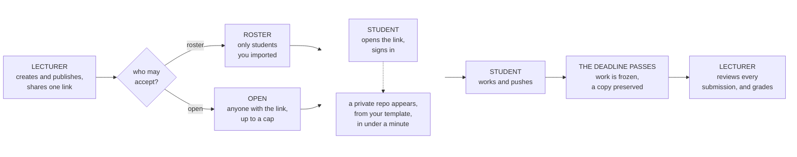

# PXL Classroom Presentation

## Prep

- **Browser profile 1 (Lecturer `tomcoolpxl`):**
  - Tab 1: Hub repository `README.md` on GitHub (`PXL-Digital-Application-Samples/pxl-classroom`).
  - Tab 2: PXL Classroom Web App: `/dashboard/<your-course-org>`.
  - Tab 3: A pre-created starter template repository (e.g. `template-demo-lab` marked as **Template repository** on GitHub).
  - Tab 4: An existing **finished assignment** where the deadline has passed (to demonstrate the preservation banner and archive links).
- **Browser profile 2 (Student `tomccargo` in separate profile):**
  - Logged into GitHub as `tomccargo`.
  - Empty tab ready to paste the student invitation URL.

---

## What is it

An expanded version of the obsolete github classroom.

## Why

- Github Classroom retirement
- tried Classroom50
- My requirements
  - usability
    - Fast and easy UX for most common flow: create an assignment in a few clicks, share the invite URL, done
    - Monitor dashboard cf. Github Classroom
      - easy overview of who is late / who has not commited anything
  - features
    - admin rights option for student repo's: students need to configure repository secrets, GitHub environments, workflows, runners, and OIDC tokens for topics like CI/CD, DevOps, Cloud, Automation, ...
    - self-managing teams
    - common autograding support
    - nice to have: lock students repo's at deadline
  - functional
    - no central server to manage/maintain, infrastructure, availability, ...
    - minimal user management (no user database or role engine)
    - compatible with GitHub Team for Education
    - free, with the smallest possible resourece usage (GitHub API calls, Action minutes, ...) while still being responsive
    - CLI available

---

## How

**On Screen:** The Mermaid architecture diagram in `README.md`.

### Core Philosophy



At its core, this system is a **repository provisioner and a passive monitor**. It creates a private repository from your template for a student.

*Once provisioned, the risk is negligible: the rest of the system is just monitoring commit timestamps and building reports. Even if the dashboard code had a bug, student repositories and git history remain safe and untouched.*

### Public vs. Private Boundaries

| Component | Visibility | Where It Lives | Purpose |
| :--- | :--- | :--- | :--- |
| **Hub Repository (`pxl-classroom`)** | **PUBLIC** | Central Org | Holds all workflows, scripts, and the static Vue SPA frontend. **The only place code runs!** (Hub workflow minutes are 100% free). |
| **Web App (GitHub Pages)** | **PUBLIC** | Central Hub Pages | Static SPA. Holds **no secret keys**. Talks to GitHub's REST/GraphQL API using the authenticated user's own token. |
| **Broker Repository (`broker-<id>`)** | **PUBLIC** | Your Course Org | **1 public repo per assignment.** Serves as a secure "doorbell" to catch student acceptance triggers at the edge. |
| **Control Repository (`pxl-classroom-control`)** | **PRIVATE** | Your Course Org | **Data only.** Holds YAML configs, rosters, teams, reports, and observations. **Contains zero workflows.** |
| **Student Repositories** | **PRIVATE** | Your Course Org | Private repos generated from your template where the student can be `Admin`. |
| **Archive Repositories (`pxl-classroom-archive-<id>`)** | **PRIVATE** | Your Course Org | **1 private archive repo per assignment.** Holds frozen, immutable snapshot branches of submissions at the deadline. Out of student reach. |

### Two GitHub Apps

```text
                  ┌──────────────────────────────┐
                  │ 1. PROVISIONER APP           │
                  │ Installed on: Course Org     │
                  │ Scope: Full org admin        │
                  └──────────────┬───────────────┘
                                 │ (Only hub workflows can touch this)
                                 ▼
┌──────────────┐          ┌──────────────┐          ┌────────────────┐
│ Student SPA  │ ───────► │ Public Broker│ ───────► │ Central Hub    │
│ (Web browser)│          │ (doorbell)   │          │ (Actions)      │
└──────────────┘          └──────────────┘          └────────────────┘
                                 ▲
                                 │ (Holds narrow dispatch token only)
                  ┌──────────────┴───────────────┐
                  │ 2. BROKER APP                │
                  │ Installed on: Hub Repo ONLY  │
                  │ Scope: contents:write only   │
                  └──────────────────────────────┘
```

To keep security tight without a server, we split permissions between two GitHub Apps:

- **Provisioner App:** *Installed on the course organization with full repository access. It creates repos, manages permissions, and sets rulesets. Its private key stays locked in the hub environment-it never touches a broker.*
- **Broker App:** *Installed ONLY on the central hub repo with `contents: write` alone. It can do only one thing: dispatch an event back to the hub.

### Token-Based / Signed Invite

- Students have no permissions on our private course control repo.
  - When a student opens the public invitation link, how do we know they are authorized without random internet bots abusing our Actions minutes?
- When you publish an assignment:
  - PXL Classroom mints a cryptographic keypair (`P-256` elliptic curve).
  - The private key is embedded in the link URL.
  - When the student clicks Accept, their browser signs their GitHub ID with that key.
  - The public broker checks that signature in 5 seconds on a free public runner.
    - If valid, it dispatches to the hub.
    - a doorbell that only rings if the student holds the key.

### User Management

There is no user database or role engine.

- If you are an Owner of the course GitHub organization, you are a Lecturer in PXL Classroom.
- If you have Write access on the central hub, you can publish assignments.

---

## Demo - The Default Scenario

**On Screen:** Switch between Lecturer Window (`tomcoolpxl`) and Student Window (`tomccargo`).

- Step 1: Lecturer Creates and Publishes an assignment (Browser 1)
- Step 2: Student Accepts (Browser 2)
- Step 3: Lecturer Dashboard Live Update (Browser 1)
  - Manually refresh the assignment overview page

---

## Enrolment Modes, Claims & Rosters

**On Screen:** Admin Panel → **Roster Tab** (`students/roster.yml`).

**Three Enrolment Modes:**

- **`open` (Default):** Anyone with the link can join up to a headcount cap.
- **`enforced`:** Only GitHub usernames already listed in `students/roster.yml` are allowed to accept.
- **`claim`:**
  - when students accept, the page asks them to confirm their institutional address.
  - The address is encrypted to the hub, verified against your roster email list, and saved permanently to `students/claims/<github_id>.json`. The email claim is an authentic identity binding between their school identity and their GitHub account across the whole organization."*
- **Promoting existing open students onto the Roster:**
  - **"Add students who accepted to roster"** button: all subsequent assignments can be strictly `enforced`.

---

## Deadlines, Preservation & Autograding

**On Screen:** Browser 1 → Tab with the **Finished Assignment** (passed deadline).

### What Happens at the Deadline?

- **Block writes via Repository Ruleset (`late_policy: block`):**
  - At the deadline instant, the 4-hourly deadline sentinel automatically applies a repository ruleset (`pxl-classroom-deadline`).
  - Students can still view their repo, secrets, and run workflows, but **all pushes are blocked immediately**.
  - Can be circumvented with Admin access
- **Lockdown Permissions (`lock_down_enabled`):**
  - Optional toggle to demote students from Admin to `pull` (read-only)
- **Immutable Preservation Archive (`pxl-classroom-archive-<id>`):**
  - **Preservation Summary Banner**
  - Every student's submission commit is pushed into a dedicated private archive repository that students cannot reach.
  - Even if a student force-pushes, rewrites history, or deletes their repo, the preserved branch is immutable proof for grading and disputes.

demo:

- Show the **Lock-down Delay** metric (e.g. `maximum delay: 0s`).
- Click on an archive link to show the preserved tree.

### Autograding Options

- **Student-Side (GitHub Actions):**
  - Runs on every push in the student repo.
  - If your template already ships a standard GitHub Classroom `classroom.yml`, PXL Classroom preserves it without changes
  - After the deadline, the lecturer clicks **'Read scores from GitHub Actions'** in the dashboard.
  - The system reads the score directly from the check run's annotations and populates your grade table and CSV export.
- **Student-Side, graded at hand-in (cloud exams):**
  - For a template whose workflow grades one commit only — `if: github.event.head_commit.message == 'einde examen'` — because the checks read the student's **own** AWS account and that account is gone once their lab session ends.
  - In the assignment: **How it's graded → They come with my template → Only on a hand-in commit**, and type the same words. Scores are then read from the newest commit carrying it, not from the student's last commit.
  - A student who pushes a fix afterwards keeps their score. A student who never handed in is **listed by name, not scored zero** — the skipped run is not a measurement.
  - Starting point: `templates/template-cloud-autograding/`.
- **Lecturer-Side (Local Docker via CLI):**
  - you can run `pxl-classroom grade --runner docker` locally on your machine against the preserved archive code in an isolated sandbox.
  - useful for large cloud-based AWS and/or Kubernetes deployments

---

## Runbook Reality & Getting Started

The runbook is written as an exhaustive disaster-recovery manual (handling GitHub API outages, token unlinking, edge-case troubleshooting). For everyday teaching, your workflow is 3 simple steps:

```text
1. Create a template repo in your org (tick "Template repository").
2. Fill out the 1-page form in the Web App and click "Save & Publish".
3. Copy the invitation link and share it.
```

### How you can try it

- Send me a message. I will add you as a collaborator on the central hub
- Create a GitHub Organization for your course (e.g. `PXL-Course-2026`)
- Log in to the web app
- run the 1-click **Setup Organization** workflow.
- You are ready to publish assignments immediately.

> If you want your own completely isolated institution deployment, the entire repo is open source and configured via a single `deployment.yml` file.
>
> Find more details in the runbook.

### What's next

- More testing & maintenance
- Hardening of autograding, teams and groups
- Preprovisioning combined with open assignments for live PE's/exams
- Investigate setting up other central hubs
