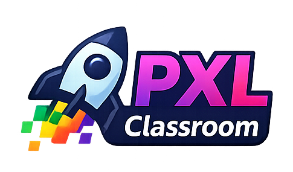
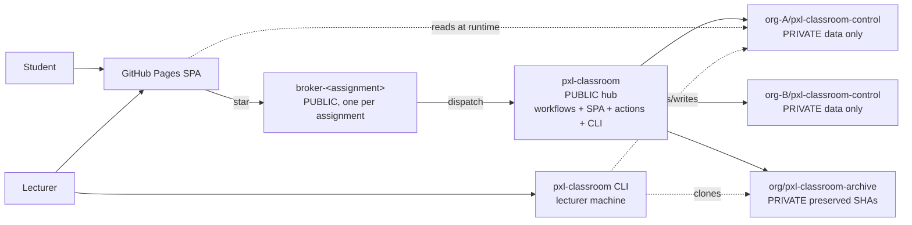

# PXL Classroom

A GitHub-native replacement of GitHub Classroom. Built entirely on GitHub Pages + GitHub Actions + a single GitHub App. No server, no database, no external dependency.

Targets specifically **GitHub Team for Education**. Never depends on GitHub Enterprise.

## What it does

- **Assignment distribution.** Lecturers define an assignment from a private template repository in the Admin Panel; one acceptance URL is shared with students.
- **Student acceptance.** A student opens the URL, authenticates with GitHub device flow, clicks Accept. A private repository is created from the template and the student is granted admin — synchronously, no queue.
- **Submission reporting.** A single nightly workflow collects activity, finalizes deadlines (lock-down + preserve + report), and regenerates the dashboard. Optional `submit/<timestamp>-<sha>` tags let students mark a specific commit for grading.
- **Lecturer power tools.** A companion `pxl-classroom` CLI (same App, same device flow, same schemas as the SPA) handles CSV roster import, install health audits, feedback-PR orchestration, bulk submission download from the archive, and lecturer-side autograding against archive SHAs.
- **Zero idle minutes.** When no class is active, the nightly workflow disables itself. The system sits dormant and bills nothing until a new assignment is published.

## Architecture at a glance

One central public hub holds all logic. Per-organization private control repositories hold data, no workflows. A private archive repo per org preserves submission SHAs out of student reach. A single GitHub App is installed per participating org for short-lived tokens. The browser SPA and the CLI both read each org's data at runtime with the viewer's own token.

## Documentation

- **[`ARCHITECTURE.md`](ARCHITECTURE.md)** — full technical specification: topology, trust model, data model, workflows, actions, flows, constraints.
- **[`RUNBOOK.md`](RUNBOOK.md)** — operational procedures: initial setup, onboarding an org, creating assignments, monitoring, edge cases, recovery, CLI installation, autograder/feedback-PR/bulk-download how-tos.

## Where things live

| Layer | Path |
|---|---|
| Central workflows | `.github/workflows/` |
| Composite actions | `acceptance/`, `provisioning/`, `collect/`, `lockdown/`, `preserve/`, `report/`, `pages/`, `notify/`, `registry/` |
| Shared libraries | `lib/` (`yaml.mjs`, `gh.mjs`, `gittree.mjs`, `audit.mjs`, `dashboard-aggregate.mjs`) |
| Scripts (extracted from workflow inline JS) | `scripts/` |
| Frontend SPA | `frontend/` |
| Lecturer CLI workspace | `cli/` (`pxl-classroom` binary) |
| Data schemas | `schemas/` |
| Control-repo scaffold | `control-repo-template/` |
| Unit tests | `tests/`, `cli/tests/` |

Live service: https://pxl-digital-application-samples.github.io/pxl-classroom/
