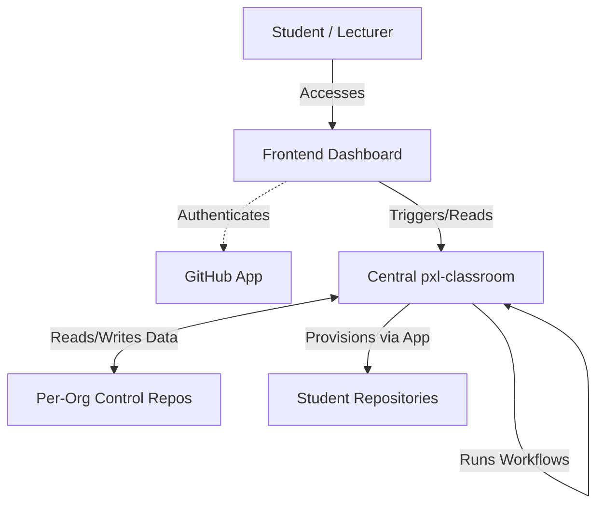

# PXL Classroom

PXL Classroom is a fully serverless, highly-scalable GitHub Action-based classroom automation system designed specifically for higher-education environments using GitHub Teams for Education.

Unlike GitHub Classroom, this system uses a centralized public workflow hub (`pxl-classroom`) driving private, per-organization **Control Repositories** as the data store, ensuring absolute privacy of student rosters and data while minimizing maintenance.

## Architecture

1. **GitHub App:** A central GitHub App handles secure repository provisioning and lock-downs using short-lived installation tokens.
2. **Frontend Dashboard:** A static Vue.js SPA hosted on GitHub Pages. Lecturers use it to monitor progress, while students use it to "Accept" assignments via the GitHub Device Flow. Data is fetched *at runtime* directly from the control repo—no backend database is required.
3. **Central Hub (`pxl-classroom`):** Contains all the centralized workflows and scripts (`provisioning`, `collect`, `report`, etc.) that orchestrate the platform.
4. **Control Repository:** A private repository per organization that stores assignments, roster definitions, and student JSON records. It contains no workflow files, operating purely as a data store.

## IT Administrator Setup

See the [Lecturer Runbook](RUNBOOK.md) for full organization setup and budget policy requirements. No local cloning or terminal commands are required for lecturers.

## Lecturer Usage

See the [Lecturer Runbook](RUNBOOK.md) for day-to-day operations, creating assignments, and handling student edge-cases.
