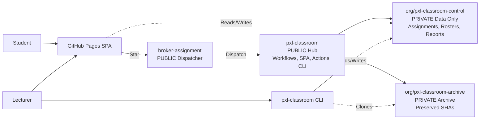

# PXL Classroom

<p align="center">
  
</p>

GitHub-native assignment distribution and submission reporting for higher education. Built on GitHub Pages, GitHub Actions, and a single GitHub App. No external server, no external database.

Target platform: GitHub Team for Education (no GitHub Enterprise required).

Links: [Web App](https://pxl-digital-application-samples.github.io/pxl-classroom/) | [ARCHITECTURE.md](ARCHITECTURE.md) | [RUNBOOK.md](RUNBOOK.md)

---

## Feature Comparison

| Feature / Capability | GitHub Classroom (Legacy) | Classroom50 (Fifty Foundation) | PXL Classroom |
| :--- | :--- | :--- | :--- |
| **Architecture & Hosting** | Centralized server & database | Hosted web service + CLI | 100% Serverless (GitHub Pages + Actions + 1 GitHub App) |
| **Infrastructure Costs** | Maintained by GitHub | Free open-source hosted tier | Zero external server or database costs |
| **Idle Minute Management** | Continuous cloud background jobs | Continuous service availability | Zero Idle Minutes (Nightly cron sleeps when inactive) |
| **Resource & Billing Audits** | None (standard GitHub billing page) | None (standard GitHub billing page) | Automated weekly SKU billing audits with @-mention alerts |
| **Student Repository Role** | Write only (Restricted) | Write only (Restricted) | Admin (Enables Secrets, Environments, Runners, OIDC) |
| **Student Self-Service Acceptance** | Web redirect with background queue | Web portal acceptance link | Instant 1-click provisioning (repository ready in 15–30s) |
| **Roster Management** | CSV import or LMS sync (Strict) | Org-level repository roster | Dual-Mode: Enforced roster or Open signup with student caps |
| **Team Formation Self-Service** | Basic team selection from preset list | Basic team repository creation | Full self-service team creation, capacity limits, and team switching |
| **Assignment Creation Flow** | Multi-step web form | Web configuration form | 1-Click publish from web Admin Panel with instant validation |
| **Lecturer Dashboard & UI** | Standard web portal (basic list) | Web portal + terminal views | Real-time web dashboard with live commit sync and student hover cards |
| **CLI Companion Tooling** | `gh classroom` extension (clone, list) | `classroom50` CLI | `@pxl-classroom/cli` (Local Docker grading, bulk clone, audit checks) |
| **Autograding: Cloud Actions** | Runs in student repo on push (`classroom-resources/*`) | Runs in student repo on push (Actions + `check50`) | Automatic Actions grading with score harvesting into dashboard |
| **Autograding: Local Sandboxing**| Not supported natively | Not supported natively (grades live repos) | Sandboxed Local Docker CLI (Zero cloud Actions minutes billed) |
| **Deadline Enforcement** | Soft deadline (manual freeze or stop Actions) | Timestamp logging & manual review | Automated API lockdown (demotes students from Admin to Read) |
| **Submission Archiving** | None (grades live repo HEAD) | None (grades live repo HEAD) | Permanent copy saved to private archive repository |
| **Feedback Pull Requests** | Created on repo creation (breaks on empty commits) | Standard GitHub PR / comments | Clean baseline branch with draft PR opened on first commit |
| **LMS & Grade Export** | LTI 1.3 (Canvas, Moodle, Blackboard) | Basic CSV export | Live CSV and JSON export matching table filters (LTI in v2) |

### Detailed Value Highlights

- **Fast Web UI & Real-Time Dashboard:** Create, validate, and publish assignments in seconds via the Admin Panel. Monitor student progress with live commit synchronization, resolve student identities with 4-tier hover cards (matching rosters, Git commit authors, and GitHub profiles), run System Health audits, and apply deadline extensions directly in the browser.
- **Complete Self-Service for Students & Teams:** Students accept assignments via a direct link that provisions repositories in 15–30 seconds. For group assignments, students create teams, join groups under strict capacity limits, or switch teams before deadlines without instructor intervention.
- **Dual-Mode Autograding:** Run autograding workflows on GitHub Actions for student push feedback, or run local tests inside sandboxed Docker containers via the CLI with zero billed Actions minutes.
- **Built for Advanced Engineering & DevOps:** Students receive repository Administrator access to configure GitHub Actions secrets, environments, self-hosted runners, and cloud deployment pipelines. Grading integrity is preserved through automated deadline lock-down and immutable commit archival.
- **Zero Infrastructure & Budget Protection:** Runs entirely on GitHub Pages, GitHub Actions, and one GitHub App with no external servers or databases. Nightly workflows automatically sleep when no assignments are active, and weekly billing audits alert instructors to excessive runner minutes or storage usage.

---

## Quickstart

### 1. Connect Organization
1. Open the [Web App](https://pxl-digital-application-samples.github.io/pxl-classroom/).
2. Sign in with GitHub device flow.
3. Open `/setup` to create and install the GitHub App on your organization.

### 2. Create Assignment
1. Open `/dashboard/:org/admin`.
2. Configure assignment parameters: title, template repository, opens date, deadline, assignment type (individual/group), and autograding mode.
3. Click Save & Publish.

### 3. Student Acceptance
1. Distribute the URL `/:org/a/:assignment-id` to students.
2. Students sign in and accept. The repository is provisioned immediately.

### 4. Collection and Grading
1. Deadlines are finalized automatically by the nightly workflow.
2. Submissions are preserved as immutable branches in `<org>/pxl-classroom-archive`.
3. View grades in the web dashboard or grade locally via the CLI.

---

## Architecture


```mermaid
graph LR
    Hub[pxl-classroom<br/>PUBLIC Hub<br/>Workflows, SPA, Actions, CLI]
    Control[org/pxl-classroom-control<br/>PRIVATE Data Only<br/>Assignments, Rosters, Reports]
    Archive[org/pxl-classroom-archive<br/>PRIVATE Archive<br/>Preserved SHAs]
    Broker[broker-assignment<br/>PUBLIC Dispatcher]
    SPA[GitHub Pages SPA]
    CLI[pxl-classroom CLI]

    Student[Student] --> SPA
    SPA -->|Star| Broker
    Broker -->|Dispatch| Hub
    Hub --> Control
    Hub --> Archive
    Lecturer[Lecturer] --> SPA
    Lecturer --> CLI
    SPA -.Reads/Writes.-> Control
    CLI -.Reads/Writes.-> Control
    CLI -.Clones.-> Archive
```

---

## CLI Usage

```bash
# Login via GitHub device flow
npx pxl-classroom login

# Bulk download preserved submissions for an assignment
npx pxl-classroom download --org my-org --assignment lab-1

# Run local autograding in sandboxed Docker container
npx pxl-classroom grade --org my-org --assignment lab-1 --runner docker

# Create feedback pull requests
npx pxl-classroom feedback open --org my-org --assignment lab-1
```

---

## Repository Layout

| Path | Description |
|---|---|
| `.github/workflows/` | Hub workflows (acceptance, daily activity, dashboard regen) |
| `acceptance/`, `provisioning/`, `lockdown/`, `preserve/`, `report/` | Composite actions |
| `frontend/` | Vue 3 single page application |
| `cli/` | Companion `@pxl-classroom/cli` package |
| `lib/` | Shared utility modules (yaml, gh, gittree, audit) |
| `schemas/` | JSON schemas for assignments, rosters, teams, reports, grading |
| `control-repo-template/` | Template scaffold for new organization control repos |
| `tests/`, `cli/tests/` | Unit and integration test suites |
