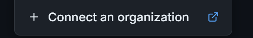
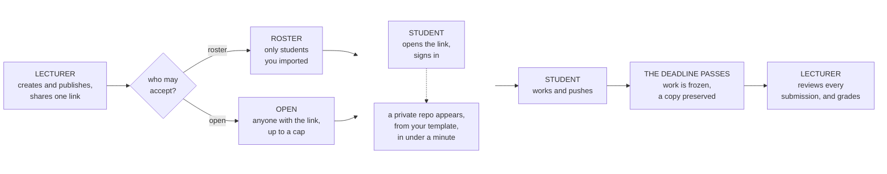
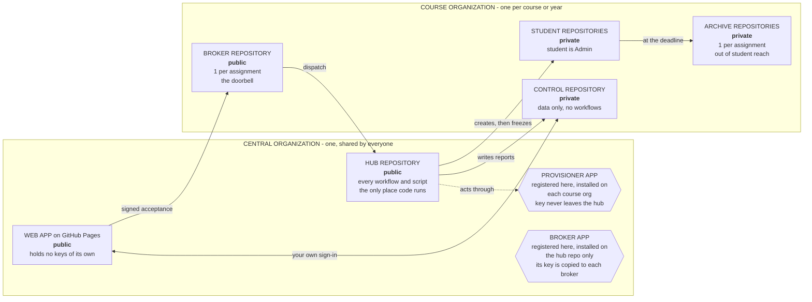

# PXL Classroom


<https://pxl-digital-application-samples.github.io/pxl-classroom/>

GitHub-native assignment distribution and submission reporting for higher education. Built on GitHub Pages, GitHub Actions, and two narrowly-scoped GitHub Apps. No external server, no external database.

Target platform: GitHub Team for Education (no GitHub Enterprise required).

**PXL Classroom** is named for *PXL eXecutable Labs*.

Live: [Web App](https://pxl-digital-application-samples.github.io/pxl-classroom/)

---

## Why

Classroom50 works well, but a few things made me build PXL Classroom anyway.

- **Classroom50 does not support open assignments.**
  - It enrols from a roster, while GitHub Classroom used to hand out a link anyone could accept.
  - Exams and workshops need that, so it is back, with a cap, alongside roster and email-claim enrolment.
- **Setting up an assignment is too complicated / takes too long.**
  - In PXL Classroom it is one form with very few clicks.
- **Admin rights option for student repositories.**
  - Students need to configure repository secrets, GitHub environments, workflows, runners, and OIDC tokens for topics like CI/CD

The result is an expanded GitHub Classroom's feature set with a dashboard on top, running entirely on GitHub Team for Education. GitHub Enterprise is not required.

I built it for my own courses at first.

---

## Screenshots

### Lecturer Dashboard Overview
*Organization overview showing active assignments, submission metrics, and resource limit monitoring.*


### Assignment Submissions & Management
*Student progress, live submission status badges, and starter code sync actions.*


### Group Assignments & Team Management
*Self-service team formation, capacity limits, under-capacity indicators, and team repository tracking.*


---

## Highlights

- **Nothing to run, nothing to pay for, nothing to maintain.**
  - The whole system is a Pages site, some Actions workflows and two GitHub Apps.
  - No central server management and maintenance
  - When no assignment is active, nothing runs and nothing is billed.
  - A weekly check watches each organization's usage against its limits.

- **Students get their repository fast.**
  - They open the invitation link, sign in, and press Accept
  - A signing key verifies the accepting account before credentials are created, without exposing the link.

- **You decide who may accept, per assignment.**
  - open signup with a limit on how many places there are.
  - a roster you import (by name and email, or by GitHub username)
  - a self-service email claim, where the student confirms their institutional address and it is matched against your roster
  
- **Students hold Admin on their own repository.**
  - They can manage secrets, environments, runners and OIDC

- **Teams form and manage themselves.**
  - Students create or join a team within the size you set, and can move between teams until the deadline.
  - A grouping that already worked can be carried into the next assignment.

- **Fix a mistake after students have started.**
  - Correct it once in the template and send it out.
  - Files a student has not touched are updated directly
  - anything they have edited arrives as a pull request.

- **Grading, via GitHub Actions or on your machine.**
  - Checks can run in each student repository on push
  - or locally in a sandboxed Docker container that costs no Actions minutes, for very large or complex workloads.
  - Scores come back into the dashboard either way
  - includes a template that already ships GitHub Classroom's own grading workflow.

- **The deadline can be a real deadline.**
  - Choose per assignment: record late work, or stop writes at the deadline instant.
  - A watcher enforces this immediately; the nightly workflow is the fallback.

- **Archival function.**
  - Every submission is archived in a private repository the student cannot access.
  - useful for examinations and grade disputes.

---

## Setup

There are two organizations involved.

### 1. The central organization

Everyone shares the central PXL Classroom organization.

It holds this repository, the workflows, the Pages site, the GitHub App and the sample repositories.

- **Grant repository Write access, not organization ownership.**
  - Publishing assignments dispatches a workflow using `workflow_dispatch`, which requires write access.
  - Give lecturers **Write** permission on this repository (as a collaborator or via a team).

- **More than one central organization can exist.** To be independent of this one, fork the repository, edit `deployment.yml`, create your own Apps at `/setup`, and publish your own Pages site - [INSTALL.md](INSTALL.md) is that path start to finish.

### 2. Your own course organization

The assumed model is one organization per course. It holds the private `pxl-classroom-control` repository, the student repositories and the archives.

An owner installs the App there with access to **All repositories**, then runs **Setup Organization**.

**The "Connect an organization" button in the web app walks you through both steps.**



**Owning this organization is what makes you a lecturer in it.** There is no user list and no roles, so every owner can edit every assignment in the organization.

---

## Quickstart

### 1. Connect Organization

- Open the [Web App](https://pxl-digital-application-samples.github.io/pxl-classroom/) and sign in with the GitHub device flow.
- Pick your organization in the switcher. If it is not connected yet, see [Setup](#setup).

### 2. Create Assignment

- Open `/dashboard/:org/admin`.
- Fill in the template repository, the title and deadline
- Check settings for individual or group work, who may accept, and any automated checks.
- Click Save & Publish.

### 3. Student Acceptance

- Distribute the invitation link `/:org/i/:secret` - copy it from the assignment's detail view.
- It is minted at publish time and cannot be derived from the assignment id.
- Students sign in and accept; the repository is provisioned in 1 to 2 minutes.

### 4. Collection and Grading

- If you set late work not to count, writes stop at the instant the deadline passes
- the nightly workflow finalizes the cohort either way, and is the fallback if anything goes wrong.
- Submissions are preserved as immutable branches in `<org>/pxl-classroom-archive-<assignment-id>`.
- View grades in the web dashboard.

---

## Architecture

### Core Philosophy


```mermaid
flowchart LR
    Create["LECTURER<br/>creates and publishes,<br/>shares one link"] --> Who{"who may<br/>accept?"}
    Who -->|"roster"| Roster["ROSTER<br/>only students<br/>you imported"]
    Who -->|"open"| Open["OPEN<br/>anyone with the link,<br/>up to a cap"]
    Roster --> acc
    Open --> acc

    subgraph acc [" "]
        direction TB
        Accept["STUDENT<br/>opens the link,<br/>signs in"] -.-> Repo["a private repo appears,<br/>from your template,<br/>in under a minute"]
    end

    acc --> Work["STUDENT<br/>works and pushes"]
    Work --> Deadline["THE DEADLINE PASSES<br/>work is frozen,<br/>a copy preserved"]
    Deadline --> Grade["LECTURER<br/>reviews every<br/>submission, and grades"]

    style acc fill:none,stroke:none
```

At its core, this system is a **repository provisioner and a passive monitor**. It creates a private repository from your template for a student.

*Once provisioned, the risk is negligible: the rest of the system is just monitoring commit timestamps and building reports. Even if the dashboard code had a bug, student repositories and git history remain safe and untouched, with the exception of a hard lockdown of student repos at the deadline.*

### Public vs. Private Boundaries


```mermaid
flowchart LR
    subgraph Central["CENTRAL ORGANIZATION - one, shared by everyone"]
        direction TB
        Hub["HUB REPOSITORY<br/><b>public</b><br/>every workflow and script<br/>the only place code runs"]
        Pages["WEB APP on GitHub Pages<br/><b>public</b><br/>holds no keys of its own"]
        ProvApp{{"PROVISIONER APP<br/>registered here, installed on<br/>each course org<br/>key never leaves the hub"}}
        BrokApp{{"BROKER APP<br/>registered here, installed on<br/>the hub repo only<br/>its key is copied to each broker"}}
    end

    subgraph Course["COURSE ORGANIZATION - one per course or year"]
        direction TB
        Broker["BROKER REPOSITORY<br/><b>public</b><br/>1 per assignment<br/>the doorbell"]
        Control["CONTROL REPOSITORY<br/><b>private</b><br/>data only, no workflows"]
        Student["STUDENT REPOSITORIES<br/><b>private</b><br/>student is Admin"]
        Archive["ARCHIVE REPOSITORIES<br/><b>private</b><br/>1 per assignment<br/>out of student reach"]
    end

    Pages -->|"signed acceptance"| Broker
    Broker -->|"dispatch"| Hub
    Hub -->|"creates, then freezes"| Student
    Hub -->|"writes reports"| Control
    Student -->|"at the deadline"| Archive
    Pages <-->|"your own sign-in"| Control
    Hub -.->|"acts through"| ProvApp
```

Everything public is either code you can read or a doorbell that carries a request inward. Everything with student work or student data in it is private.

| Component | Visibility | Where It Lives | Purpose |
| :--- | :--- | :--- | :--- |
| **Hub Repository (`pxl-classroom`)** | **PUBLIC** | Central Org | Holds all workflows, scripts, and the static Vue SPA frontend. **The only place code runs!** (Hub workflow minutes are 100% free). |
| **Web App (GitHub Pages)** | **PUBLIC** | Central Hub Pages | Static SPA. Holds **no secret keys**. Talks to GitHub's REST/GraphQL API using the authenticated user's own token. |
| **Broker Repository (`broker-<id>`)** | **PUBLIC** | Your Course Org | **1 public repo per assignment.** Serves as a secure "doorbell" to catch student acceptance triggers at the edge. |
| **Control Repository (`pxl-classroom-control`)** | **PRIVATE** | Your Course Org | **Data only.** Holds YAML configs, rosters, teams, reports, and observations. **Contains zero workflows.** |
| **Student Repositories** | **PRIVATE** | Your Course Org | Private repos generated from your template where the student can be `Admin`. |
| **Archive Repositories (`pxl-classroom-archive-<id>`)** | **PRIVATE** | Your Course Org | **1 private archive repo per assignment.** Holds frozen, immutable snapshot branches of submissions at the deadline. Out of student reach. |

### Two GitHub Apps

A GitHub App is a bot that gets short-lived access tokens, limited to specific permissions and organizations.

```text
                  ┌──────────────────────────────┐
                  │ 1. PROVISIONER APP           │
                  │ Owned by:     Central Org    │
                  │ Installed on: Course Org     │
                  │ Scope: declared perms only   │
                  └──────────────┬───────────────┘
                                 │ (Only hub workflows can touch this)
                                 ▼
┌──────────────┐          ┌──────────────┐          ┌────────────────┐
│ Student SPA  │ ───────► │ Public Broker│ ───────► │ Central Hub    │
│ (Web browser)│          │ (doorbell)   │          │ (Actions)      │
└──────────────┘          └──────────────┘          └────────────────┘
                                 ▲
                                 │ (Its key sits here, and is deleted
                                 │  when the assignment is finalized)
                  ┌──────────────┴───────────────┐
                  │ 2. BROKER APP                │
                  │ Owned by:     Central Org    │
                  │ Installed on: Hub Repo ONLY  │
                  │ Scope: contents:write only   │
                  └──────────────────────────────┘
```

To keep security tight without a server, we split permissions between two GitHub Apps:

- **Provisioner App:**
  - Installed on the course organization.
  - creates repositories, manages permissions and sets rulesets, through a declared permission set rather than ownership
  - private key stays locked in the hub environment; it never touches a broker.
- **Broker App:**
  - Installed ONLY on the central hub repo, with `contents: write`.
  - only function: dispatch an event back to the hub.
  - key sits on each broker while the assignment is open, and is deleted when it closes.

### Token-Based / Signed Invite

Students never get access to the private course control repository.

When you publish an assignment:

- PXL Classroom creates a cryptographic keypair for that assignment.
- The invite link contains the private key. The broker keeps only the matching public key.
- When a student accepts, their browser opens an issue on the public broker repository. Its title is their GitHub ID, signed with the private key.
- The broker verifies that signature, and checks it against the GitHub account that opened the issue - which GitHub records, not the student.
- A copied signature is useless to anyone else, because it names the account that made it.
- If everything matches, the broker sends the request to the hub.

### User Management

There is no user database or role engine.

- If you are an Owner of the course GitHub organization, you are a Lecturer in PXL Classroom.
- If you have Write access on the central hub, you can publish assignments.

### Sign-in needs a CORS proxy

The device-flow endpoints do not support CORS, so browsers cannot access them directly. A proxy is therefore required.

- 2 solutions are bundled: a Cloudflare Worker and corsproxy.io configuration
- the Web App tries the Cloudflare Worker first and uses corsproxy.io as fallback.

---

## CLI Usage

Installed from a clone of this repo - the package is not published to npm.

```bash
npm install && npm link --workspace=cli

# Authenticate via GitHub device flow
pxl-classroom auth login --client-id Iv23li...

# Import a roster from CSV (--dry-run shows the diff first)
pxl-classroom roster import students.csv --org my-org

# Bulk download preserved submissions for an assignment
pxl-classroom download --org my-org --assignment lab-1

# Run local autograding in a sandboxed Docker container
pxl-classroom grade --org my-org --assignment lab-1 --runner docker

# Open draft feedback pull requests
pxl-classroom feedback open --org my-org --assignment lab-1
```

Full command list: [cli/README.md](cli/README.md).

---

## Repository Layout

| Path | Description |
| --- | --- |
| `deployment.yml` | **Institution-specific configuration** - email domains, timezone, hub/App/control-repo names, and the sign-in proxy. It is the only *code* a fork edits; the App and Pages site are set up per [INSTALL.md](INSTALL.md) |
| `.github/workflows/` | Every workflow in the system - acceptance, publishing, the nightly collect, the deadline sentinel, dashboard regeneration, usage reporting, release and deploy. A course organization has none of its own |
| `acceptance/`, `provisioning/`, `collect/`, `lockdown/`, `preserve/`, `report/`, `notify/`, `pages/`, `registry/` | Composite actions |
| `scripts/` | Node scripts the workflows call (no inline `node -e` in YAML) |
| `frontend/` | Vue 3 single page application |
| `cors-worker/` | The Cloudflare Worker that proxies GitHub's device-flow endpoints, because they send no CORS headers - see [Sign-in needs a CORS proxy](#sign-in-needs-a-cors-proxy) |
| `templates/` | Starter template repositories, including the autograding ones |
| `public/`, `assets/` | Data published to the Pages site, and the images this README uses |
| `cli/` | Companion `@pxl-classroom/cli` package |
| `lib/` | Shared utility modules (gh, gittree, audit, diagnostics, invite-token, claim, roster-mode) |
| `schemas/` | JSON schemas for assignments, rosters, teams, reports, grading |
| `control-repo-template/` | Template scaffold for new organization control repos |
| `tests/`, `cli/tests/` | Unit and integration test suites |

## Documentation

| Document | What it covers |
| --- | --- |
| [RUNBOOK.md](RUNBOOK.md) | Running assignments: publishing, deadlines, grading, rosters |
| [AUTOGRADING.md](AUTOGRADING.md) | Setting up checks, in Actions or locally |
| [ADMIN.md](ADMIN.md) | Onboarding an organization, budgets, App permissions, incidents |
| [INSTALL.md](INSTALL.md) | Standing up your own instance, once |
| [ARCHITECTURE.md](ARCHITECTURE.md) | How it works, in detail |
| [CLAUDE.md](CLAUDE.md) | Working conventions for changing the code |
| [DESIGN.md](DESIGN.md) | The UI design system and its rules |
| [MANUAL.md](MANUAL.md) | The in-app help; read inside the web app |
| [LESSONS.md](LESSONS.md) | What broke, and what it cost |
| [OPEN-ITEMS.md](OPEN-ITEMS.md) | Known gaps, each with the command that tests it |

---

## License

This project is licensed under the [MIT License](LICENSE).
