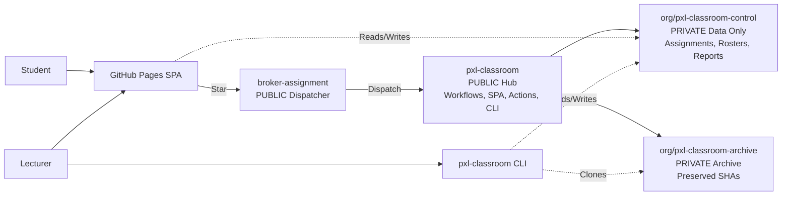

# PXL Classroom


GitHub-native assignment distribution and submission reporting for higher education. Built on GitHub Pages, GitHub Actions, and a single GitHub App. No external server, no external database.

Target platform: GitHub Team for Education (no GitHub Enterprise required).

Links: [Web App](https://pxl-digital-application-samples.github.io/pxl-classroom/) | [ARCHITECTURE.md](ARCHITECTURE.md) | [RUNBOOK.md](RUNBOOK.md)

---

## Features

- Zero infrastructure: Runs entirely on GitHub Pages, GitHub Actions, and one GitHub App.
- Zero idle minutes: Nightly cron disables itself when no assignments are active.
- Synchronous provisioning: Students click accept and get a private repository created from the template immediately.
- Individual and group assignments: Supports single-student repositories and collaborative team repositories with capacity limits.
- Deadline enforcement and preservation: Student write access is demoted at the deadline, and full commit histories are archived into a private archive repository.
- Dual-mode autograding:
  - Local Docker runner via the CLI (0 Actions minutes billed).
  - GitHub Actions runner with automatic score harvesting via GitHub Checks.
- Feedback PRs: Creates draft pull requests against starter code baseline for inline code reviews.
- Lecturer CLI: Companion command line tool for bulk archive downloads, CSV roster sync, and grading.

---

## Quickstart

### 1. Connect Organization
1. Open the [Web App](https://pxl-digital-application-samples.github.io/pxl-classroom/).
2. Sign in with GitHub device flow.
3. Open `/setup` to create and install the GitHub App on your organization.

### 2. Create Assignment
1. Open `/dashboard/:org/admin`.
2. Configure assignment parameters: title, template repository, opens date, deadline, assignment type (individual/group), and autograding mode.
3. Click Save & Publish.

### 3. Student Acceptance
1. Distribute the URL `/:org/a/:assignment-id` to students.
2. Students sign in and accept. The repository is provisioned immediately.

### 4. Collection and Grading
1. Deadlines are finalized automatically by the nightly workflow.
2. Submissions are preserved as immutable branches in `<org>/pxl-classroom-archive`.
3. View grades in the web dashboard or grade locally via the CLI.

---

## Architecture


```mermaid
graph LR
    Hub[pxl-classroom<br/>PUBLIC Hub<br/>Workflows, SPA, Actions, CLI]
    Control[org/pxl-classroom-control<br/>PRIVATE Data Only<br/>Assignments, Rosters, Reports]
    Archive[org/pxl-classroom-archive<br/>PRIVATE Archive<br/>Preserved SHAs]
    Broker[broker-assignment<br/>PUBLIC Dispatcher]
    SPA[GitHub Pages SPA]
    CLI[pxl-classroom CLI]

    Student[Student] --> SPA
    SPA -->|Star| Broker
    Broker -->|Dispatch| Hub
    Hub --> Control
    Hub --> Archive
    Lecturer[Lecturer] --> SPA
    Lecturer --> CLI
    SPA -.Reads/Writes.-> Control
    CLI -.Reads/Writes.-> Control
    CLI -.Clones.-> Archive
```

---

## CLI Usage

```bash
# Login via GitHub device flow
npx pxl-classroom login

# Bulk download preserved submissions for an assignment
npx pxl-classroom download --org my-org --assignment lab-1

# Run local autograding in sandboxed Docker container
npx pxl-classroom grade --org my-org --assignment lab-1 --runner docker

# Create feedback pull requests
npx pxl-classroom feedback open --org my-org --assignment lab-1
```

---

## Repository Layout

| Path | Description |
|---|---|
| `.github/workflows/` | Hub workflows (acceptance, daily activity, dashboard regen) |
| `acceptance/`, `provisioning/`, `lockdown/`, `preserve/`, `report/` | Composite actions |
| `frontend/` | Vue 3 single page application |
| `cli/` | Companion `@pxl-classroom/cli` package |
| `lib/` | Shared utility modules (yaml, gh, gittree, audit) |
| `schemas/` | JSON schemas for assignments, rosters, teams, reports, grading |
| `control-repo-template/` | Template scaffold for new organization control repos |
| `tests/`, `cli/tests/` | Unit and integration test suites |
