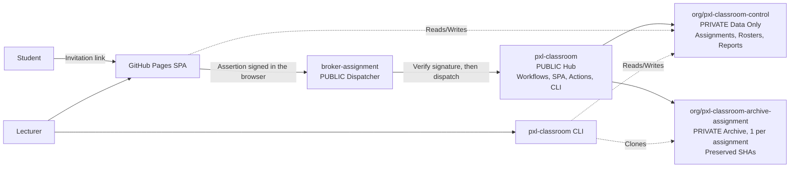

# PXL Classroom


<https://pxl-digital-application-samples.github.io/pxl-classroom/>

GitHub-native assignment distribution and submission reporting for higher education. Built on GitHub Pages, GitHub Actions, and a single GitHub App. No external server, no external database.

Target platform: GitHub Team for Education (no GitHub Enterprise required).

Links: [Web App](https://pxl-digital-application-samples.github.io/pxl-classroom/) | [ARCHITECTURE.md](ARCHITECTURE.md) | [RUNBOOK.md](RUNBOOK.md) | [DESIGN.md](DESIGN.md)

---

## Screenshots

### Lecturer Dashboard Overview
*Organization overview showing active assignments, submission metrics, and resource limit monitoring.*


### Assignment Submissions & Management
*Real-time student progress tracking, live submission status badges, and starter code sync actions.*


### Group Assignments & Team Management
*Self-service team formation, capacity limits, under-capacity indicators, and team repository tracking.*


---

## Highlights

- **Fast Web UI & Dashboard:**
  - Create and publish assignments in seconds via the Admin Panel.
  - Monitor progress with live commit sync
- **Zero Infrastructure:**
  - 100% serverless on GitHub Pages, Actions, and a single GitHub App.
  - Workflows sleep when idle, and weekly audits monitor SKU billing limits.
- **Student & Team Self-Service:**
  - One-click repository provisioning - 20 to 40 seconds from Accept to a ready repository.
  - The invitation link carries a private signing key: the student's browser signs an assertion naming their own GitHub account, and the public broker verifies it before a single credential is minted. A link somebody else has seen is not enough to accept with.
  - Three enrolment modes per assignment - an enforced roster of GitHub logins, an email claim (the student proves an institutional address, encrypted to the hub), or open signup capped by `max_acceptances`.
  - Students form teams, join under capacity limits, or switch teams before the deadline; an existing grouping can be carried forward into the next assignment.
- **Starter Code Synchronization:**
  - Correct a mistake in the assignment after students have accepted: fix it in the template, and the sync distributes that commit.
  - Interactive file diff picker; the selection is applied per file. Files a student has not touched land directly on their `main`, files they have edited arrive as a pull request, so their work is never overwritten.
- **Dual-Mode Autograding & Feedback PRs:**
  - Automated feedback on push via GitHub Actions or local CLI grading in sandboxed Docker containers (0 Actions minutes billed).
  - Per-student scores read back into the dashboard - including from a template that ships its own GitHub Classroom workflow, with nothing to configure.
  - 1-click Web UI button to lazily open Feedback Pull Requests (`main` -> `pxl-baseline`) once students push code.
- **DevOps-Ready Student Admin:**
  - Students get repository Admin rights to manage Secrets, Environments, Runners and OIDC - the subject matter of the courses this runs.
- **Deadline Enforcement & Archival:**
  - A sentinel arms ahead of the deadline and stops writes at the instant it passes; the nightly finalize is the fallback, and every failure degrades to it.
  - `late_policy: block` freezes the submission ref with a repository ruleset the App bypasses; `lock_down_enabled` additionally demotes students to read.
  - Verified commit SHAs are preserved as immutable branches in `<org>/pxl-classroom-archive-<assignment-id>`, one archive per assignment so a finished cohort can be retired on its own.
  - An unalterable record for grade disputes, examination boards, and institutional accreditation.

---

## Feature Comparison

| Feature / Capability | GitHub Classroom (Legacy) | Classroom50 (Fifty Foundation) | PXL Classroom |
| :--- | :--- | :--- | :--- |
| **Architecture & Hosting** | Centralized server & database | Hosted web service + CLI | 100% Serverless (GitHub Pages + Actions + 1 GitHub App) |
| **Infrastructure Costs** | Maintained by GitHub | Free open-source hosted tier | Zero external server or database costs |
| **Idle Minute Management** | Continuous cloud background jobs | Continuous service availability | Zero Idle Minutes (Nightly cron sleeps when inactive) |
| **Resource & Billing Audits** | None (standard GitHub billing page) | None (standard GitHub billing page) | Automated weekly SKU billing audits with @-mention alerts |
| **Student Repository Role** | Write only (Restricted) | Write only (Restricted) | Admin (Enables Secrets, Environments, Runners, OIDC) |
| **Student Self-Service Acceptance** | Web redirect with background queue | Web portal acceptance link | Instant 1-click provisioning (repository ready in 20-40s) |
| **Invitation Link Security** | Opaque token, validated server-side | Portal link | Link holds a signing key; the browser signs an assertion naming the account, verified at the edge before any credential is minted |
| **Roster Management** | CSV import or LMS sync (Strict) | Org-level repository roster | Tri-Mode: Enforced roster, email claim, or Open signup with student caps |
| **Team Formation Self-Service** | Basic team selection from preset list | Basic team repository creation | Full self-service team creation, capacity limits, and team switching |
| **Assignment Creation Flow** | Multi-step web form | Web configuration form | 1-Click publish from web Admin Panel with instant validation |
| **Lecturer Dashboard & UI** | Standard web portal (basic list) | Web portal + terminal views | Real-time web dashboard with live commit sync and student hover cards |
| **Starter Code Resync & Updates** | Manual pull or forks only | Manual Git upstream pulling | Per-file: lands directly where untouched, PR where the student edited it |
| **CLI Companion Tooling** | `gh classroom` extension (clone, list) | `classroom50` CLI | `@pxl-classroom/cli` (Local Docker grading, roster import, starter sync, team seeding, audit checks) |
| **Autograding: Cloud Actions** | Runs in student repo on push (`classroom-resources/*`) | Runs in student repo on push (Actions + `check50`) | Automatic Actions grading with score harvesting into dashboard |
| **Autograding: Local Sandboxing**| Not supported natively | Not supported natively (grades live repos) | Sandboxed Local Docker CLI (Zero cloud Actions minutes billed) |
| **Deadline Enforcement** | Soft deadline (manual freeze or stop Actions) | Timestamp logging & manual review | Sentinel stops writes at the deadline instant (repository ruleset), nightly fallback, optional demotion to Read |
| **Submission Archiving** | None (grades live repo HEAD) | None (grades live repo HEAD) | Dedicated private archive repository per assignment (`<org>/pxl-classroom-archive-<assignment-id>`) |
| **Archive Tamper Resistance** | Vulnerable to history rewrite or deletion | Vulnerable to history rewrite or deletion | Immune (SHA verified via `git ls-remote` in isolated archive) |
| **Feedback Pull Requests** | Created on repo creation (breaks on empty commits) | Standard GitHub PR / comments | Clean baseline branch with 1-click lazy opening in Web UI & CLI |
| **LMS & Grade Export** | LTI 1.3 (Canvas, Moodle, Blackboard) | Basic CSV export | Live CSV and JSON export matching table filters (LTI in v2) |

---

## Quickstart

### 1. Connect Organization

- Open the [Web App](https://pxl-digital-application-samples.github.io/pxl-classroom/) and sign in with the GitHub device flow.
- Use **Connect an organization** in the org switcher to install the App on your org, then run **Setup Organization** to scaffold `<org>/pxl-classroom-control`.
- A brand-new deployment creates the App itself once, from the manifest form at `/setup` (RUNBOOK §1.2).

### 2. Create Assignment

- Open `/dashboard/:org/admin`.
- Configure assignment parameters: title, template repository, opens date, deadline, assignment type (individual/group), who may accept (`roster_mode`), and automated checks.
- Click Save & Publish.

### 3. Student Acceptance

- Distribute the invitation link `/:org/i/:secret` - copy it from the assignment's detail view. It is minted at publish time and cannot be derived from the assignment id.
- Students sign in and accept; the repository is provisioned in 20 to 40 seconds.

### 4. Collection and Grading

- The deadline is enforced by the sentinel at the instant it passes and finalized by the nightly workflow.
- Submissions are preserved as immutable branches in `<org>/pxl-classroom-archive-<assignment-id>`.
- View grades in the web dashboard or grade locally via the CLI.

---

## Architecture


```mermaid
graph LR
    Hub[pxl-classroom<br/>PUBLIC Hub<br/>Workflows, SPA, Actions, CLI]
    Control[org/pxl-classroom-control<br/>PRIVATE Data Only<br/>Assignments, Rosters, Reports]
    Archive[org/pxl-classroom-archive-assignment<br/>PRIVATE Archive, 1 per assignment<br/>Preserved SHAs]
    Broker[broker-assignment<br/>PUBLIC Dispatcher]
    SPA[GitHub Pages SPA]
    CLI[pxl-classroom CLI]

    Student[Student] -->|Invitation link| SPA
    SPA -->|Assertion signed in the browser| Broker
    Broker -->|Verify signature, then dispatch| Hub
    Hub --> Control
    Hub --> Archive
    Lecturer[Lecturer] --> SPA
    Lecturer --> CLI
    SPA -.Reads/Writes.-> Control
    CLI -.Reads/Writes.-> Control
    CLI -.Clones.-> Archive
```

---

## CLI Usage

Installed from a clone of this repo - the package is not published to npm.

```bash
npm install && npm link --workspace=cli

# Authenticate via GitHub device flow
pxl-classroom auth login --client-id Iv23li...

# Import a roster from CSV (--dry-run shows the diff first)
pxl-classroom roster import students.csv --org my-org

# Bulk download preserved submissions for an assignment
pxl-classroom download --org my-org --assignment lab-1

# Run local autograding in a sandboxed Docker container
pxl-classroom grade --org my-org --assignment lab-1 --runner docker

# Open draft feedback pull requests
pxl-classroom feedback open --org my-org --assignment lab-1
```

Full command list: [cli/README.md](cli/README.md).

---

## Repository Layout

| Path | Description |
|---|---|
| `.github/workflows/` | Hub workflows (acceptance, daily activity, deadline sentinel, dashboard regen, publish) |
| `acceptance/`, `provisioning/`, `collect/`, `lockdown/`, `preserve/`, `report/`, `notify/`, `pages/`, `registry/` | Composite actions |
| `scripts/` | Node scripts the workflows call (no inline `node -e` in YAML) |
| `frontend/` | Vue 3 single page application |
| `cli/` | Companion `@pxl-classroom/cli` package |
| `lib/` | Shared utility modules (gh, gittree, audit, diagnostics, invite-token, claim, roster-mode) |
| `schemas/` | JSON schemas for assignments, rosters, teams, reports, grading |
| `control-repo-template/` | Template scaffold for new organization control repos |
| `tests/`, `cli/tests/` | Unit and integration test suites |

---

## License

This project is licensed under the [MIT License](LICENSE).
