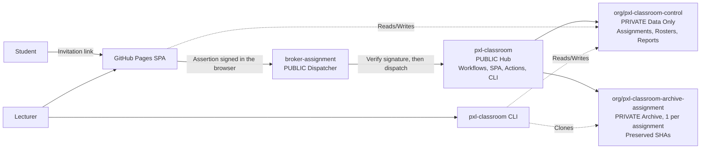

# PXL Classroom


<https://pxl-digital-application-samples.github.io/pxl-classroom/>

GitHub-native assignment distribution and submission reporting for higher education. Built on GitHub Pages, GitHub Actions, and a single GitHub App. No external server, no external database.

Target platform: GitHub Team for Education (no GitHub Enterprise required).

Links: [Web App](https://pxl-digital-application-samples.github.io/pxl-classroom/) | [ARCHITECTURE.md](ARCHITECTURE.md) | [RUNBOOK.md](RUNBOOK.md) | [DESIGN.md](DESIGN.md)

---

## Screenshots

### Lecturer Dashboard Overview
*Organization overview showing active assignments, submission metrics, and resource limit monitoring.*


### Assignment Submissions & Management
*Student progress, live submission status badges, and starter code sync actions.*


### Group Assignments & Team Management
*Self-service team formation, capacity limits, under-capacity indicators, and team repository tracking.*


---

## Highlights

**Nothing to run, nothing to pay for.** The whole system is a Pages site, some Actions workflows and one GitHub App. When no assignment is active, nothing runs and nothing is billed. A weekly check watches each organization's usage against its limits and tells you before you hit one.

**Students get their repository in under a minute.** They open the invitation link, sign in, and press Accept; the repository is ready in 20 to 40 seconds. The link carries a signing key, so a student's browser proves which account is accepting before any credential is created - and using the link no longer publishes it.

**You decide who may accept, per assignment.** Either a roster of GitHub usernames, or an email claim where the student confirms their institutional address and it is matched against your roster, or open signup with a limit on how many places there are. Exams and workshops usually want the last one; a known cohort wants the first.

**Students hold Admin on their own repository.** They can manage secrets, environments, runners and OIDC - which on these courses is the subject being taught, not a convenience.

**Teams form themselves.** Students create or join a team within the size you set, and can move between teams until the deadline. A grouping that already worked can be carried into the next assignment instead of being rebuilt.

**Fix a mistake after students have started.** Correct it once in the template and send it out. Files a student has not touched are updated directly; anything they have edited arrives as a pull request, so their work is never overwritten.

**Grading, in the cloud or on your machine.** Checks can run in each student repository on push, or locally in a sandboxed Docker container that costs no Actions minutes. Scores come back into the dashboard either way - including from a template that already ships GitHub Classroom's own grading workflow, with nothing to set up. One button opens draft feedback pull requests for everyone who has pushed.

**The deadline is a real deadline.** Writes to the submission branch stop at the instant it passes, not on the next nightly run, and you choose whether late work counts. Every submission is then copied to a private archive the student cannot reach - one archive per assignment, so a finished cohort can be retired on its own. That archive is what you show at an examination board or a grade dispute.

---

## Feature Comparison

The rows where the three genuinely differ. Everything else - assignment creation, team formation, feedback pull requests, CSV export - all three do in some form.

| | GitHub Classroom | Classroom50 | PXL Classroom |
| :--- | :--- | :--- | :--- |
| **Student repo role** | Write | Write | **Admin** - secrets, environments, runners, OIDC |
| **Deadline** | Soft; freeze by hand | Timestamps, reviewed by hand | Writes stop at the instant it passes |
| **Submission archive** | None; the live repo is the grade | None; the live repo is the grade | Private archive repo per assignment, out of the student's reach |
| **Grading off the cloud** | No | No | Sandboxed Docker via CLI - no Actions minutes |
| **Enrolment** | Roster or LMS sync | Org repository roster | Roster, email claim matched to your roster, or open signup with a cap |
| **Starter-code fixes** | Manual pull or fork | Manual upstream pull | Per file: direct where untouched, pull request where edited |
| **Cost when idle** | GitHub-hosted | Hosted service | Nothing runs, so nothing is billed |
| **Hosting** | GitHub's servers | Hosted web service | Your own Pages site and Actions; no server, no database |

Two things the others have and this does not: direct LMS gradebook sync over LTI 1.3, and someone else running the service for you.

---

## Quickstart

### 1. Connect Organization

- Open the [Web App](https://pxl-digital-application-samples.github.io/pxl-classroom/) and sign in with the GitHub device flow.
- Use **Connect an organization** in the org switcher to install the App on your org, then run **Setup Organization** to scaffold `<org>/pxl-classroom-control`.
- A brand-new deployment creates the App itself once, from the manifest form at `/setup` (RUNBOOK §1.2).

### 2. Create Assignment

- Open `/dashboard/:org/admin`.
- Fill in the title, the template repository, when it opens and closes, whether it is individual or group work, who may accept, and any automated checks.
- Click Save & Publish.

### 3. Student Acceptance

- Distribute the invitation link `/:org/i/:secret` - copy it from the assignment's detail view. It is minted at publish time and cannot be derived from the assignment id.
- Students sign in and accept; the repository is provisioned in 20 to 40 seconds.

### 4. Collection and Grading

- Writes stop at the instant the deadline passes; the nightly workflow finalizes the cohort and is the fallback if anything goes wrong.
- Submissions are preserved as immutable branches in `<org>/pxl-classroom-archive-<assignment-id>`.
- View grades in the web dashboard or grade locally via the CLI.

---

## Architecture


```mermaid
graph LR
    Hub[pxl-classroom<br/>PUBLIC Hub<br/>Workflows, SPA, Actions, CLI]
    Control[org/pxl-classroom-control<br/>PRIVATE Data Only<br/>Assignments, Rosters, Reports]
    Archive[org/pxl-classroom-archive-assignment<br/>PRIVATE Archive, 1 per assignment<br/>Preserved SHAs]
    Broker[broker-assignment<br/>PUBLIC Dispatcher]
    SPA[GitHub Pages SPA]
    CLI[pxl-classroom CLI]

    Student[Student] -->|Invitation link| SPA
    SPA -->|Assertion signed in the browser| Broker
    Broker -->|Verify signature, then dispatch| Hub
    Hub --> Control
    Hub --> Archive
    Lecturer[Lecturer] --> SPA
    Lecturer --> CLI
    SPA -.Reads/Writes.-> Control
    CLI -.Reads/Writes.-> Control
    CLI -.Clones.-> Archive
```

---

## CLI Usage

Installed from a clone of this repo - the package is not published to npm.

```bash
npm install && npm link --workspace=cli

# Authenticate via GitHub device flow
pxl-classroom auth login --client-id Iv23li...

# Import a roster from CSV (--dry-run shows the diff first)
pxl-classroom roster import students.csv --org my-org

# Bulk download preserved submissions for an assignment
pxl-classroom download --org my-org --assignment lab-1

# Run local autograding in a sandboxed Docker container
pxl-classroom grade --org my-org --assignment lab-1 --runner docker

# Open draft feedback pull requests
pxl-classroom feedback open --org my-org --assignment lab-1
```

Full command list: [cli/README.md](cli/README.md).

---

## Repository Layout

| Path | Description |
|---|---|
| `deployment.yml` | **Institution-specific configuration** — email domains, timezone, hub/App/control-repo names. A fork edits this file and nothing else |
| `.github/workflows/` | Hub workflows (acceptance, daily activity, deadline sentinel, dashboard regen, publish) |
| `acceptance/`, `provisioning/`, `collect/`, `lockdown/`, `preserve/`, `report/`, `notify/`, `pages/`, `registry/` | Composite actions |
| `scripts/` | Node scripts the workflows call (no inline `node -e` in YAML) |
| `frontend/` | Vue 3 single page application |
| `cli/` | Companion `@pxl-classroom/cli` package |
| `lib/` | Shared utility modules (gh, gittree, audit, diagnostics, invite-token, claim, roster-mode) |
| `schemas/` | JSON schemas for assignments, rosters, teams, reports, grading |
| `control-repo-template/` | Template scaffold for new organization control repos |
| `tests/`, `cli/tests/` | Unit and integration test suites |

---

## License

This project is licensed under the [MIT License](LICENSE).
