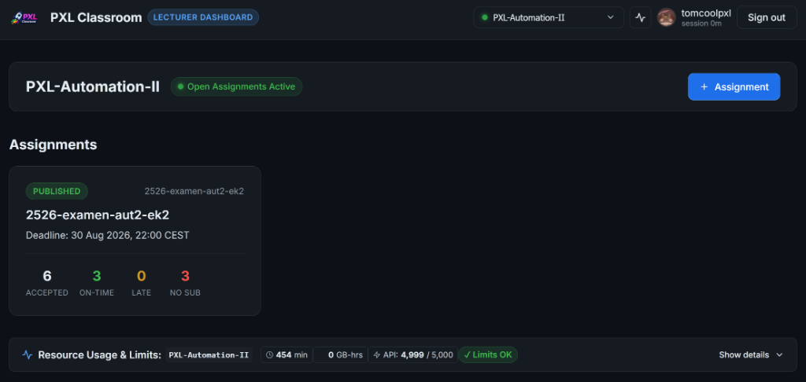
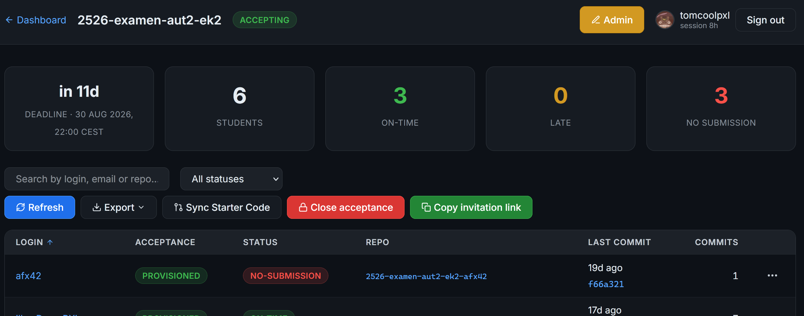
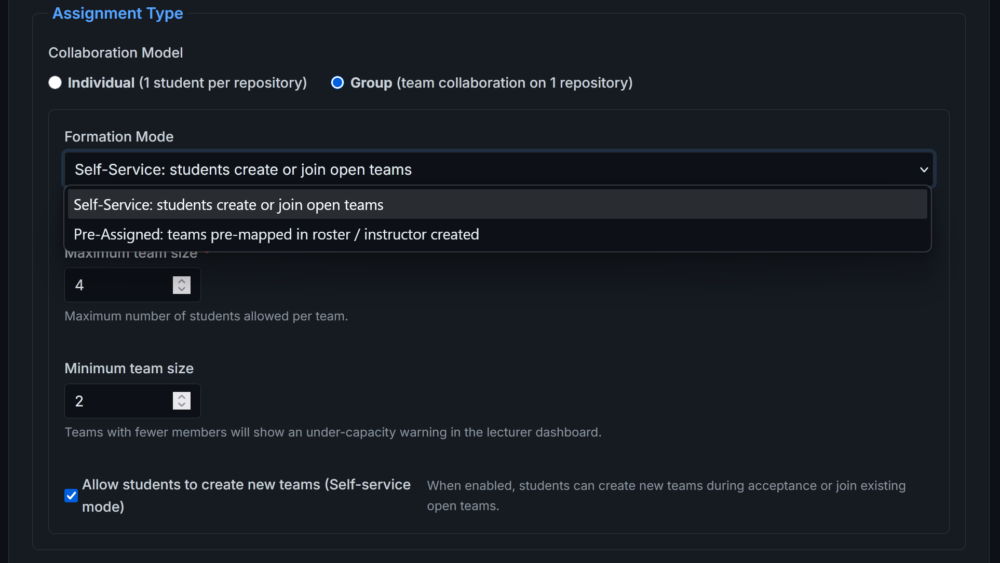
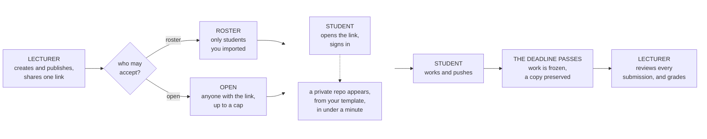
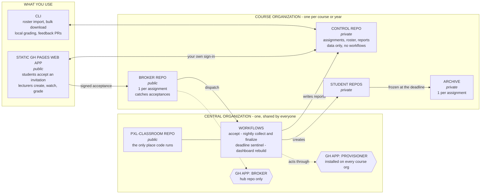

# PXL Classroom


<https://pxl-digital-application-samples.github.io/pxl-classroom/>

GitHub-native assignment distribution and submission reporting for higher education. Built on GitHub Pages, GitHub Actions, and two narrowly-scoped GitHub Apps. No external server, no external database.

Target platform: GitHub Team for Education (no GitHub Enterprise required).

**PXL Classroom** is named for *PXL eXecutable Labs*.

Live: [Web App](https://pxl-digital-application-samples.github.io/pxl-classroom/)

---

## Why

Classroom50 works well, but two things made me build PXL Classroom anyway.

- **Classroom50 cannot do open assignments.** It enrols from a roster, while GitHub Classroom used to hand out a link anyone could accept. Exams and workshops need that, so it is back, with a cap, alongside roster and email-claim enrolment.
- **Setting up an assignment takes too long.** Here it is one form: fill it in, publish, copy the link.

The result is GitHub Classroom's feature set with a dashboard on top, running entirely on GitHub Team for Education.

GitHub Enterprise is never used. The CLI handles what scales badly through clicks (roster import, bulk download, local grading) and the web UI is what you use day to day.

I built it for my own courses at first.

---

## Screenshots

### Lecturer Dashboard Overview
*Organization overview showing active assignments, submission metrics, and resource limit monitoring.*



### Assignment Submissions & Management
*Student progress, live submission status badges, and starter code sync actions.*



### Group Assignments & Team Management
*Self-service team formation, capacity limits, under-capacity indicators, and team repository tracking.*



---

## Highlights

**Nothing to run, nothing to pay for.** The whole system is a Pages site, some Actions workflows and two GitHub Apps. When no assignment is active, nothing runs and nothing is billed. A weekly check watches each organization's usage against its limits and tells you before you hit one.

**Students get their repository in under a minute.** They open the invitation link, sign in, and press Accept; the repository is ready in 20 to 40 seconds. A signing key verifies the accepting account before credentials are created, without exposing the link.

**You decide who may accept, per assignment.** Either a roster of GitHub usernames, or an email claim where the student confirms their institutional address and it is matched against your roster, or open signup with a limit on how many places there are.

**Students hold Admin on their own repository.** They can manage secrets, environments, runners and OIDC - which on these courses is the subject being taught, not a convenience.

**Teams form themselves.** Students create or join a team within the size you set, and can move between teams until the deadline. A grouping that already worked can be carried into the next assignment.

**Fix a mistake after students have started.** Correct it once in the template and send it out. Files a student has not touched are updated directly; anything they have edited arrives as a pull request, so their work is never overwritten.

**Grading, in the cloud or on your machine.** Checks can run in each student repository on push, or locally in a sandboxed Docker container that costs no Actions minutes. Scores come back into the dashboard either way - including from a template that already ships GitHub Classroom's own grading workflow, with nothing to set up. One button opens draft feedback pull requests for everyone who has pushed.

**The deadline can be a real deadline.** Choose per assignment: record late work, or stop writes at the deadline instant. A watcher enforces this immediately; the nightly workflow is the fallback. Every submission is archived in a private repository the student cannot access, so finished cohorts can be retired independently. Use the archive for examinations and grade disputes.

---

## Feature Comparison

The rows where the three genuinely differ. Everything else - assignment creation, team formation, feedback pull requests, CSV export - all three do in some form.

| | GitHub Classroom | Classroom50 | PXL Classroom |
| :--- | :--- | :--- | :--- |
| **Student repo role** | Write | Write | **Admin** - secrets, environments, runners, OIDC |
| **Deadline** | Soft; freeze by hand | Timestamps, reviewed by hand | Your choice per assignment: record late work, or stop writes at the instant it passes |
| **Submission archive** | None; the live repo is the grade | None; the live repo is the grade | Private archive repo per assignment, out of the student's reach |
| **Auto-grading** | GitHub Actions | GitHub Actions | GitHub Actions and local Sandboxed Docker via CLI |
| **Enrolment** | Roster or LMS sync | Org repository roster | Roster, email claim matched to your roster, or open signup with a cap |
| **Starter-code fixes** | Manual pull or fork | Manual upstream pull | Per file: direct where untouched, pull request where edited |
| **Cost when idle** | GitHub-hosted | Hosted service | Nothing runs, so nothing is billed |
| **Hosting** | GitHub's servers | Hosted web service | Your own Pages site and Actions; no server, no database |

---

## Setup

There are two organizations involved.

### 1. The central organization

Everyone shares this one. It holds this repository, the workflows, the Pages site, the GitHub App and the sample repositories.

Give lecturers **Write** permission on this repository (as a collaborator or via a team). Publishing assignments dispatches a workflow using `workflow_dispatch`, which requires write access.

**Grant repository Write access, not organization ownership.** Organization owners can generate private keys for the GitHub App (accessing all participating orgs), whereas Write access provides only the necessary publishing permissions.

**More than one central organization can exist.** To be independent of this one, fork the repository, edit `deployment.yml`, create your own Apps at `/setup`, and publish your own Pages site - [INSTALL.md](INSTALL.md) is that path start to finish.

### 2. Your own course organization

There is one of these per course or academic year. It holds the private `pxl-classroom-control` repository, the student repositories and the archives.

An owner installs the App there with access to **All repositories**, then runs **Setup Organization**. The **Connect an organization** button in the web app walks you through both steps.

**Owning this organization is what makes you a lecturer in it.** There is no user list and no roles, so every owner can edit every assignment in the organization.

---

## Quickstart


```mermaid
flowchart LR
    Create["LECTURER<br/>creates and publishes,<br/>shares one link"] --> Who{"who may<br/>accept?"}
    Who -->|"roster"| Roster["ROSTER<br/>only students<br/>you imported"]
    Who -->|"open"| Open["OPEN<br/>anyone with the link,<br/>up to a cap"]
    Roster --> acc
    Open --> acc

    subgraph acc [" "]
        direction TB
        Accept["STUDENT<br/>opens the link,<br/>signs in"] -.-> Repo["a private repo appears,<br/>from your template,<br/>in under a minute"]
    end

    acc --> Work["STUDENT<br/>works and pushes"]
    Work --> Deadline["THE DEADLINE PASSES<br/>work is frozen,<br/>a copy preserved"]
    Deadline --> Grade["LECTURER<br/>reviews every<br/>submission, and grades"]

    style acc fill:none,stroke:none
```

The one choice that changes what a student experiences is **who may accept**.
Everything after the link is the same either way, and there is one link per
assignment rather than one per student.

### 1. Connect Organization

- Open the [Web App](https://pxl-digital-application-samples.github.io/pxl-classroom/) and sign in with the GitHub device flow.
- Pick your organization in the switcher. If it is not connected yet, see [Setup](#setup).

### 2. Create Assignment

- Open `/dashboard/:org/admin`.
- Fill in the title, the template repository, when it opens and closes, whether it is individual or group work, who may accept, and any automated checks.
- Click Save & Publish.

### 3. Student Acceptance

- Distribute the invitation link `/:org/i/:secret` - copy it from the assignment's detail view. It is minted at publish time and cannot be derived from the assignment id.
- Students sign in and accept; the repository is provisioned in 20 to 40 seconds.

### 4. Collection and Grading

- If you set late work not to count, writes stop at the instant the deadline passes; the nightly workflow finalizes the cohort either way, and is the fallback if anything goes wrong.
- Submissions are preserved as immutable branches in `<org>/pxl-classroom-archive-<assignment-id>`.
- View grades in the web dashboard or grade locally via the CLI.

---

## Architecture

### Components


```mermaid
flowchart LR
    subgraph You["WHAT YOU USE"]
        direction TB
        WebApp["STATIC GH PAGES WEB APP<br/><i>public</i><br/>students accept an invitation<br/>lecturers create, watch, grade"]
        CLI["CLI<br/>roster import, bulk download<br/>local grading, feedback PRs"]
    end

    subgraph Central["CENTRAL ORGANIZATION - one, shared by everyone"]
        direction TB
        Hub["PXL-CLASSROOM REPO<br/><i>public</i><br/>the only place code runs"]
        Flows["WORKFLOWS<br/>accept - nightly collect and finalize<br/>deadline sentinel - dashboard rebuild"]
        Prov{{"GH APP: PROVISIONER<br/>installed on every course org"}}
        Brok{{"GH APP: BROKER<br/>hub repo only"}}
        Hub --- Flows
        Flows -.acts through.-> Prov
    end

    subgraph Course["COURSE ORGANIZATION - one per course or year"]
        direction TB
        BrokerRepo["BROKER REPO<br/><i>public</i><br/>1 per assignment<br/>catches acceptances"]
        Control["CONTROL REPO<br/><i>private</i><br/>assignments, roster, reports<br/>data only, no workflows"]
        Student["STUDENT REPOS<br/><i>private</i>"]
        Archive["ARCHIVE<br/><i>private</i><br/>1 per assignment"]
        Student -->|"frozen at the deadline"| Archive
    end

    WebApp -->|"signed acceptance"| BrokerRepo
    BrokerRepo -->|"dispatch"| Flows
    BrokerRepo -.-> Brok
    Flows -->|"creates"| Student
    Flows -->|"writes reports"| Control
    WebApp <-->|"your own sign-in"| Control
    CLI <--> Control
```

Notes:

- **Nothing you run holds a credential.**
  - The web app and the CLI act as *you*, through your own GitHub sign-in
  - they can only reach what you could reach by hand.
- **All the code lives in the central organization**
  - and runs nowhere else
  - the hub repository owns every workflow, which is why a course organization can be
handed over or deleted without taking the machinery with it.
- **A course organization holds only data and student work**, and has no workflows of its own.

The two Apps are split on purpose:

- The Provisioner is installed on every course organization, so only workflows in the hub ever use it.
- The Broker exists because a public acceptance page needs *something* to carry a
request inward: it is installed on one repository and can do only one thing.

The request path a single acceptance takes, and the table of what each repository
role owns, are in [ARCHITECTURE.md](ARCHITECTURE.md).

---

## CLI Usage

Installed from a clone of this repo - the package is not published to npm.

```bash
npm install && npm link --workspace=cli

# Authenticate via GitHub device flow
pxl-classroom auth login --client-id Iv23li...

# Import a roster from CSV (--dry-run shows the diff first)
pxl-classroom roster import students.csv --org my-org

# Bulk download preserved submissions for an assignment
pxl-classroom download --org my-org --assignment lab-1

# Run local autograding in a sandboxed Docker container
pxl-classroom grade --org my-org --assignment lab-1 --runner docker

# Open draft feedback pull requests
pxl-classroom feedback open --org my-org --assignment lab-1
```

Full command list: [cli/README.md](cli/README.md).

---

## Repository Layout

| Path | Description |
|---|---|
| `deployment.yml` | **Institution-specific configuration** - email domains, timezone, hub/App/control-repo names, and the sign-in proxy. It is the only *code* a fork edits; the App and Pages site are set up per [INSTALL.md](INSTALL.md) |
| `.github/workflows/` | Hub workflows (acceptance, daily activity, deadline sentinel, dashboard regen, publish) |
| `acceptance/`, `provisioning/`, `collect/`, `lockdown/`, `preserve/`, `report/`, `notify/`, `pages/`, `registry/` | Composite actions |
| `scripts/` | Node scripts the workflows call (no inline `node -e` in YAML) |
| `frontend/` | Vue 3 single page application |
| `cli/` | Companion `@pxl-classroom/cli` package |
| `lib/` | Shared utility modules (gh, gittree, audit, diagnostics, invite-token, claim, roster-mode) |
| `schemas/` | JSON schemas for assignments, rosters, teams, reports, grading |
| `control-repo-template/` | Template scaffold for new organization control repos |
| `tests/`, `cli/tests/` | Unit and integration test suites |

## Further documentation

| If you are | Read |
|---|---|
| Meeting this for the first time | **[INTRODUCTION.md](INTRODUCTION.md)** - what it is and what using it looks like |
| A **lecturer** running assignments | **[RUNBOOK.md](RUNBOOK.md)** - publishing, deadlines, grading, a student who is stuck |
| An **administrator** | **[ADMIN.md](ADMIN.md)** - onboarding an organization, budgets, App permissions, incidents |
| Standing the system up for an institution | **[INSTALL.md](INSTALL.md)** - the one-time setup |
| A **developer** changing the code | **[ARCHITECTURE.md](ARCHITECTURE.md)**, then **[CLAUDE.md](CLAUDE.md)** for the working conventions |
| Changing the **UI** | **[DESIGN.md](DESIGN.md)** - the design system, and the rules the components already follow |

Also here: [MANUAL.md](MANUAL.md) is the in-app help a lecturer sees, rendered inside the web app rather than read here. [OPEN-ITEMS.md](OPEN-ITEMS.md) is a standing register of known infrastructure gaps, each with the command that says whether it is still open. [LESSONS.md](LESSONS.md) records what broke and what it cost - read it before arguing with a rule, because nearly every one is there for a reason that already happened.

---

## License

This project is licensed under the [MIT License](LICENSE).
