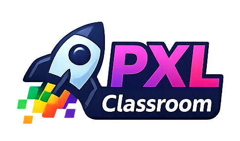
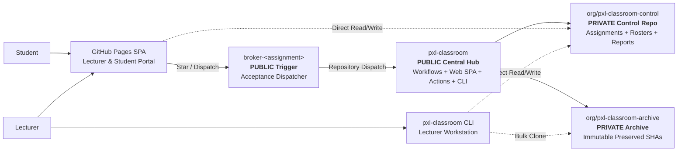

# PXL Classroom

<p align="center">
  
</p>

<p align="center">
  <strong>A serverless, zero-database GitHub Classroom replacement built entirely on GitHub Pages, GitHub Actions, and a single GitHub App.</strong>
</p>

<p align="center">
  <a href="https://pxl-digital-application-samples.github.io/pxl-classroom/"><strong>Launch Web App</strong></a> •
  <a href="ARCHITECTURE.md"><strong>Architecture Spec</strong></a> •
  <a href="RUNBOOK.md"><strong>Operations Runbook</strong></a>
</p>

---

## Why PXL Classroom?

- ⚡ **Zero Infrastructure & Zero Database:** Runs 100% natively on GitHub. No servers to maintain, no databases to host, no external SaaS dependencies.
- 🎯 **Tailored for GitHub Team for Education:** Never requires GitHub Enterprise. Works out-of-the-box with standard education orgs.
- 💰 **Zero Idle Cost:** Nightly cron jobs automatically disable themselves when no assignment is active. Billed Actions minutes drop to zero between assignment windows.
- 🔒 **Tamper-Proof Deadlines & Auto-Lockdown:** Submissions are automatically frozen at the deadline, student write permissions are demoted, and full Git commit histories are archived safely into a private organization archive.
- 👥 **Individual & Group Assignments:** First-class support for single-student repositories and collaborative team projects (with self-service team creation or pre-assigned roster mapping).
- 🧪 **Dual-Mode Autograding:**
  - **Local Sandbox (0 Actions Minutes):** Run fast, sandboxed Docker autograding locally on the lecturer's machine via the CLI.
  - **Student-Side Actions:** Automatically execute CI tests on student pushes with live score reporting (`Points X/Y`) harvested directly via GitHub Checks.
- 💬 **Continuous Feedback PRs:** Automatically create feedback pull requests comparing student work against baseline starter code for inline code reviews.
- 🛠️ **Full-Featured Web SPA + Lecturer CLI:** A modern Vue 3 web interface for students and lecturers, paired with a companion `pxl-classroom` CLI for bulk downloads, roster syncs, and power workflows.

---

## 5-Minute Quickstart

### 1. Connect Your Organization
1. Open the [PXL Classroom Web App](https://pxl-digital-application-samples.github.io/pxl-classroom/).
2. Sign in with GitHub using the device flow code.
3. If this is your first time, head to **Setup** to generate and install your organization's GitHub App in 2 clicks.

### 2. Create & Publish an Assignment
1. Navigate to the **Admin Panel** (`/admin`).
2. Fill in the assignment details:
   - **Type:** Choose **Individual** or **Group** (team size, formation mode).
   - **Template:** Select any repository in your organization.
   - **Schedule:** Set opens date and submission deadline.
   - **Autograding (Optional):** Choose local Docker grading (0 billed minutes) or GitHub Actions.
3. Click **Save & Publish**.

### 3. Share with Students
Share the generated acceptance link with your class (e.g. `/:org/a/:assignment-id`):
1. Students open the link and sign in with GitHub.
2. Students click **Accept Assignment** (or join/create a team for group assignments).
3. A private repository is provisioned immediately from the template with student access granted.

### 4. Collect & Grade
- **Nightly / Live Tracking:** Watch progress on the real-time Lecturer Dashboard.
- **Deadline Lockdown:** Submissions are locked and archived automatically at the deadline.
- **Grade & Review:** View autograding results in the SPA or run `pxl-classroom grade` / `pxl-classroom download` from your terminal.

---

## Architecture at a Glance


```mermaid
graph LR
    Hub[pxl-classroom<br/><b>PUBLIC Central Hub</b><br/>Workflows + Web SPA + Actions + CLI]
    Control[org/pxl-classroom-control<br/><b>PRIVATE Control Repo</b><br/>Assignments + Rosters + Reports]
    Archive[org/pxl-classroom-archive<br/><b>PRIVATE Archive</b><br/>Immutable Preserved SHAs]
    Broker[broker-&lt;assignment&gt;<br/><b>PUBLIC Trigger</b><br/>Acceptance Dispatcher]
    SPA[GitHub Pages SPA<br/>Lecturer & Student Portal]
    CLI[pxl-classroom CLI<br/>Lecturer Workstation]

    Student[Student] --> SPA
    SPA -->|Star / Dispatch| Broker
    Broker -->|Repository Dispatch| Hub
    Hub --> Control
    Hub --> Archive
    Lecturer[Lecturer] --> SPA
    Lecturer --> CLI
    SPA -.Direct Read/Write.-> Control
    CLI -.Direct Read/Write.-> Control
    CLI -.Bulk Clone.-> Archive
```

### Key Components

- **Central Hub (`pxl-classroom`):** Contains all reusable workflows, composite actions, the web portal, and the CLI.
- **Control Repository (`pxl-classroom-control`):** Private repository in each participating organization holding metadata (assignments, rosters, teams, reports) without any workflow files.
- **Archive Repository (`pxl-classroom-archive`):** Private storage preserving frozen submission branches (`refs/heads/preserved/<assignment>/<student-or-team>`) out of student reach.
- **GitHub App:** Single App installed per organization providing short-lived tokens for repository provisioning and collaborator management.

---

## Companion Lecturer CLI

Install or run the companion CLI directly with Node.js:

```bash
# Authenticate with your GitHub account
npx pxl-classroom login

# Bulk download student submissions for an assignment
npx pxl-classroom download --org my-org --assignment lab-1

# Run local sandboxed autograding inside Docker (0 Actions minutes billed)
npx pxl-classroom grade --org my-org --assignment lab-1 --runner docker

# Open feedback PRs for inline code review across all students
npx pxl-classroom feedback open --org my-org --assignment lab-1
```

---

## Documentation

- **[`ARCHITECTURE.md`](ARCHITECTURE.md):** Comprehensive technical specification covering security model, trust boundaries, data schemas, and workflow topology.
- **[`RUNBOOK.md`](RUNBOOK.md):** Operational guide with step-by-step procedures for setup, troubleshooting, roster management, extensions, and recovery.

---

## Repository Structure

| Directory / Layer | Purpose |
|---|---|
| `.github/workflows/` | Core orchestration workflows (acceptance, daily activity, dashboard regen) |
| `acceptance/`, `provisioning/`, `lockdown/`, `preserve/`, `report/` | Encapsulated composite actions |
| `frontend/` | Vue 3 + Vite single-page application hosted on GitHub Pages |
| `cli/` | Companion `@pxl-classroom/cli` Node.js package |
| `lib/` | Shared zero-dependency utility modules (`yaml`, `gh`, `gittree`, `audit`) |
| `schemas/` | Authoritative JSON schemas validating assignments, rosters, teams, and reports |
| `control-repo-template/` | Clean directory scaffold for new organization control repos |
| `tests/`, `cli/tests/` | Unit and integration test suites |

---

<p align="center">
  <sub>Maintained for PXL Digital Application Samples • Designed for GitHub Team for Education</sub>
</p>
